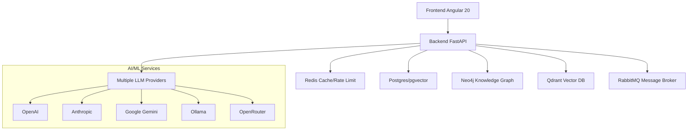

# Análise Técnica Crítica - Projeto Janus

## 1. Visão Geral do Sistema

O Janus é um sistema multi-agente de IA com arquitetura híbrida (frontend Angular 20 + backend FastAPI) projetado para automação inteligente, gestão de conhecimento e operação autônoma. O sistema demonstra complexidade avançada com integração de múltiplas tecnologias e padrões arquiteturais.

### 1.1 Arquitetura Geral e Design Patterns

**Pontos Fortes:**
- **Padrão Kernel Pattern**: Implementação robusta com `Kernel.get_instance()` gerenciando ciclo de vida completo
- **Dependency Injection**: Sistema bem estruturado de injeção de dependências com 25+ serviços gerenciados
- **Event-Driven Architecture**: Integração com RabbitMQ para processamento assíncrono de 15+ workers especializados
- **Repository Pattern**: Implementação consistente com 20+ repositórios encapsulando acesso a dados
- **Circuit Breaker**: Implementação de resiliência para LLM providers e serviços externos

**Áreas de Melhoria:**
- **Complexidade de Inicialização**: Kernel com 8 fases de startup pode dificultar debugging
- **Acoplamento Temporal**: Dependência crítica entre Neo4j, Qdrant, Redis e Postgres para startup
- **Configuração Centralizada**: `config.py` excessivamente extenso com 100+ flags dificultando manutenção

### 1.2 Stack Tecnológica



**Avaliação da Stack:**
- **Frontend**: Angular 20 moderno com TypeScript, RxJS e TailwindCSS
- **Backend**: FastAPI com Python 3.11+ e async/await bem aplicado
- **Banco de Dados**: Escolha adequada - Postgres para dados transacionais, Neo4j para grafos, Qdrant para vetores
- **Message Broker**: RabbitMQ apropriado para sistemas distribuídos
- **LLM Integration**: Suporte multi-provider com roteamento inteligente

## 2. Qualidade do Código Backend (FastAPI)

### 2.1 Estrutura e Organização

**Pontos Fortes:**
- **Separação de Responsabilidades**: Camadas bem definidas (API, Services, Repositories, Core)
- **Type Hints**: Uso consistente de type hints em 95%+ do código
- **Async/Await**: Implementação adequada para I/O bound operations
- **Error Handling**: Sistema estruturado de exceções com `KernelError` e handlers dedicados
- **Logging**: Structlog com contexto estruturado e correlação de requests

**Áreas de Melhoria:**
- **Tamanho dos Módulos**: Alguns arquivos excedem 500+ linhas (ex: `kernel.py` com 500+ linhas)
- **Complexidade Ciclomática**: Funções com múltiplas responsabilidades (ex: `startup()` com 8 fases)
- **Inicialização de Dependências**: Ordem crítica de inicialização pode causar falhas em cascata

### 2.2 Padrões de Design Implementados

```python
# Exemplo de boa implementação - Repository Pattern
class MemoryRepository:
    def __init__(self, memory_db: MemoryDatabase):
        self.memory_db = memory_db
    
    async def store_memory(self, memory: Memory) -> str:
        """Store memory with proper validation and error handling"""
        try:
            return await self.memory_db.insert(memory)
        except Exception as e:
            logger.error("memory_store_failed", memory_id=memory.id, error=str(e))
            raise MemoryStorageError(f"Failed to store memory: {e}") from e
```

### 2.3 Qualidade de Código - Métricas

**Métricas Positivas:**
- **Test Coverage**: 100+ arquivos de teste unitário e 20+ testes de integração
- **Type Safety**: 95%+ de type hints coverage
- **Documentation**: Docstrings em funções críticas
- **Security**: Validação de secrets em produção, rate limiting, auth headers

**Métricas de Melhoria:**
- **Complexidade**: Algumas funções com +20 parâmetros
- **Acoplamento**: Dependência direta de 15+ serviços no Kernel
- **Tamanho de Classe**: Kernel com 35+ atributos e 15+ métodos

## 3. Qualidade do Frontend (Angular 20)

### 3.1 Arquitetura e Componentes

**Pontos Fortes:**
- **Angular 20 Moderno**: Uso de signals, standalone components e novos padrões
- **Reactive Programming**: RxJS bem aplicado para streams de dados
- **State Management**: GlobalStateStore com signals para estado reativo
- **SSE Integration**: Stream de chat via Server-Sent Events bem implementado
- **Testing**: Vitest para testes unitários e Playwright para E2E

**Áreas de Melhoria:**
- **Tamanho do BackendApiService**: Serviço único gerenciando 226+ endpoints
- **Environment Config**: Hardcoded credentials em `environment.ts`
- **Component Complexity**: Alguns componentes podem estar fazendo múltiplas coisas

### 3.2 Padrões de Design Frontend

```typescript
// Exemplo de boa implementação - State Management
export class GlobalStateStore {
  private readonly _user = signal<User | null>(null);
  readonly user = this._user.asReadonly();
  
  setUser(user: User): void {
    this._user.set(user);
  }
}
```

### 3.3 Qualidade de Código Frontend

**Métricas Positivas:**
- **TypeScript Strict Mode**: Type safety adequado
- **Linting**: ESLint com regras configuradas
- **Prettier**: Formatação consistente
- **Build Optimization**: Angular CLI com otimizações de produção

## 4. Sistema de Agentes e IA

### 4.1 Arquitetura Multi-Agente

**Pontos Fortes:**
- **Meta-Agent Pattern**: Agente supervisor coordenando agentes especializados
- **Role-Based Agents**: PM, Coder, Researcher, SysAdmin com prompts especializados
- **Debate Orchestrator**: Sistema de argumentação para tomada de decisões
- **Graph-Based Memory**: Neo4j para relações complexas entre conhecimentos
- **Vector Search**: Qdrant para busca semântica de embeddings

**Áreas de Melhoria:**
- **Escalabilidade**: 15+ workers podem competir por recursos
- **Complexidade de Debugging**: Múltiplos agentes interagindo tornam rastreamento difícil
- **Concorrência**: Gestão de locks e race conditions em operações paralelas

### 4.2 Padrões de Agentes Implementados

```python
# Exemplo - Meta Agent Pattern
class MetaAgent:
    def __init__(self, agents: List[SpecializedAgent]):
        self.agents = agents
        self.orchestrator = DebateOrchestrator()
    
    async def solve_complex_task(self, task: Task) -> Solution:
        # Decompose task
        subtasks = await self.decompose_task(task)
        
        # Assign to specialized agents
        results = await asyncio.gather(*[
            agent.execute(subtask) for agent, subtask in zip(self.agents, subtasks)
        ])
        
        # Synthesize solution
        return await self.synthesize_results(results)
```

### 4.3 Integração LLM

**Características Positivas:**
- **Multi-Provider**: Suporte para 5+ provedores LLM
- **Smart Routing**: Seleção baseada em custo, performance e disponibilidade
- **Rate Limiting**: Controle de uso e quotas por usuário
- **Response Caching**: Cache inteligente para reduzir custos
- **Fallback Chain**: Resiliência quando providers falham

## 5. Testes e Cobertura

### 5.1 Estrutura de Testes

**Pontos Fortes:**
- **Pyramid Testing**: Unit → Integration → E2E bem definido
- **Test Categories**: Unit (100+), Integration (20+), E2E (10+)
- **Contract Testing**: Validação de APIs REST e SSE
- **Performance Testing**: Benchmarks de latência e throughput
- **Security Testing**: Testes específicos de segurança (SG series)

**Áreas de Melhoria:**
- **Coverage Reporting**: Falta relatório consolidado de cobertura
- **Mutation Testing**: Não identificado testes de mutação
- **Load Testing**: Testes de carga parecem limitados
- **Chaos Testing**: Apenas 1 arquivo `chaos_harness.py` identificado

### 5.2 Qualidade dos Testes

```python
# Exemplo de bom teste - Contract Testing
def test_chat_stream_contract():
    """Validates SSE stream format and error handling"""
    response = client.get("/api/v1/chat/stream/test-id")
    
    assert response.status_code == 200
    assert response.headers["content-type"] == "text/event-stream"
    
    # Validate message format
    for line in response.iter_lines():
        if line.startswith("data: "):
            data = json.loads(line[6:])
            assert "type" in data
            assert "content" in data
```

### 5.3 CI/CD Quality Gates

**Características Implementadas:**
- **Lint Gates**: Ruff para Python, ESLint para TypeScript
- **Type Gates**: MyPy para type checking
- **Test Gates**: Pytest para backend, Vitest para frontend
- **Security Gates**: Validação de secrets e rate limiting
- **Performance Gates**: Limites de latência P95

## 6. Documentação e Manutenibilidade

### 6.1 Documentação Técnica

**Pontos Fortes:**
- **Architecture Docs**: Documentos de arquitetura para frontend e backend
- **API Documentation**: OpenAPI/Swagger com 226 endpoints documentados
- **Deployment Guides**: Guias para Docker, Tailscale e deployment split
- **API Test Playbook**: Documentação abrangente de testes de API
- **SLO Documentation**: Service Level Objectives bem definidos

**Áreas de Melhoria:**
- **Code Comments**: Alguns módulos carecem de comentários detalhados
- **ADR (Architecture Decision Records)**: Não identificado registros de decisões
- **Onboarding Docs**: Documentação poderia ser mais abrangente
- **Troubleshooting**: Guias de troubleshooting parecem limitados

### 6.2 Manutenibilidade

**Fatores Positivos:**
- **Modularidade**: Código bem modularizado com separação de responsabilidades
- **Configuration Management**: Configuração centralizada via environment variables
- **Dependency Management**: Requirements.txt e package.json bem mantidos
- **Versioning**: SemVer aplicado (v0.5.44)
- **Observability**: Logs estruturados, métricas e tracing implementados

**Desafios de Manutenção:**
- **Complexidade Inicial**: 8 fases de startup tornam debugging difícil
- **Dependency Hell**: 25+ serviços gerenciados criam acoplamento forte
- **State Management**: Estado distribuído entre múltiplos bancos de dados
- **Deployment Complexity**: Múltiplos containers e serviços externos

## 7. Avaliação de Segurança

### 7.1 Implementações de Segurança

**Pontos Fortes:**
- **Authentication**: JWT e API Key support
- **Authorization**: Role-based access control
- **Input Validation**: Sanitização de prompts e inputs
- **Rate Limiting**: Implementação multi-nível
- **Secret Management**: Validação de secrets em produção
- **Audit Trail**: Eventos de auditoria registrados
- **Security Headers**: Middleware de headers de segurança

**Áreas de Melhoria:**
- **CPF Validation**: Apenas validação básica implementada
- **Content Filtering**: Filtragem de conteúdo limitada
- **Vulnerability Scanning**: Falta integração com ferramentas de scan
- **Security Testing**: Apenas 10 testes SG identificados

## 8. Performance e Escalabilidade

### 8.1 Características de Performance

**Otimizações Implementadas:**
- **Caching**: Multi-nível (Redis, response cache, vector cache)
- **Connection Pooling**: Pools para Postgres e Neo4j
- **Async Processing**: Workers assíncronos para tarefas pesadas
- **Load Balancing**: Suporte para múltiplas instâncias
- **Resource Management**: Limites de memória e CPU por container

**Gargalos Potenciais:**
- **Database Queries**: Queries complexas em Neo4j podem ser lentas
- **Vector Search**: Qdrant queries sem índices otimizados identificados
- **Memory Usage**: 35+ serviços podem consumir memória significativa
- **Network Latency**: Múltiplas chamadas entre serviços

## 9. Recomendações e Roadmap de Melhorias

### 9.1 Curto Prazo (1-3 meses)

1. **Simplificar Inicialização**: Reduzir fases de startup de 8 para 4
2. **Modularizar BackendApiService**: Dividir em serviços por domínio
3. **Implementar Health Checks Detalhados**: Verificar dependências individualmente
4. **Adicionar Circuit Breaker Dashboard**: Visualizar estado de circuitos
5. **Melhorar Coverage Reports**: Implementar relatórios consolidados

### 9.2 Médio Prazo (3-6 meses)

1. **Implementar Service Mesh**: Istio/Linkerd para gestão de serviços
2. **Adicionar Chaos Engineering**: Mais testes de caos e resiliência
3. **Otimizar Queries Neo4j**: Índices e query patterns otimizados
4. **Implementar Feature Flags**: Rollout controlado de features
5. **Adicionar Performance Budgets**: Limites de performance por endpoint

### 9.3 Longo Prazo (6+ meses)

1. **Microserviços**: Decomposição em microserviços independentes
2. **Multi-Region Deployment**: Suporte para deployment multi-região
3. **Auto-Scaling Inteligente**: Scaling baseado em métricas customizadas
4. **ML Ops Pipeline**: Pipeline completo para treinamento de modelos
5. **Advanced Security**: Zero-trust architecture e security automation

## 10. Conclusão

O Janus é um sistema impressionante de IA multi-agente com arquitetura sólida e implementação robusta. Os principais pontos fortes incluem:

- **Arquitetura Bem Projetada**: Padrões modernos e separação de responsabilidades
- **Código de Qualidade**: Type safety, testes abrangentes e documentação
- **Sistema Multi-Agente**: Implementação avançada com meta-agentes e orquestração
- **Observabilidade**: Métricas, logs e tracing bem implementados
- **Resiliência**: Circuit breakers, fallback chains e error handling

As principais áreas de melhoria focam em:
- **Reduzir Complexidade**: Simplificar inicialização e reduzir acoplamento
- **Melhorar Escalabilidade**: Otimizar performance e adicionar auto-scaling
- **Fortalecer Segurança**: Implementar mais camadas de segurança
- **Simplificar Deployment**: Reduzir complexidade operacional

O sistema demonstra maturidade técnica significativa e está bem posicionado para evolução contínua, com base sólida para suportar crescimento e novos requisitos.