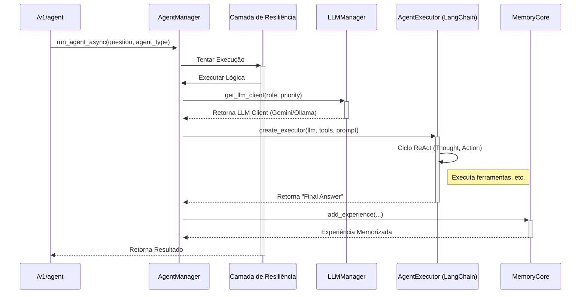

# Guia Definitivo da Arquitetura de Agentes do Projeto Janus

## 1. Filosofia: Especialização e Resiliência

A arquitetura de agentes do Janus é construída sobre dois pilares fundamentais:

1. **Especialização e Princípio do Menor Privilégio**: Em vez de um único agente monolítico, o Janus emprega um elenco
   de agentes especializados, cada um com um papel (`AgentType`) e um conjunto de ferramentas (`tools`) estritamente
   definidos. Isso garante que um agente tenha apenas as permissões necessárias para cumprir sua função, aumentando a
   segurança e a previsibilidade do sistema.

2. **Resiliência Nativa**: A execução de cada agente é uma operação crítica. Por isso, o `AgentManager` envolve cada
   chamada em múltiplas camadas de proteção, incluindo **Circuit Breakers**, **retentativas com backoff exponencial** e
   **timeouts**. Isso garante que o sistema possa lidar com falhas transitórias (ex: instabilidade da API do LLM) e
   falhas persistentes sem comprometer sua estabilidade geral.

## 2. O Elenco de Agentes: Papéis e Responsabilidades

O `AgentType` (definido em `app/core/agent_manager.py`) classifica os diferentes papéis cognitivos no sistema.

### 2.1. `AgentType.TOOL_USER`

* **Descrição**: O agente de linha de frente, o "operário" do sistema. É responsável por executar a maioria das tarefas
  que exigem interação com o ambiente, como ler e escrever arquivos, buscar informações na web ou consultar a memória.
* **Prompt Principal**: `react_agent` (de `app/core/prompt_loader.py`).
* **Ferramentas**: Acesso ao `unified_tools`, o conjunto mais amplo de ferramentas, incluindo `write_file`, `read_file`,
  `list_directory`, `recall_experiences`, etc.
* **Exemplo de Tarefa**: "Crie um arquivo chamado `plano.md` com o plano de desenvolvimento para o próximo sprint."

### 2.2. `AgentType.ORCHESTRATOR`

* **Descrição**: Um planejador tático. Embora atualmente compartilhe o mesmo prompt e ferramentas do `TOOL_USER`, seu
  papel é semanticamente distinto. É invocado para tarefas que exigem um planejamento inicial ou a decomposição de um
  problema antes da execução.
* **Prompt Principal**: `react_agent`.
* **Ferramentas**: `unified_tools`.
* **Exemplo de Tarefa**: "Analise a solicitação do usuário e crie um plano passo a passo para implementar a nova
  funcionalidade."

### 2.3. `AgentType.META_AGENT`

* **Descrição**: O "supervisor" do sistema, responsável pela autoanálise e otimização. Ele opera em um ciclo de vida
  próprio (`meta_agent_cycle.py`) para monitorar a saúde do Janus.
* **Prompt Principal**: `meta_agent_supervisor`.
* **Ferramentas**: Um conjunto restrito e poderoso de ferramentas de introspecção, como `analyze_memory_for_failures` e
  `recall_experiences`.
* **Exemplo de Tarefa (invocada pelo sistema)**: "Analise as últimas 20 experiências e identifique padrões de falha
  recorrentes."

### 2.4. O Agente "Fantasma" - Visão Estratégica e Evolução

* **Nota Estratégica**: A separação do `ORCHESTRATOR` é uma decisão de design intencional para a evolução do sistema. No
  futuro, este agente será o nó principal em grafos de execução mais complexos (utilizando LangGraph), onde ele não
  executará ferramentas diretamente, mas sim delegará tarefas a outros agentes `TOOL_USER` especializados. Ele é o
  futuro "maestro" da orquestra de agentes.

## 3. O Ciclo de Vida de Execução de um Agente

Toda a lógica de execução é orquestrada pelo `AgentManager` (`app/core/agent_manager.py`). Quando uma tarefa é delegada
a um agente, o seguinte fluxo ocorre:

### 3.1. A Seleção do "Cérebro" - Conexão com o `llm_manager.py`

A decisão de usar o "Cérebro Soberano" (Ollama local) ou o "Co-processador de Elite" (um modelo de nuvem como Gemini ou
GPT-4o) é crucial.

* **Roteamento Dinâmico**: Antes de criar o `AgentExecutor`, o `AgentManager` chama o `get_llm_client` do `llm_manager`.
* **ModelRole e ModelPriority**: A seleção do modelo não é aleatória, mas sim uma decisão arquitetural baseada no *
  *papel** (`ModelRole`) e na **prioridade** (`ModelPriority`) da tarefa.
    * **Exemplo 1**: O `AgentType.TOOL_USER` pode, por padrão, usar `ModelPriority.FAST_AND_CHEAP` para tarefas
      rotineiras, priorizando o modelo local.
    * **Exemplo 2**: O `AgentType.META_AGENT`, por sua natureza analítica, sempre solicita um
      `ModelPriority.HIGH_QUALITY`, garantindo que ele "pense" com o melhor modelo disponível, justificando o custo para
      uma tarefa de alta importância.

### 3.2. Fluxo de Execução

1. **Requisição**: Um endpoint (ex: `app/api/v1/endpoints/agent.py`) recebe uma `question` e um `agent_type`.
2. **Execução Assíncrona**: A chamada é encaminhada para `agent_manager.run_agent_async`, que é totalmente assíncrona e
   não bloqueia o servidor.
3. **Seleção de Configuração**: O `_get_agent_config` seleciona o template de prompt e o conjunto de ferramentas
   corretos para o `agent_type` solicitado.
4. **Criação do Executor**: Um `AgentExecutor` da LangChain é instanciado, combinando o LLM (selecionado via
   `get_llm_client`), as ferramentas e o prompt. Este é o motor que executa o ciclo **ReAct (Reason-and-Act)**.
5. **Execução Resiliente (O Coração da Robustez)**:
    * **Circuit Breaker**: Antes de qualquer tentativa, o `CircuitBreaker` específico do agente é verificado. Se
      estiver "aberto" (devido a falhas anteriores), a chamada é bloqueada imediatamente.
    * **Timeout**: Cada tentativa de execução tem um timeout estrito (`OP_TIMEOUT`).
    * **Retentativas com Backoff**: Se a execução falhar, o sistema espera (backoff exponencial) e tenta novamente, até
      `MAX_ATTEMPTS`.
6. **Memorização**: Se a execução for bem-sucedida, a função `_handle_successful_run` memoriza a experiência no
   `memory_core`.
7. **Resposta**: O resultado final (`Final Answer` do agente) ou um erro estruturado é retornado.

## 4. Ferramentas: As Capacidades dos Agentes

As ferramentas (`app/core/agent_tools.py`) são as "mãos" dos agentes.

### 4.1. O Ecossistema de Ferramentas - Segurança e Workspace

* **O Princípio do Workspace**: Todo o trabalho dos agentes é confinado ao diretório `/app/workspace`. Nenhuma
  ferramenta tem permissão para ler ou escrever em diretórios de sistema, código-fonte (`/app/core`) ou configuração.
  Isso transforma o workspace numa "caixa de areia" segura, protegendo a integridade do sistema.

### 4.2. Ferramentas Principais

* `write_file`: Escreve arquivos no disco, com **validações de segurança críticas** (restrito ao workspace, valida
  extensões, impede path traversal).
* `read_file`: Lê arquivos do projeto.
* `list_directory`: Lista o conteúdo do workspace.
* `recall_experiences`: Permite ao agente consultar sua própria memória sobre ações passadas.
* `analyze_memory_for_failures`: **Ferramenta exclusiva do Meta-Agente** para diagnósticos de saúde.

## 5. A Memória do Agente - Curto e Longo Prazo

### 5.1. Detalhando a Interação da Memória

* **Memória de Trabalho (Scratchpad)**: Durante uma execução, o `AgentExecutor` mantém um histórico de
  `Thought/Action/Observation` para manter o contexto da tarefa atual. Esta é a memória de curto prazo.
* **Memória de Longo Prazo (Episódica)**: Ao final de uma execução bem-sucedida, o `_handle_successful_run` extrai a
  essência da interação e a envia para o `memory_core.add_experience`.
* **A Utilidade da Memória**: A ferramenta `recall_experiences` permite que um agente consulte a memória de longo prazo
  para influenciar seu raciocínio atual. Exemplo: "Já executei uma tarefa parecida? Qual foi o resultado?".

## 6. Engenharia de Prompts: Guiando o Raciocínio

Os prompts em `app/core/prompt_loader.py` são o "DNA" do comportamento do agente.

* **`REACT_AGENT_TEMPLATE`**: O prompt mais importante. Ele instrui o agente a seguir o padrão
  `Thought -> Action -> Action Input -> Observation`. As `INSTRUCOES_CRUCIAIS_E_OBRIGATORIAS` forçam o agente a ser
  metódico e previsível.
* **`META_AGENT_SUPERVISOR_TEMPLATE`**: Um prompt focado que instrui o Meta-Agente a usar suas ferramentas de
  diagnóstico.

## 7. Como Estender o Sistema

A arquitetura foi projetada para ser extensível.

### Adicionando uma Nova Ferramenta

1. **Crie a Função**: Em `app/core/agent_tools.py`, defina sua função.
2. **Decore com `@tool`**: Adicione o decorador da LangChain.
3. **Defina os Argumentos**: Crie uma classe Pydantic para os argumentos, garantindo validação.
4. **Adicione à Lista**: Adicione sua nova ferramenta à lista apropriada (`unified_tools`, etc.).

### Adicionando um Novo Tipo de Agente

1. **Enum**: Adicione um novo valor ao `AgentType` em `app/core/agent_manager.py`.
2. **Configuração**: Atualize a função `_get_agent_config` para retornar o prompt e as ferramentas para seu novo agente.
3. **Circuit Breaker**: Um novo `CircuitBreaker` será criado automaticamente.
4. **Prompt (Opcional)**: Se necessário, crie um novo template de prompt.

## 8. Debugging e Observabilidade

* **Logs Correlacionados**: Cada requisição tem um `trace_id` (`X-Request-ID`). Use-o para filtrar e rastrear o fluxo
  completo de uma tarefa.
* **Métricas Prometheus**: O `AgentManager` expõe métricas detalhadas (latência, retentativas, estado do circuit
  breaker) visíveis no Grafana.
* **Modo `verbose=True`**: O `AgentExecutor` imprime o ciclo completo de `Thought/Action/Observation` nos logs,
  fornecendo uma visão clara do "raciocínio" do agente.
