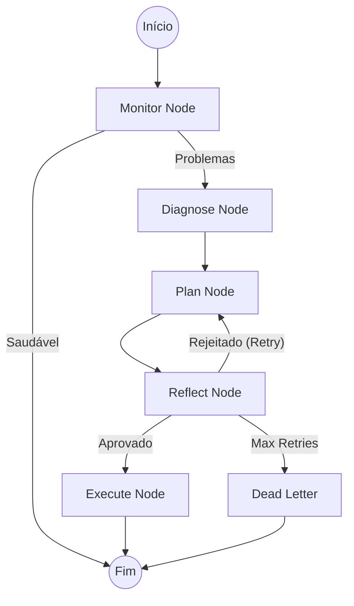

# Janus — Manual Completo

> **Documento Único de Referência (Single Source of Truth)**
>
> Este arquivo consolida toda a documentação do projeto Janus: arquitetura, configuração, uso, exemplos, estrutura de arquivos e troubleshooting.

---

## Índice

1.  [Visão Geral](#1-visão-geral)
2.  [Instalação e Configuração](#2-instalação-e-configuração)
3.  [Arquitetura e Estrutura do Projeto](#3-arquitetura-e-estrutura-do-projeto)
4.  [Guia de Uso e Processos](#4-guia-de-uso-e-processos)
5.  [Mecanismos e Componentes (Inventory)](#5-mecanismos-e-componentes-inventory)
6.  [Autonomia e Meta-Agente (Deep Dive)](#6-autonomia-e-meta-agente-deep-dive)
7.  [Exemplos Práticos](#7-exemplos-práticos)
8.  [Troubleshooting](#8-troubleshooting)
9.  [Roadmap e Futuro](#9-roadmap-e-futuro)
10. [Histórico de Versões (Release Notes)](#10-histórico-de-versões-release-notes)

---

## 1. Visão Geral

### 1.1 Objetivos e Princípios

O Janus foi projetado como uma **Arquitetura Cognitiva Resiliente (ACR)**: um sistema que não apenas responde, mas mantém contexto, aprende com o uso e se protege de falhas inevitáveis (provedores instáveis, limites de custo, latência variável e dados incompletos).

Pilares fundamentais:

- **Autonomia supervisionada**: loops de percepção-ação com um Meta-Agente que inspeciona a saúde do sistema e propõe ações corretivas.
- **Memória híbrida**: episódios em vetor (Qdrant) para recuperação difusa + grafo (Neo4j) para relações estruturadas + cache LRU/TTL para velocidade.
- **Eficiência de custo**: roteamento dinâmico que reserva modelos caros para raciocínio complexo e usa modelos baratos/locais para tarefas simples.
- **Resiliência por design**: circuit breakers, retries, timeouts, modo degradado e métricas para detecção precoce.
- **Contratos estáveis**: API unificada (`/api/v1`) para desacoplar frontend, workers e integrações externas.

### 1.2 Tecnologias e Componentes

- **Backend**: Python 3.11, FastAPI, Uvicorn.
- **LLM**: LangChain/LangGraph, OpenAI, Anthropic, Gemini, Ollama.
- **Datastores**: Neo4j (grafo), Qdrant (vetorial), MySQL (perfil/usuário).
- **Mensageria**: RabbitMQ.
- **Observabilidade**: Prometheus, Grafana.
- **Frontend**: Angular 20 + Material/CDK.
- **Deploy**: Docker e Docker Compose.

---

## 2. Instalação e Configuração

Este projeto utiliza Docker Compose para orquestrar todos os serviços.

### 2.1 Pré-requisitos
- Docker e Docker Compose.
- Python 3.11+ (para desenvolvimento local sem Docker, se desejado).
- Node.js 20+ (para desenvolvimento frontend local).

### 2.2 Quick Start
1.  **Clone o repositório.**
2.  **Configure o ambiente:**
    Crie um arquivo `janus/app/.env` (ou use variáveis de ambiente). Veja a seção de Variáveis abaixo.
3.  **Inicie os serviços:**
    ```bash
    docker compose up -d --build
    ```
4.  **Acesse:**
    -   API Backend: `http://localhost:8000/docs`
    -   Frontend: `http://localhost:4300`
    -   Grafana: `http://localhost:3000` (admin/admin)
    -   RabbitMQ: `http://localhost:15672` (guest/guest)

### 2.3 Variáveis de Configuração (`janus/app/config.py`)

**Aplicativo**
- `APP_NAME`, `APP_VERSION`, `ENVIRONMENT` (`development|staging|production`)
- `DRY_RUN` (`true|false`) — modo de simulação para operações de risco

**Bancos de Dados**
- `NEO4J_URI`, `NEO4J_USER`, `NEO4J_PASSWORD`
- `QDRANT_HOST`, `QDRANT_PORT`, `QDRANT_API_KEY` (opcional)

**LLMs e Roteamento**
- OpenAI: `OPENAI_API_KEY`, `OPENAI_MODEL_NAME`
- Gemini: `GEMINI_API_KEY`, `GEMINI_MODEL_NAME`
- Ollama: `OLLAMA_HOST`, `OLLAMA_ORCHESTRATOR_MODEL`
- Budgets: `LLM_BUDGETS_JSON`, `LLM_PRIORITIES_JSON`

**Memória**
- `MEMORY_SHORT_TTL_SECONDS`, `MEMORY_SHORT_MAX_ITEMS`
- `MEMORY_PII_REDACT` (`true|false`)

**Mensageria**
- `RABBITMQ_HOST`, `RABBITMQ_PORT`, `RABBITMQ_USER`, `RABBITMQ_PASSWORD`, `RABBITMQ_VHOST`

---

## 3. Arquitetura e Estrutura do Projeto

### 3.1 Estrutura de Arquivos

Mapeamento lógico dos ~750 arquivos do projeto:

```
/ (raiz)
├─ README.md                      # Este manual
├─ ROADMAP.md                     # Planejamento estratégico
├─ docker-compose.yml             # Orquestração
├─ front/                         # Frontend Angular
├─ janus/                         # Backend Python
│  ├─ app/
│  │  ├─ api/                     # Endpoints REST (/api/v1)
│  │  ├─ core/                    # Núcleo (LLM, Memória, Agentes)
│  │  │  ├─ agents/               # Meta-Agente (LangGraph)
│  │  │  ├─ autonomy/             # Planner e Policy Engine
│  │  │  ├─ llm/                  # Roteador e Clientes
│  │  │  ├─ memory/               # Qdrant e Neo4j Wrappers
│  │  │  ├─ tools/                # Registro de Ferramentas
│  │  │  └─ workers/              # Consumidores RabbitMQ
│  │  ├─ services/                # Regras de Negócio (Service Layer)
│  │  ├─ repositories/            # Acesso a Dados
│  │  ├─ models/                  # Schemas Pydantic
│  │  └─ main.py                  # Entrypoint
│  └─ tests/
```

### 3.2 Componentes Principais

1.  **Orquestração e API**: `janus/app/main.py` e `janus/app/api/v1/endpoints/`. Porta de entrada REST.
2.  **O Cérebro (LLM)**: `janus/app/core/llm/`. Gerencia roteamento (Fast vs Quality), cache e circuit breakers.
3.  **Memória (Hot & Cold)**:
    -   *Hot Path (Vetor)*: `janus/app/core/memory/memory_core.py` (Qdrant).
    -   *Cold Path (Grafo)*: `janus/app/core/workers/knowledge_consolidator_worker.py` (Neo4j).
4.  **Autonomia**: `janus/app/services/autonomy_service.py` e `janus/app/core/agents/meta_agent.py`. Ciclos de decisão autônomos.
5.  **Workers Assíncronos**: Processamento background via RabbitMQ (`janus/app/core/workers/`).

### 3.3 Fluxos de Dados

-   **Chat**: User -> API -> LLM Service -> Router -> Model -> Memory -> User.
-   **Consolidação**: Chat -> RabbitMQ -> Knowledge Worker -> Neo4j.
-   **Autonomia**: Timer -> Autonomy Service -> Meta-Agent -> Tools -> Action.

---

## 4. Guia de Uso e Processos

### 4.1 Autonomia (Heartbeat)
O sistema pode rodar em loop autônomo para monitoramento e manutenção.

-   **Iniciar**: `POST /api/v1/autonomy/start` (JSON: `{ "interval_seconds": 60, "risk_profile": "balanced" }`)
-   **Parar**: `POST /api/v1/autonomy/stop`
-   **Status**: `GET /api/v1/autonomy/status`

### 4.2 Metas (Goals)
O Janus opera orientado a metas quando em modo autônomo.
-   **Criar Meta**: `POST /api/v1/autonomy/goals` (`{ "title": "...", "priority": 5 }`)
-   O **Planner** quebrará a meta em passos e executará as ferramentas necessárias.

### 4.3 Chat e LLM
-   **Mensagem**: `POST /api/v1/chat/message`
-   **Stream**: `GET /api/v1/chat/stream/{conversation_id}`
-   **Invocação Direta**: `POST /api/v1/llm/invoke` (útil para testes de prompt).

### 4.4 Memória e Conhecimento
-   **Upload Documento**: `POST /api/v1/documents/upload`
-   **Consolidar Grafo**: `POST /api/v1/knowledge/consolidate` (Dispara worker para processar memórias recentes).
-   **Busca RAG**: `GET /api/v1/rag/search`

---

## 5. Mecanismos e Componentes (Inventory)

Esta seção lista os mecanismos do Janus, dividindo-os entre os que já possuem documentação consolidada e os que serão detalhados futuramente.

### ✅ Mecanismos Documentados (Core)

#### 🧠 Inteligência & Orquestração
- **LLM Routing (`janus/app/core/llm/router.py`)**: Roteamento dinâmico baseado em custo/latência.
- **Autonomy Loop (`janus/app/services/autonomy_service.py`)**: Ciclo OODA para operação autônoma.
- **Meta-Agente (`janus/app/core/agents/meta_agent.py`)**: Supervisor de alto nível em LangGraph.
- **Policy Engine (`janus/app/core/autonomy/policy_engine.py`)**: Governança de execução de ferramentas.

#### 💾 Memória & Conhecimento
- **Hot Path Vector (`janus/app/core/memory/memory_core.py`)**: Gravação rápida em Qdrant.
- **Cold Path Graph (`janus/app/core/workers/knowledge_consolidator_worker.py`)**: Consolidação assíncrona em Neo4j.
- **RAG Híbrido (`janus/app/core/memory/graph_rag_core.py`)**: Recuperação combinando vetores e grafo.

#### ⚙️ Infraestrutura & Workers
- **Message Broker (`janus/app/core/infrastructure/message_broker.py`)**: Wrapper resiliente para RabbitMQ.
- **Orchestrator (`janus/app/core/workers/orchestrator.py`)**: Gestão de ciclo de vida de workers.

---

### 🚧 Mecanismos Identificados (A Documentar)

Os componentes abaixo existem no código mas carecem de documentação detalhada neste manual.

#### Workers Especializados (`janus/app/core/workers/`)
- [ ] **Code Agent (`code_agent_worker.py`)**: Agente especializado em geração de código.
- [ ] **Professor Agent (`professor_agent_worker.py`)**: Agente revisor/crítico de código.
- [ ] **Data Harvester (`data_harvester.py`)**: Coletor de dados para fine-tuning.
- [ ] **Distillation Worker (`distillation_worker.py`)**: Processo de destilação de conhecimento.
- [ ] **Google Productivity (`google_productivity_worker.py`)**: Integração com Calendar/Gmail.
- [ ] **Neural Training (`neural_training_worker.py`)**: Pipeline de treinamento de modelos.
- [ ] **Red Team Agent (`red_team_agent_worker.py`)**: Testes adversariais internos.
- [ ] **Thinker Agent (`thinker_agent_worker.py`)**: Agente de raciocínio profundo (DeepSeek integration).

#### Serviços de Aplicação (`janus/app/services/`)
- [ ] **AB Testing (`ab_testing_service.py`)**: Framework de testes A/B para prompts/modelos.
- [ ] **Bias Check (`bias_check_service.py`)**: Verificação de viés em respostas.
- [ ] **Data Retention (`data_retention_service.py`)**: Políticas de expurgo de dados.
- [ ] **DB Migration (`db_migration_service.py`)**: Migrações de esquema de banco.
- [ ] **Dedupe Service (`dedupe_service.py`)**: Deduplicação de dados.
- [ ] **Document Parser (`document_parser_service.py`)**: Extração de texto de arquivos.
- [ ] **Feedback Service (`feedback_service.py`)**: Gestão de feedback de usuários.
- [ ] **Prompt Builder/Composer (`prompt_*_service.py`)**: Montagem dinâmica de prompts.
- [ ] **Semantic Commit (`semantic_commit_service.py`)**: Geração de mensagens de commit.
- [ ] **Scheduler (`scheduler_service.py`)**: Agendamento de tarefas recorrentes.

#### Core e Infraestrutura (`janus/app/core/`)
- [ ] **Evolution Manager (`evolution/evolution_manager.py`)**: Mecanismo de auto-evolução do sistema.
- [ ] **Self Study (`evolution/self_study_manager.py`)**: Rotina de aprendizado autônomo.
- [ ] **Janus Lab (`evolution/janus_lab.py`)**: Ambiente de experimentação isolado.
- [ ] **Senses (Vision/Audio)**: Capacidades multimodais em `janus/app/core/senses`.
- [ ] **Python Sandbox (`infrastructure/python_sandbox.py`)**: Isolamento de execução de código.
- [ ] **Windows Agent Client (`infrastructure/windows_agent_client.py`)**: Integração com agente desktop.
- [ ] **Firebase Integration (`infrastructure/firebase.py`)**: Uso de Firebase (auth/db).
- [ ] **Redis Manager (`infrastructure/redis_manager.py`)**: Gestão de cache distribuído.

---

## 6. Autonomia e Meta-Agente (Deep Dive)

O Janus implementa um ciclo **OODA (Observe, Orient, Decide, Act)** supervisionado por uma arquitetura avançada de **Meta-Agente**. Esta seção detalha o funcionamento interno, a máquina de estados (LangGraph) e as ferramentas utilizadas.

### 6.1 Visão Geral

O sistema de autonomia é composto por dois níveis hierárquicos:

1.  **Autonomy Loop (Nível Operacional):** Executa tarefas do dia a dia (conversar, pesquisar, gerar código). Gerenciado pelo `AutonomyService`.
2.  **Meta-Agente (Nível Estratégico/Supervisor):** Monitora a saúde do sistema, detecta anomalias (ex: aumento de latência, erros recorrentes) e altera a configuração do nível operacional (ex: resetar circuit breakers, limpar cache). Gerenciado pela classe `MetaAgent` via LangGraph.

### 6.2 O Meta-Agente (Supervisor)

O Meta-Agente não é apenas um script de monitoramento; é um agente cognitivo completo que "reflete" sobre o estado do sistema.

#### Arquitetura (LangGraph)

O Meta-Agente é implementado como um grafo de estados (`StateGraph`), permitindo ciclos de feedback e persistência.

**Arquivo Principal:** `janus/app/core/agents/meta_agent.py`

##### Os Nós do Grafo (The Nodes)

1.  **Monitor (`monitor_node_logic`)**:
    *   **Função:** Coleta métricas de saúde e uso de recursos.
    *   **Ferramentas:** `get_system_health_metrics`, `analyze_memory_for_failures`, `get_resource_usage`.
    *   **Saída:** Lista de `DetectedIssue` (se houver). Se saudável, o ciclo termina aqui.

2.  **Diagnose (`diagnosis_node_logic`)**:
    *   **Função:** Se problemas forem detectados, usa um LLM para analisar a causa raiz (`root_cause`) com base nas evidências.
    *   **Saída:** String de diagnóstico e nível de severidade.

3.  **Plan (`planning_node_logic`)**:
    *   **Função:** Gera um plano de correção estruturado (`PlanSchema`), sugerindo ações específicas (Recomendações).
    *   **Saída:** Lista de `RecommendationItem` (ex: "Aumentar timeout do Redis", "Reiniciar worker de consolidação").

4.  **Reflect (`reflection_node_logic`)**:
    *   **Função:** Crítica de segurança. O LLM avalia o próprio plano gerado no passo anterior.
    *   **Critérios:** O plano é seguro? Resolve o problema diagnosticado?
    *   **Decisão:**
        *   *Aprovado*: Segue para execução.
        *   *Rejeitado*: Retorna ao nó `Plan` para gerar uma nova estratégia (até `max_retries`).
        *   *Desistir*: Vai para `Dead Letter` se exceder tentativas.

5.  **Execute (`execution_node_logic`)**:
    *   **Função:** Despacha as tarefas recomendadas para os agentes ou serviços responsáveis.
    *   **Status:** Marca o ciclo como `completed`.

##### Estado do Agente (`AgentState`)

O estado é mantido em um `TypedDict` persistido entre reinicializações (via `MemorySaver` ou Postgres):

```python
class AgentState(TypedDict):
    cycle_id: str
    timestamp: float
    metrics: dict              # Snapshot de métricas
    detected_issues: list      # Problemas encontrados
    diagnosis: str             # Análise de causa raiz
    candidate_plan: list       # Plano proposto
    critique: dict             # Resultado da reflexão
    final_plan: list           # Plano aprovado
    retry_count: int           # Contador de tentativas de planejamento
```

### 6.3 Ferramentas do Meta-Agente

As ferramentas (`janus/app/core/agents/meta_agent_module/tools.py`) fornecem os "sentidos" para o Meta-Agente:

*   **`analyze_memory_for_failures(time_window_hours)`**: Consulta o Qdrant (memória episódica) buscando logs de erro recentes e agrupa por tipo.
*   **`get_system_health_metrics()`**: Agrega status de todos os componentes (RabbitMQ, Neo4j, LLM Pool, Circuit Breakers).
*   **`analyze_performance_trends(metric_name)`**: Analisa tendências (ex: latência subindo) usando estatística simples (média, p95).
*   **`get_resource_usage()`**: Retorna CPU, RAM e Disco do container atual via `psutil`.

### 6.4 O Autonomy Loop (Operacional)

Gerenciado pelo `AutonomyService` (`janus/app/services/autonomy_service.py`), este loop foca na execução de metas de usuário.

#### Ciclo de Execução (`_run_cycle`)

1.  **Perceber (Observe)**: Consulta métricas básicas e estado do `GoalManager`.
2.  **Planejar (Plan)**:
    *   Se não houver plano ativo, invoca o **Planner** (`janus/app/core/autonomy/planner.py`).
    *   O Planner usa o `ActionRegistry` para saber quais ferramentas estão disponíveis e gera uma sequência de passos JSON.
3.  **Executar (Act)**:
    *   Itera passo a passo.
    *   **Governança (`PolicyEngine`)**: Antes de cada ação, verifica:
        *   *Allowlist/Blocklist*: A ferramenta é permitida?
        *   *Risk Profile*: O perfil (Conservative/Balanced) permite essa ação? (ex: `write_file` pode exigir aprovação manual).
        *   *Rate Limit*: O limite de uso foi excedido?
    *   Se aprovado, executa a ferramenta e registra o resultado no histórico.
4.  **Replanejar (React)**:
    *   Se um passo falhar, o sistema pode entrar em `replan_goal`, onde o LLM decide se tenta novamente com novos argumentos ou aborta a meta.

#### Governança e Policy Engine

O `PolicyEngine` (`janus/app/core/autonomy/policy_engine.py`) é o "freio de segurança" do sistema. Ele garante que o agente não execute ações destrutivas sem permissão explícita, dependendo do nível de risco configurado (`CONSERVATIVE`, `BALANCED`, `AGGRESSIVE`).

### 6.5 Diagrama de Fluxo (Meta-Agente)



---

## 7. Exemplos Práticos

### Python (Requests)

**Invocar LLM:**
```python
import requests
resp = requests.post("http://localhost:8000/api/v1/llm/invoke", json={
  "prompt": "Status do sistema?",
  "role": "orchestrator",
  "priority": "fast_and_cheap"
})
print(resp.json())
```

**Agendar Treinamento:**
```python
requests.post("http://localhost:8000/api/v1/learning/train", json={
  "dataset_id": "ds-2024", "model": "bert", "epochs": 3
})
```

### cURL

**Listar Ferramentas:**
```bash
curl -s http://localhost:8000/api/v1/tools
```

**Status do Loop de Autonomia:**
```bash
curl -s http://localhost:8000/api/v1/autonomy/status
```

---

## 8. Troubleshooting

### Problemas Comuns

-   **RabbitMQ Indisponível**: Verifique credenciais e host no `.env`. A API entrará em modo degradado (sem workers).
-   **Qdrant 400 Bad Request**: IDs dos pontos devem ser UUIDs ou Inteiros.
-   **Circuit Breakers Abertos**: Verifique `GET /api/v1/llm/circuit-breakers`. Use o endpoint de reset se necessário.
-   **Treinamento Travado**: Verifique logs do container `janus-api` e se a fila `janus.neural.training` tem consumidores.

### Comandos de Diagnóstico
-   `docker compose logs -f janus-api`
-   `docker compose ps`
-   Acesse Grafana (`:3000`) para dashboards visuais.

---

## 9. Roadmap e Futuro

### Visão 2026 (Extrato)
O Janus evolui para uma arquitetura de **Meta-Agente** baseada em **LangGraph**, com foco em:
1.  **Interfaces Generativas (A2UI)**: UI criada dinamicamente pelos agentes.
2.  **GraphRAG Nativo**: Uso de `neo4j_graphrag` para recuperação híbrida avançada.
3.  **Human-in-the-Loop Centralizado**: Checkpoints persistentes no Postgres para aprovações.

### Roadmap Atual (`ROADMAP.md`)
-   [x] Migração para PostgreSQL (pgvector).
-   [x] Otimização Qdrant (Quantization).
-   [ ] Implementação de **Generative UI**.
-   [ ] Adoção completa de **LangGraph** para todos os sub-agentes.
-   [ ] Middleware de Segurança Nativo (PII Redaction).

---

## 10. Histórico de Versões (Release Notes)

### Versão 1.0.0
-   **Destaques**: Orquestração unificada de workers, Consolidação de conhecimento robusta, Meta-Agente integrado.
-   **Correções**: Fix de SyntaxError em f-strings no Code Agent; Validação de IDs no Qdrant.
-   **Breaking**: Validação estrita de IDs no Qdrant; Inicialização de workers falha se houver erros de sintaxe nos módulos.

---
> *Janus Project — Documentação Unificada.*
