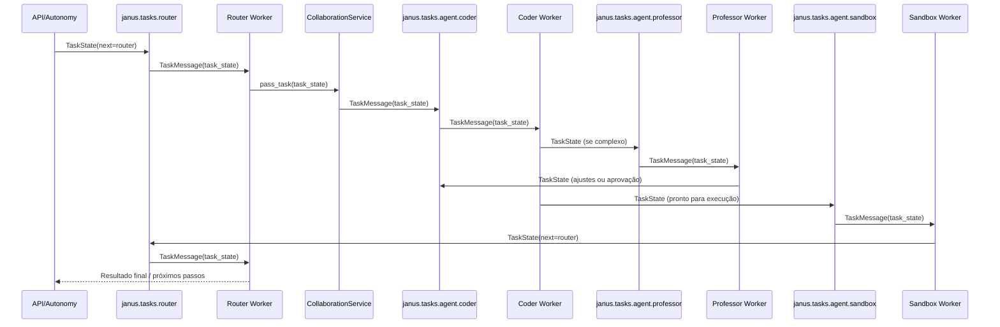

# Janus — Manual Completo

## Índice

- [1. Visão Geral](#1-visão-geral)
  - [1.1 Objetivos e Princípios](#11-objetivos-e-princípios)
  - [1.2 Filosofia de Design e Decisões Arquiteturais](#12-filosofia-de-design-e-decisões-arquiteturais)
  - [1.3 Tecnologias e Componentes](#13-tecnologias-e-componentes)
- [2. Arquitetura](#2-arquitetura)
  - [2.1 Topologia](#21-topologia)
  - [2.2 Camadas e Responsabilidades](#22-camadas-e-responsabilidades)
- [3. Processos Ponta a Ponta](#3-processos-ponta-a-ponta)
  - [3.1 Conversas e LLM Routing](#31-conversas-e-llm-routing)
  - [3.2 Memória e Conhecimento](#32-memória-e-conhecimento)
  - [3.3 Autonomia e Meta-Agente](#33-autonomia-e-meta-agente)
  - [3.4 Aprendizado Contínuo e Fine-Tuning](#34-aprendizado-contínuo-e-fine-tuning)
  - [3.5 Observabilidade](#35-observabilidade)
  - [3.6 Inicialização e Ciclo de Vida (Kernel e Daemon)](#36-inicialização-e-ciclo-de-vida-kernel-e-daemon)
  - [3.7 Parlamento (Router → Coder → Professor → Sandbox)](#37-parlamento-router--coder--professor--sandbox)
  - [3.8 Resiliência e Auto-Healing](#38-resiliência-e-auto-healing)
  - [3.9 Produtividade (Google)](#39-produtividade-google)
- [4. API de Backend](#4-api-de-backend)
  - [4.1 Superfície de Endpoints](#41-superfície-de-endpoints)
  - [4.2 Contratos](#42-contratos)
  - [4.3 Router e Modos de Exposição (Full vs Minimal)](#43-router-e-modos-de-exposição-full-vs-minimal)
  - [4.4 Middlewares, Autenticação e Envelope de Erros](#44-middlewares-autenticação-e-envelope-de-erros)
  - [4.5 Chat: Request/Response, Streaming e Eventos](#45-chat-requestresponse-streaming-e-eventos)
  - [4.6 Identidade: Auth, Users e Profiles](#46-identidade-auth-users-e-profiles)
  - [4.7 Governança Operacional: Consents e Pending Actions](#47-governança-operacional-consents-e-pending-actions)
  - [4.8 Mensageria: TaskMessage, Filas e Workers](#48-mensageria-taskmessage-filas-e-workers)
  - [4.9 Ferramentas e Sandbox](#49-ferramentas-e-sandbox)
  - [4.10 Documentos e RAG](#410-documentos-e-rag)
  - [4.11 Recipes Rápidos de Uso da API](#411-recipes-rápidos-de-uso-da-api)
- [5. Frontend (Site)](#5-frontend-site)
  - [5.1 Páginas e Fluxos](#51-páginas-e-fluxos)
  - [5.2 Integração com a API](#52-integração-com-a-api)
- [6. Ambientes e Deploy](#6-ambientes-e-deploy)
  - [6.1 Docker Compose](#61-docker-compose)
  - [6.2 Variáveis e Configuração](#62-variáveis-e-configuração)
- [7. Segurança e Governança](#7-segurança-e-governança)
  - [7.1 Consentimentos e Políticas](#71-consentimentos-e-políticas)
  - [7.2 Endurecimento e Segredos](#72-endurecimento-e-segredos)
- [8. Troubleshooting](#8-troubleshooting)
- [9. Referências e Código](#9-referências-e-código)

---

## 1. Visão Geral

### 1.1 Objetivos e Princípios

O Janus foi projetado como uma **Arquitetura Cognitiva Resiliente (ACR)**: um sistema que não apenas responde, mas mantém contexto, aprende com o uso e se protege de falhas inevitáveis (provedores instáveis, limites de custo, latência variável e dados incompletos).

Pilares fundamentais:

- **Autonomia supervisionada**: loops de percepção-ação com um Meta-Agente que inspeciona a saúde do sistema e propõe ações corretivas.
- **Memória híbrida**: episódios em vetor (Qdrant) para recuperação difusa + grafo (Neo4j) para relações estruturadas + cache LRU/TTL para velocidade.
- **Eficiência de custo**: roteamento dinâmico que reserva modelos caros para raciocínio complexo e usa modelos baratos/locais para tarefas simples.
- **Resiliência por design**: circuit breakers, retries, timeouts, modo degradado e métricas para detecção precoce.
- **Contratos estáveis**: API unificada (`/api/v1`) para desacoplar frontend, workers e integrações externas.

Referência rápida: [Project-Structure.md](docs/Project-Structure.md).

### 1.2 Filosofia de Design e Decisões Arquiteturais

O Janus segue um conjunto de decisões “conscientes” (trade-offs explícitos) para que o sistema seja sustentável em produção, e não apenas funcional em demo.

1. **Por que memória híbrida (vetor + grafo + cache)?**
   - *Problema*: vetores recuperam similaridade, mas não garantem consistência de relações (“A é pai de B”, “X depende de Y”). Grafos representam relações, mas não são bons para busca difusa a partir de texto longo.
   - *Decisão*: armazenar o “registro bruto” (episódios) no Qdrant e consolidar, em background, entidades e relações no Neo4j. O cache de curto prazo reduz custo/latência em interações repetidas e recentes.

2. **Por que o roteamento de LLM é obrigatório (e não opcional)?**
   - *Problema*: um único modelo é caro demais para tudo e, mesmo quando “o melhor”, pode falhar por rate limits ou indisponibilidade.
   - *Decisão*: seleção adaptativa por prioridade, custo estimado, saúde do provedor e histórico de latência/erros, com fallback automático.

3. **Por que existe um Meta-Agente separado do fluxo do usuário?**
   - *Problema*: sistemas reativos só descobrem problemas quando o usuário reclama.
   - *Decisão*: um supervisor em loop (LangGraph) que observa métricas, detecta anomalias e propõe planos, com etapa de reflexão/critique antes de executar ações.

4. **Por que “hot path” e “cold path” na consolidação do conhecimento?**
   - *Problema*: extrair conhecimento com LLM em tempo real aumenta latência e custo do chat.
   - *Decisão*: gravar rápido no hot path e consolidar depois, assincronamente, com workers dedicados.

### 1.3 Tecnologias e Componentes

- Backend: Python 3.11, FastAPI, Uvicorn — expõe `/api/v1`, `/metrics` e health checks, faz o bootstrap de serviços/infra e publica tarefas em filas.
- LLM: LangChain/LangGraph, provedores OpenAI/Anthropic/Gemini e fallback Ollama — encapsulam clientes, policies de roteamento, ferramentas e fluxos multi‑agente.
- Datastores: Neo4j (grafo), Qdrant (vetorial), MySQL (perfil/usuário) — sustentam memória híbrida (episódios + conhecimento estruturado) e dados transacionais de usuários.
- Mensageria: RabbitMQ — orquestra workers (consolidação, harvesting, fine‑tuning) e desacopla o caminho quente do frio.
- Observabilidade: Prometheus, Grafana — coletam métricas (LLM, memória, filas, API) e viabilizam alertas/diagnósticos.
- Frontend: Angular 20 + Material/CDK — fornece UI de chat, HUD de agentes, gestão de usuários e painéis operacionais básicos.
- Deploy: Docker e docker-compose — padronizam ambientes locais/homolog/produção, incluindo dependências externas (DB, Qdrant, Neo4j, RabbitMQ, Prometheus, Grafana).

Em termos práticos:

- Desenvolvedores backend atuam principalmente em `janus/app` (APIs, serviços, núcleo de LLM/memória).
- Desenvolvedores frontend atuam em `site/` (experiência do usuário, componentes Angular, chamadas de API).
- Operação/DevOps atua em `deploy/`, `docker-compose*.yml` e variáveis de ambiente para instrumentação, escalabilidade e segurança.

---

## 2. Arquitetura

### 2.1 Topologia

- Composição do app: [main.py](janus/app/main.py#L1-L300)
  - Inicialização paralela de Neo4j, Qdrant e RabbitMQ
  - Construção de serviços e repositórios
  - Arranque de workers
  - Exposição de `/metrics` e middlewares

Arquitetura (ASCII):

```text
   [Frontend Angular] --HTTP--> [FastAPI /api/v1]
      |                          |-- Services (LLM, Memory, Knowledge, Autonomy, Observability)
      |                          |-- Repos (Neo4j, Qdrant, RabbitMQ, MySQL)
      |                          |-- Core (LLM Router, Resilience, Monitoring)
      |                          |-- Workers (Consolidator, Harvester, Training)
      \--> /metrics ----> Prometheus ----> Grafana (dashboards)
```

Principais blocos do diagrama:

- Frontend Angular: autentica usuário, gerencia estado de conversa e consome `/api/v1/chat` e demais recursos.
- FastAPI /api/v1: recebe requisições, aplica middlewares (auth, logging, tracing), delega a serviços e traduz erros em envelopes estáveis de resposta.
- Services (LLM/Memory/Knowledge/Autonomy/Observability): implementam regras de negócio de alto nível, orquestram repositórios e encapsulam detalhes de provedores externos.
- Repos (Neo4j, Qdrant, RabbitMQ, MySQL): implementam acesso a dados com contratos estáveis, permitindo troca de fornecedores/infra sem impactar camadas superiores.
- Core (LLM Router, Resilience, Monitoring): concentra políticas de roteamento, controle de orçamento, rate limiting, circuit breaker, métricas e integrações de observabilidade.
- Workers (Consolidator, Harvester, Training): executam tarefas pesadas/assíncronas (consolidação de conhecimento, ingestão de documentos, jobs de treinamento/afinação).
- Prometheus/Grafana: coletam métricas expostas pelo backend (`/metrics`) e exibem dashboards para operação e tuning de políticas de LLM/memória.

### 2.2 Camadas e Responsabilidades

- API: [endpoints](janus/app/api/v1/endpoints) — definem contratos HTTP, validação e mapeamento entre requests/responses e serviços.
- Serviços: [services](janus/app/services) — traduzem casos de uso (chat, memória, conhecimento, autonomia) em chamadas coordenadas ao núcleo e repositórios.
- Núcleo: [core](janus/app/core) — implementa políticas de LLM, memória, ferramentas, workers e observabilidade compartilhadas por toda a aplicação.
- Persistência: [repositories](janus/app/repositories), [db](janus/app/db) — centralizam acesso a bancos, coleções vetoriais e grafos, incluindo mapeamentos de modelos de domínio.
- Configuração: [config.py](janus/app/config.py) — concentra leitura de variáveis de ambiente, flags de recursos e URLs de provedores/infra.

---

## 3. Processos Ponta a Ponta

### 3.1 Conversas e LLM Routing

O coração da interação é o roteador dinâmico de modelos, que decide "quem responde" baseado no contexto.

**Lógica de Decisão (Scoring):**
O `LLMRouter` calcula um score para cada modelo candidato:

- **Score = (Peso * Custo) + (Peso * Latência) + Penalidade de Erro**
- Se `Priority == FAST_AND_CHEAP`: O algoritmo favorece modelos locais (Ollama) ou modelos cloud de baixo custo (Gemini Flash).
- Se `Priority == HIGH_QUALITY`: Favorece modelos com maior capacidade de raciocínio (GPT-4o), ignorando custo marginal.
- **Fallback**: Se o modelo principal falhar (timeout/erro 5xx), o `CircuitBreaker` abre e o roteador tenta o próximo da lista automaticamente.

Fluxo:

```text
Frontend -> JanusApiService -> /api/v1/chat (ou /llm/invoke)
   -> LLMService -> get_llm(role, priority)
       -> llm_manager.get_llm(...) [cache, CB, budget]
           -> router.py: Seleciona Provider (OpenAI/Gemini/Ollama)
       -> cliente.send(prompt) [retry/timeout]
<- resposta + métricas (custo, tokens)
```

Referências:

- [router.py](janus/app/core/llm/router.py): Algoritmo de seleção e scoring.
- [llm_manager.py](janus/app/core/llm/llm_manager.py): Gestão de ciclo de vida e cache.

#### 3.1.1 Contratos do Chat (API)

O chat é exposto como um conjunto pequeno de contratos estáveis, com duas “experiências”:

1. **Request/Response** para integrações simples.
2. **SSE (Streaming)** para UI responsiva, métricas e eventos de agentes.

Principais endpoints:

- `POST /api/v1/chat/start` inicia uma conversa e retorna `conversation_id`.
- `POST /api/v1/chat/message` envia mensagem e retorna a resposta final.
- `GET /api/v1/chat/stream/{conversation_id}?message=...` retorna tokens via SSE.
- `GET /api/v1/chat/{conversation_id}/events` retorna eventos de agentes via SSE.

Referências:

- [chat.py](janus/app/api/v1/endpoints/chat.py)

#### 3.1.2 Sequência Lógica do Chat (Request/Response)

A lógica do chat segue uma sequência de responsabilidades para manter previsibilidade:

1. **Validação de entrada**: papel (`role`), prioridade (`priority`) e limites (ex.: mensagem > 10KB é rejeitada no SSE).
2. **Recuperação do estado da conversa**: histórico e persona (repositório de conversas).
3. **Enriquecimento com memória (RAG)**: se o `MemoryService` está disponível, busca experiências relevantes e anexa ao prompt.
4. **Construção do prompt final**: persona + histórico + resumo + memórias relevantes + mensagem atual.
5. **Invocação do LLM**: delegada ao `LLMService`, que aplica cache, budget e circuit breakers via roteador.
6. **Loop de ferramentas (se necessário)**: se o modelo respondeu com chamadas de ferramenta, executa e reinvoca o LLM com “observations”.
7. **Persistência de mensagens**: armazena a interação e atualiza métricas (tokens/custo/latência).
8. **Gatilhos assíncronos**: publica tarefas de consolidação/reflexão para melhoria contínua.

Exemplo simplificado (Request/Response):

```http
POST /api/v1/chat/message
Content-Type: application/json
Authorization: Bearer <token>

{
  "conversation_id": "uuid-da-conversa-ou-null",
  "message": "Explique o fluxo de memória do Janus.",
  "role": "user",
  "priority": "HIGH_QUALITY",
  "metadata": {
    "client": "web",
    "locale": "pt-BR"
  }
}
```

Resposta típica (campos ilustrativos):

```json
{
  "conversation_id": "uuid-resolvido",
  "message_id": "uuid-da-mensagem",
  "content": "Texto da resposta...",
  "usage": {
    "input_tokens": 1234,
    "output_tokens": 456,
    "cost_usd": 0.0031
  },
  "provider": {
    "name": "google_gemini",
    "model": "gemini-1.5-flash"
  }
}
```

Referências:

- [chat_service.py](janus/app/services/chat_service.py)
- [llm_service.py](janus/app/services/llm_service.py)

#### 3.1.3 Loop de Ferramentas (Tools) — “ReAct” Controlado

Quando o assistente precisa agir (buscar dados, operar recursos, executar ações), ele entra num loop controlado:

1. **Detectar tool calls**: a resposta do LLM é parseada.
2. **Executar ferramentas**: cada ferramenta roda com permissões, categorias e políticas.
3. **Anexar outputs ao contexto**: os resultados viram “System: Tool Output ...”.
4. **Reinvocar**: o LLM recebe o novo contexto e continua até não haver tool calls ou atingir `max_iterations`.

Esse design separa claramente:

- *Raciocínio* (LLM) de *Ação* (ToolService/ActionRegistry).
- *Falhas de ferramenta* de *falhas do provedor LLM*.

Referências:

- [chat_service.py](janus/app/services/chat_service.py)
- [tools](janus/app/core/tools)

#### 3.1.4 Streaming (SSE) — Protocolo de Eventos

O streaming resolve dois problemas práticos:

- UI precisa exibir tokens conforme chegam (latência percebida menor).
- O sistema precisa sinalizar erros/heartbeats/done de forma padronizada.

O endpoint SSE emite eventos como:

- `protocol`, `ack`, `token`, `heartbeat`, `done`, `error`.

Além do stream de tokens, existe um stream dedicado a **eventos de agentes** (HUD/observabilidade) que consome eventos publicados via broker.

Referências:

- [chat.py](janus/app/api/v1/endpoints/chat.py#L433-L534)

#### 3.1.5 Modos de Falha e Degradação

O chat foi desenhado para “falhar bem”:

- **Circuit breaker aberto**: bloqueia cedo (early-block) e evita cascata de timeouts.
- **Timeout/latência alta**: roteia para alternativas conforme prioridade.
- **Restrições de payload**: o SSE limita tamanho para evitar exaustão do servidor.
- **Memória indisponível**: o chat continua sem RAG (degradação graciosa).

#### 3.1.6 Detalhamento interno do `router.get_llm()`

O coração do roteamento de modelos está em [router.get_llm](janus/app/core/llm/router.py#L105-L525), que encapsula overrides dinâmicos, cache, política de custo e fallback:

1. **Overrides dinâmicos por config**  
   - Se o `config` opcional for passado, o método tenta sobrescrever `priority`, `exclude_providers`, `cache_key`, `provider`, `model` e `temperature`.  
   - Quando `provider` e `model` são definidos, o código primeiro tenta reutilizar um cliente já existente via `_get_from_pool(provider, model)`.  
   - Se não houver cliente em pool, ele instancia explicitamente o modelo selecionado (Ollama/OpenAI/Gemini) e registra o contador `LLM_ROUTER_COUNTER`.

2. **Modo `LOCAL_ONLY`: “cérebro soberano” no Ollama**  
   - Define `local_model_name` a partir do papel (`ModelRole`) usando `settings.OLLAMA_*_MODEL`.  
   - Se já existir uma instância em cache para esse modelo local, ela é retornada imediatamente.  
   - Caso contrário, instancia `ChatOllama` com parâmetros de desempenho (`OLLAMA_NUM_CTX`, `OLLAMA_NUM_THREAD`, `OLLAMA_NUM_BATCH`, `OLLAMA_GPU_LAYERS`, `OLLAMA_KEEP_ALIVE`).  
   - Executa `_health_check_ollama` com timeout ampliado para evitar falsos negativos no primeiro carregamento; falha crítica aqui levanta erro explícito (“nenhum modelo local carregado”).

3. **Catálogo de nuvem (Gemini e OpenAI)**  
   - Monta um `cloud_catalog` com entradas para `google_gemini` e `openai`, cada uma contendo:
     - `enabled`: booleano baseado na validade da chave (`_validate_*_key`).  
     - `initializer_factory`: factory que sabe instanciar o cliente correto para cada modelo.  
     - `models`: lista de modelos permitidos vinda de `settings.*_MODELS` ou de um default (`*_MODEL_NAME`).  
   - Esses dados alimentam os candidatos que serão avaliados pela estratégia adaptativa.

4. **Seleção adaptativa (FAST_AND_CHEAP / HIGH_QUALITY)**  
   - Para cada papel (`role.value`), o código lê `LLM_CLOUD_MODEL_CANDIDATES` (ex.: `"openai:gpt-4o"`, `"google_gemini:gemini-1.5-flash"`), construindo um mapa `provider -> {models}`.  
   - Em seguida:
     - Filtra provedores desabilitados, com circuito aberto (`_circuit_closed`) ou sem orçamento (`_budget_allows`).  
     - Pede ao `rate_limiter` se o modelo está disponível; se a utilização ultrapassar o limite, o candidato é ignorado.  
     - Busca o pricing via `_get_model_pricing` e estatísticas agregadas em `_model_stats` (latência média, taxa de sucesso).
   - Cada candidato recebe:
     - `cost_per_1k` (input + output),  
     - estimativa de custo esperado (`expected_k * cost_per_1k`), com teto por papel (`LLM_MAX_COST_PER_REQUEST_USD[role]`).  
   - Candidatos acima do teto são filtrados; o restante participa do **scoring**:
     - Para `FAST_AND_CHEAP`, o score combina custo normalizado, latência e penalidade de falha, ponderados pela `LLM_ECONOMY_POLICY` (`strict`, `balanced`, `quality`).  
     - Para `HIGH_QUALITY`, o score privilegia taxa de sucesso e latência, tratando custo como penalidade menor (ajustável via `alpha`).  
     - Penalizações acumuladas (`_model_penalty_factors`) reduzem o score de modelos problemáticos ao longo do tempo.
   - Métricas de score são exportadas por `LLM_SELECTION_SCORE` (por provedor) e `LLM_MODEL_SELECTION_SCORE` (por modelo).

5. **Exploração controlada (`LLM_EXPLORATION_PERCENT`)**  
   - Após ordenar os candidatos por score, o algoritmo pode, com probabilidade `explore_p`, promover um candidato alternativo em vez do primeiro.  
   - Cada decisão de exploração incrementa `LLM_EXPLORATION_DECISIONS` e gera log explicando a troca.

6. **Instanciação com retries implícitos no nível superior**  
   - Para cada candidato ordenado:
     - Chama a `initializer_factory(model_name)` e, em caso de sucesso, registra métricas, adiciona ao pool (`_add_to_pool`) e retorna o cliente.  
     - Falhas de inicialização são logadas com `warning`, e o próximo candidato é tentado.

7. **Fallback final para modelo local**  
   - Se nenhum modelo de nuvem pôde ser selecionado (ou estão desabilitados), o roteador recorre ao modelo local (Ollama) novamente, com novos logs e health check.  
   - Se ainda assim falhar, registra um log `critical` e levanta `RuntimeError("Sistema inoperável: nenhum LLM disponível.")`.

Em resumo, `get_llm()` encapsula uma **política de seleção multiobjetivo** (custo, latência, sucesso, orçamento, rate limit e exploração) e reduz fortemente o risco de “ficar sem modelo”, sempre tentando recuperar com o modelo local.

### 3.2 Memória e Conhecimento

O Janus implementa uma pipeline de dados conhecida como "Consolidação Assimétrica":

1. **Caminho Quente (Hot Path)**: A interação do usuário é salva imediatamente no **Qdrant** (vetor) como um "Episódio". Isso garante recuperação rápida (ms) para conversas recentes.
2. **Caminho Frio (Cold Path - Consolidação)**:
    - Um worker em background (`KnowledgeConsolidator`) acorda periodicamente.
    - Ele lê episódios recentes e usa um LLM (`KNOWLEDGE_CURATOR`) para extrair JSON estruturado: Entidades, Relacionamentos e Insights.
    - O **Graph Guardian** normaliza nomes (ex: "Py3" -> "Python") para evitar duplicação.
    - Os dados são mergeados no **Neo4j**, criando um grafo de conhecimento perene.

Fluxo:

```text
Texto -> embeddings -> Qdrant (Episódio)
   [Async Worker] -> LLM Extraction (JSON) -> Graph Guardian (Normalização) -> Neo4j (Grafo)
```

Referências:

- [memory_core.py](janus/app/core/memory/memory_core.py): Gestão de curto/longo prazo.
- [knowledge_consolidator_worker.py](janus/app/core/workers/knowledge_consolidator_worker.py): O "cérebro" da consolidação.
- [graph_guardian.py](janus/app/core/memory/graph_guardian.py): Normalização de entidades.

#### 3.2.1 Escrita (Memorização) — Segurança, Quotas e Cache

Quando uma experiência é adicionada, ela passa por um pipeline defensivo:

1. **Validação de tamanho**: evita persistir conteúdo excessivo.
2. **Quotas por origem**: limita itens/bytes por janela para impedir flooding.
3. **PII Redaction**: mascara padrões de dados sensíveis antes de gerar embeddings.
4. **Embedding**: gera vetor (sync/async) para indexação.
5. **Upsert no Qdrant**: persiste ponto com payload e metadados.
6. **Cache curto (LRU+TTL)**: melhora hit rate para contextos imediatos.

Na prática, isso significa:

- Origens diferentes (ex.: `chat`, `document_ingest`, `external_api`) podem ter limites de quota distintos.
- Padrões sensíveis (e‑mail, CPF, chaves, tokens) são minimizados antes de irem para embedding, reduzindo risco de vazamento em buscas vetoriais.
- Cada upsert no Qdrant inclui metadados mínimos para rastreabilidade (origem, timestamps, usuário, tipo de experiência).

Referências:

- [memory_core.py](janus/app/core/memory/memory_core.py)

#### 3.2.2 Leitura (Recall) — Recuperação para Enriquecimento do Prompt

O recall é usado para “trazer de volta” experiências relevantes:

1. A UI/serviço envia `query` (texto livre).
2. O serviço consulta o repositório com filtros (limit/min_score/janelas temporais).
3. O resultado retorna experiências com conteúdo + metadados + score.
4. O chat adiciona um resumo das experiências no prompt (RAG leve).

Referências:

- [memory_service.py](janus/app/services/memory_service.py)

#### 3.2.3 Indexação de Interações de Chat (Memória por Usuário)

Além da memória “episódica do sistema”, o Janus também indexa interações de chat por usuário:

1. Gera embedding do conteúdo.
2. Persiste no Qdrant em coleção por usuário (`user_{user_id}`).
3. Aplica limite de pontos por usuário para evitar crescimento infinito.
4. Suprime erros para não quebrar o chat (best-effort).

Referências:

- [memory_service.py](janus/app/services/memory_service.py#L131-L195)

#### 3.2.4 Consolidação Assíncrona (RabbitMQ) — Do Episódio ao Grafo

A consolidação roda fora do chat:

1. O chat publica uma tarefa de consolidação (batch ou single) na fila.
2. Um worker consome, extrai JSON com entidades/relacionamentos e persiste no Neo4j.
3. Opcionalmente publica um evento para HUD da conversa quando algo novo foi conectado.

Referências:

- [async_consolidation_worker.py](janus/app/core/workers/async_consolidation_worker.py)
- [knowledge_consolidator_worker.py](janus/app/core/workers/knowledge_consolidator_worker.py)

#### 3.2.5 Documentos Pessoais (Ingestão) — Upload/Link e Indexação Vetorial

Além da memória do chat, o Janus suporta ingestão de documentos por usuário para alimentar buscas e citar evidências em respostas.

O fluxo segue o mesmo design de hot/cold path, com uma diferença importante: o documento já entra como “chunks” vetorizados no Qdrant, prontos para busca semântica.

Sequência lógica (upload/link):

1. **Resolver usuário**: `X-User-Id` (ou `user_id` explícito).
2. **Validar tamanho e quota**:
   - limita tamanho do arquivo (ex.: `DOCS_MAX_FILE_SIZE_BYTES`).
   - verifica quota aproximada de pontos (`DOCS_MAX_POINTS_PER_USER`).
3. **Extrair texto**: por tipo (`text/plain`, `text/html`, `pdf`, `docx`).
4. **Chunking com overlap**: `DOC_CHUNK_SIZE` (default 1000) e `DOC_CHUNK_OVERLAP` (default 100).
5. **Embeddings em lote**: gera vetores para os chunks.
6. **Upsert no Qdrant**: grava em coleção por usuário (`user_{user_id}`).
7. **Deduplicação por conteúdo**:
   - calcula `content_hash` (texto normalizado) por chunk.
   - marca `metadata.status = duplicate|unique`.
8. **Auditoria e métricas**: registra eventos e incrementa contadores (best-effort).

Metadados gravados por chunk (payload do ponto):

- `metadata.type = "doc_chunk"`
- `metadata.user_id`, `metadata.doc_id`, `metadata.file_name`
- `metadata.timestamp` (ms), `metadata.index` (índice do chunk)
- `metadata.content_hash`, `metadata.status` (`duplicate|unique`)
- `metadata.conversation_id` (quando o documento está ligado a uma conversa)
- `content` truncado para ~2000 caracteres por chunk (para reduzir payload)

Referências:

- Endpoint de upload/link/status/list/delete: [documents.py](janus/app/api/v1/endpoints/documents.py)
- Serviço de extração/chunking/dedupe/upsert: [document_service.py](janus/app/services/document_service.py)

#### 3.2.6 RAG (Recuperação) — Busca Vetorial, Filtros e Citações

O RAG no Janus é um mecanismo de recuperação de trechos com **citações explícitas**. Em vez de “inventar uma resposta”, o endpoint devolve:

- `answer`: trechos curtos (snippets) extraídos dos resultados mais relevantes.
- `citations`: lista de evidências com `id`, `score` e metadados (doc_id, origem, etc.).

O design é deliberadamente simples: a API de RAG devolve “matéria-prima” citável para ser composta no prompt (ou exibida na UI) sem acoplar geração de resposta ao retrieval.

Características operacionais:

- **Filtro anti-duplicata por padrão**: `status_not = "duplicate"`.
- **Filtros por metadados**: `type`, `origin`, `metadata.doc_id`, `metadata.file_path`.
- **Controle de qualidade**: `min_score` limita trechos fracos; `limit` controla custo/latência.
- **Observabilidade**: contadores e histogramas por endpoint (sucesso/erro/latência/score).

Referências:

- Endpoints RAG: [rag.py](janus/app/api/v1/endpoints/rag.py)
- MemoryService (recall com filtros): [memory_service.py](janus/app/services/memory_service.py)

#### 3.2.7 Detalhamento interno do `MemoryCore` (Qdrant + Cache + Resiliência)

O [MemoryCore](janus/app/core/memory/memory_core.py#L1-L200) implementa a camada de memória episódica sobre Qdrant com quotas, criptografia e cache de curto prazo:

1. **Quotas por origem (anti-flood)**  
   - Cada origem (`origin`) mantém um registro `{window_start, items, bytes}`.  
   - A janela é controlada por `MEMORY_QUOTA_WINDOW_SECONDS`; ao expirar, a contagem é resetada.  
   - Antes de gravar um novo episódio, o código verifica se `items + 1` ou `bytes + content_bytes` excedem `MEMORY_QUOTA_MAX_ITEMS` ou `MEMORY_QUOTA_MAX_BYTES`.  
   - Em excesso, incrementa `memory_quota_rejections_total` e lança `ValueError("Cota de memorização excedida para a origem")`.

2. **Memorização (`memorize` / `astore`) com PII redaction e criptografia**  
   - O conteúdo bruto é inspecionado para PII quando `MEMORY_PII_REDACT` está ativo; `_redact_pii()` devolve `redacted_content` e uma lista `pii_detected`.  
   - O embedding é gerado por `aembed_text(redacted_content)`; falhas geram um vetor nulo (proteção contra indisponibilidade do serviço de embeddings).  
   - O timestamp é normalizado em milissegundos (`ts_ms`); se o `Experience.timestamp` for inválido, usa `datetime.now(UTC)`.  
   - O texto é criptografado por `encrypt_text`, e o método de criptografia (`enc`) é armazenado em `metadata`.  
   - PII detectada é registrada em `metadata.pii`, juntamente com a flag `metadata.pii_redacted = True`.  
   - O payload final é montado a partir de `experience.dict()`, com `content` criptografado, `ts_ms` e `metadata` enriquecido (incluindo o `type` para filtros offline).

3. **IDs compatíveis com Qdrant e upsert resiliente**  
   - O helper `_ensure_valid_point_id` tenta converter o `experience.id` em `int`; se falhar, checa se é UUID; caso contrário, derivado determinístico via `uuid5`.  
   - Cria `PointStruct` com `id`, `payload` e `vector`.  
   - Se `_offline` for `False`, tenta `client.upsert(...)` dentro de um span de tracing (`memory.upsert`) com atributos `janus.user_id`, `janus.trace_id`, coleção e point id.  
   - Falhas de upsert apenas geram `warning` e marcam `_offline = True`, mas não quebram o fluxo — o item ainda estará disponível em cache.

4. **Cache de curto prazo (LRU + TTL)**  
   - Cada memorização adiciona a experiência em `_short_cache` com `expires_at`, vetor, metadados e conteúdo criptografado.  
   - O cache é mantido com limite `MEMORY_SHORT_MAX_ITEMS`; ao exceder, remove o item mais antigo (política LRU).  
   - `memory_short_cache_size` expõe o tamanho atual; erros de métricas são silenciosamente ignorados para não afetar o hot path.

5. **Recall combinado (`arecall`)**  
   - Gera o vetor da consulta com `aembed_text(query)`; em falha, usa vetor nulo para evitar quebrar a recuperação.  
   - Varre o cache:
     - Remove itens expirados.  
     - Limita o número de itens avaliados (`MEMORY_SHORT_SCAN_MAX_ITEMS`) para controlar custo.  
     - Calcula similaridade de cosseno via `_cosine_similarity(query_vector, vec)` e cria `ScoredExperience` com conteúdo **descriptografado** (`decrypt_text`).  
   - Se `_offline` estiver marcado, tenta reviver a conexão com `_try_revive_connection`; caso contrário, continua em modo cache-only.

6. **Busca Qdrant com circuito e retry progressivo**  
   - Quando online, `arecall` define uma função interna `_search` decorada com `@resilient` (retry com backoff e circuit breaker `self._cb`).  
   - Usa `get_timeout_recommendation("qdrant_search", QDRANT_DEFAULT_TIMEOUT_SECONDS)` para definir o timeout base; cada tentativa reduz o timeout progressivamente (`0.8**current_attempt`, com piso de 5s).  
   - Chama `client.query_points` com `limit`, `with_payload=True` e timeout em segundos.  
   - O tempo de busca é registrado em `record_latency("qdrant_search", ...)`.  
   - Os resultados são convertidos em `ScoredExperience`, descriptografando o conteúdo e preservando metadados.

7. **Fallback e combinação de resultados**  
   - Qualquer exceção na busca Qdrant gera logs detalhados com o estado do circuit breaker, flag `offline_mode`, tamanho do cache e características do vetor.  
   - Se o circuito estiver aberto, um log `critical` indica que chamadas ao Qdrant estão bloqueadas e que apenas o cache será usado.  
   - Em seguida, `_offline` é marcado como `True`.  
   - Cache e Qdrant são combinados em um dicionário por `id`, mantendo apenas o item com maior `score`.  
   - Aplica `min_score` se fornecido e corta a lista até `limit`.  
   - `memory_short_cache_hits_total` ou `memory_short_cache_misses_total` são atualizados conforme ache ou não itens em cache, e `memory_operations_total{operation="recall"}` registra a operação.

8. **Busca filtrada (`arecall_filtered`)**  
   - Constrói um `models.Filter` a partir de `filters` via `_build_filter`, com suporte a shorthand (`origin`, `status` → `metadata.origin`, `metadata.status`).  
   - Gera vetor de consulta opcional (pode usar vetor nulo quando `query` é `None`).  
   - Em modo offline, tenta reviver a conexão; se não conseguir, retorna lista vazia (buscas filtradas complexas não têm fallback no cache).  
   - Executa `query_points` com `query_filter`, registra latência e transforma em `ScoredExperience`.  
   - Aplica `min_score` e registra `memory_operations_total{operation="recall_filtered"}`.

O resultado é um subsistema de memória que **degrada graciosamente**: mesmo com Qdrant indisponível, o sistema continua operando com cache e quotas bem definidas, sem vazar PII em texto claro.

### 3.3 Autonomia e Meta-Agente

O Meta-Agente não é apenas um script, mas um **Grafo de Estado (LangGraph)** que implementa um loop OODA (Observe, Orient, Decide, Act) com um passo extra de Reflexão (Crítica).

**Ciclo de Vida do Meta-Agente:**

1. **Monitor**: Coleta métricas de CPU, RAM e latência de LLM. Se tudo estiver "verde", o ciclo encerra.
2. **Diagnose**: Se algo está errado (ex: latência > 2s), o LLM analisa a causa raiz.
3. **Plan**: O LLM propõe uma correção (ex: "Resetar Circuit Breaker da OpenAI").
4. **Reflect (Segurança)**: O LLM "critica" o próprio plano. "Isso é seguro? Vai quebrar algo?". Se aprovado, segue.
5. **Execute**: Executa a ferramenta correta.

Visualização do Grafo:

```text
START -> Monitor --(healthy)--> END
            |
       (unhealthy)
            v
        Diagnose -> Plan -> Reflect --(approved)--> Execute -> END
                               |
                            (retry)
                               v
                              Plan
```

Referências:

- [autonomy.py endpoints](janus/app/api/v1/endpoints/autonomy.py)
- [meta_agent.py](janus/app/core/agents/meta_agent.py): Implementação do LangGraph.

#### 3.3.1 Autonomia (Loop) — O que muda em relação ao Chat

O loop de autonomia é a generalização do “loop de ferramentas” para objetivos de longo prazo:

- No chat, a unidade é “uma mensagem”.
- Na autonomia, a unidade é “um ciclo”, com quotas de tempo e número de ações por ciclo.

O controle do risco é obrigatório porque ferramentas podem alterar estado do mundo:

1. O agente propõe uma ação.
2. O `PolicyEngine` valida permissões vs perfil de risco.
3. A ação é executada (ou bloqueada) e o resultado volta para o agente.

Referências:

- [policy_engine.py](janus/app/core/autonomy/policy_engine.py)

#### 3.3.2 Policy Engine — Regras mínimas antes de agir

O Policy Engine aplica quatro camadas simples, mas eficazes:

1. **Blocklist/Allowlist**: bloqueia ferramentas explicitamente proibidas e permite exceções em perfis mais agressivos.
2. **PermissionLevel vs RiskProfile**:
   - `conservative`: bloqueia perigosas; `write` exige confirmação (ou auto_confirm).
   - `balanced`: permite `write`; perigosas só com allowlist.
   - `aggressive`: permite quase tudo; perigosas ainda precisam allowlist.
3. **Rate limit**: impede spam de ferramenta (protege custo e estabilidade).
4. **Quota por ciclo**: limita duração e quantidade de ações (evita loops infinitos).

Referências:

- [policy_engine.py](janus/app/core/autonomy/policy_engine.py#L35-L116)

#### 3.3.2.1 Detalhamento interno do `PolicyEngine.validate_tool_call()`

Em [policy_engine.py](janus/app/core/autonomy/policy_engine.py#L11-L129), o `PolicyEngine` implementa as regras acima de forma concreta:

1. **Configuração de risco (`PolicyConfig`)**  
   - `risk_profile`: `"conservative"`, `"balanced"` ou `"aggressive"`.  
   - `auto_confirm`: se `True`, o sistema pode “auto-confirmar” algumas ações; se `False`, exige confirmação humana para ferramentas sensíveis.  
   - `allowlist` e `blocklist`: conjuntos de nomes de ferramentas.  
   - `max_actions_per_cycle` e `max_seconds_per_cycle`: limites duplos para o loop de autonomia.

2. **Ciclo de cota por loop**  
   - `reset_cycle_quota()` reinicia contadores de tempo e de ações (`_cycle_started_at`, `_actions_in_cycle`).  
   - `can_continue_cycle()` verifica se:
     - o tempo decorrido desde `_cycle_started_at` não excede `max_seconds_per_cycle`, e  
     - o número de ações já executadas não ultrapassa `max_actions_per_cycle`.  
   - Se qualquer limite for excedido, o loop deve encerrar ou aguardar o próximo ciclo.

3. **Permissão vs perfil de risco** (`_check_permission_vs_risk`)  
   - Recebe os metadados da ferramenta (`ToolMetadata`) com o `permission_level` (READ_ONLY, SAFE, WRITE, DANGEROUS).  
   - Em modo **conservative**:
     - READ_ONLY/SAFE: sempre permitido.  
     - WRITE: permitido somente se `auto_confirm=True`; caso contrário, marca `require_confirmation=True`.  
     - DANGEROUS: sempre bloqueado, com reason explicando a recusa.  
   - Em modo **balanced**:
     - READ_ONLY/SAFE/WRITE: permitidos.  
     - DANGEROUS: só permitido se o nome da ferramenta estiver na `allowlist`.  
   - Em modo **aggressive**:
     - Todas as ferramentas são permitidas, exceto DANGEROUS fora da `allowlist`.  
     - Aqui, assume-se que `auto_confirm` normalmente será `True`.

4. **Fluxo de decisão em `validate_tool_call(tool_name, input_args)`**  
   - Verifica blocklist global: se `tool_name` está na `blocklist`, retorna `allowed=False`.  
   - Obtém a ferramenta e seus metadados a partir do `action_registry`; se não estiver registrada, bloqueia.  
   - Aplica o rate limit do registro: se `check_rate_limit` falhar, bloqueia com reason apropriado.  
   - Chama `_check_permission_vs_risk(meta)`; qualquer `allowed=False` encerra o fluxo e retorna a decisão (com possível motivo).  
   - Se a ferramenta marcar `requires_confirmation` e `auto_confirm=False`, retorna `allowed=False`, `require_confirmation=True`.  
   - Caso contrário, incrementa `_actions_in_cycle` e retorna `PolicyDecision(allowed=True)`.

Na prática, isso significa que todo uso de ferramentas no loop de autonomia passa por **camadas de proteção explícitas** antes de qualquer ação tocar o “mundo real”.

#### 3.3.3 Reflexion (Qualidade) — Detecção de Falhas e Sinais

O Reflexion funciona como uma auditoria assíncrona da eficiência:

1. O chat publica uma tarefa de reflexão com o contexto mínimo.
2. O worker executa um ciclo de reflexão e calcula `best_score`.
3. Se o score ficar abaixo do limiar, publica um sinal de falha para o sistema reagir (ex.: degradar estratégia, ajustar prompt, registrar lição).

Referências:

- [reflexion_worker.py](janus/app/core/workers/reflexion_worker.py)

#### 3.3.4 Meta-Agente (LangGraph) — Detalhamento do Grafo de Estado

O [MetaAgent](janus/app/core/agents/meta_agent.py#L640-L870) implementa o grafo OODA via LangGraph, com persistência opcional:

1. **Graph Builder e Checkpointer**  
   - `MetaAgentGraphBuilder.build()` cria um `StateGraph(AgentState)` com nós nomeados: `monitor`, `diagnose`, `plan`, `reflect`, `execute`, `dead_letter`.  
   - Configura:
     - `START -> monitor`;  
     - `monitor --(healthy)--> END`, `monitor --(unhealthy)--> diagnose`;  
     - `diagnose -> plan -> reflect`;  
     - `reflect --(approved)--> execute -> END`;  
     - `reflect --(retry)--> plan`;  
     - `reflect --(give_up)--> dead_letter -> END`.  
   - Quando o `SqliteSaver` está disponível, o grafo é compilado com checkpointer, permitindo “time travel” e reprocessamento seguro.

2. **Estado inicial e ciclo**  
   - `run_analysis_cycle()` inicializa um `AgentState` (TypedDict) com:
     - `cycle_id`, `timestamp`,  
     - `metrics`, `detected_issues`, `diagnosis`,  
     - `candidate_plan`, `critique`, `final_plan`, `execution_results`,  
     - `status`, `retry_count`, `max_retries`.  
   - Usa `self.app.ainvoke(initial_state, config={"configurable": {"thread_id": "meta_agent_main_thread"}})` para executar o grafo completo.  
   - Ao final, converte o estado em um `StateReport` fortemente tipado e atualiza `last_report`.

3. **Nó Monitor (coleta de métricas)**  
   - `monitor_node_logic` chama, em paralelo:
     - `get_system_health_metrics`,  
     - `analyze_memory_for_failures` (últimas 24h),  
     - `get_resource_usage`.  
   - Empacota isso em `metrics = {"health": ..., "failures": ..., "resources": ...}`.  
   - Se alguma métrica indicar `"status": "unhealthy"`, adiciona um `DetectedIssue` de alta severidade (`IssueSeverity.HIGH`, categoria `RELIABILITY`).  
   - Se `analyze_memory_for_failures` reportar falhas, adiciona outro `DetectedIssue` (`mem_failures`).  
   - Retorna um update parcial: `{"metrics": metrics, "detected_issues": issues, "status": "monitoring"}`.

4. **Nó Diagnosis (causa raiz via LLM + Pydantic)**  
   - `diagnosis_node_logic` constrói um prompt com as métricas e exige saída JSON compatível com `DiagnosisSchema` (root_cause, severity, confidence).  
   - Usa `_invoke_llm` com timeout estendido; depois extrai o JSON com `_extract_json`.  
   - Valida o JSON com `DiagnosisSchema.model_validate_json`.  
   - Se a severidade for `critical`, adiciona mais um `DetectedIssue` para sinalizar prioridade máxima.  
   - O diagnóstico final é uma string consolidada (`[SEVERITY] causa (Conf: x.y)`), armazenada em `diagnosis`.

5. **Nó Plan (plano de ação)**  
   - Usa o LLM para gerar um plano estruturado compatível com `PlanSchema`:
     - lista de `RecommendationItem` com `title`, `description`, `priority (1-5)`, `suggested_agent` (`sysadmin|coder|monitor`), `category`.  
   - Valida o JSON de resposta; em caso de falha, retorna uma lista vazia de recomendações.  
   - O resultado alimenta `candidate_plan` no estado.

6. **Nó Reflect (crítica do plano)**  
   - `reflection_node_logic` cria um prompt com:
     - o `diagnosis`,  
     - o `candidate_plan` em JSON,  
     - o schema de `CritiqueSchema` (approved, reason, safe_subset_ids).  
   - Pede explicitamente que o LLM responda em JSON compatível com esse schema.  
   - Se o plano estiver vazio, marca `approved=False` e incrementa `retry_count`.  
   - Se a crítica não for aprovada, aumenta `retry_count` e delega ao LangGraph decidir se volta para `plan` (retry) ou segue para `dead_letter` quando `retry_count >= max_retries`.

7. **Nó Execute e Dead Letter**  
   - `execution_node_logic` hoje apenas consolida o `candidate_plan` em `final_plan`, marcando `status="executed"` — a execução real pode ser feita por outros agentes.  
   - `_node_dead_letter_wrapper` registra um log `critical` para ciclos que ultrapassam o número máximo de retries, com status `"dead_letter"`.

Em conjunto, o Meta-Agente fornece uma camada de **auto-diagnóstico e auto-planejamento** que observa o sistema de fora, com histórico persistente (via LangGraph + SQLite quando habilitado).

### 3.4 Aprendizado Contínuo e Fine-Tuning

O Janus não é estático; ele melhora com o uso através do subsistema de Harvesting.

**Pipeline de Dados (Data Harvester):**

1. **Coleta**: O `DataHarvester` varre o Qdrant em busca de interações de alta qualidade (baseado em feedback ou score implícito).
2. **Normalização**: Converte logs brutos em pares `{prompt, completion}`.
3. **Deduplicação**: Usa hash SHA-256 para evitar treinar com dados repetidos.
4. **Persistência**: Salva em `training_data.jsonl` (formato JSON Lines padrão para fine-tuning OpenAI/Gemini).

Fluxo:

```text
Memory Repo -> [Harvester] -> Filter & Dedupe -> training_data.jsonl -> Fine-Tuning Job
```

**Experimentação A/B**:
O sistema suporta testes A/B de modelos (`ABExperimentModels`), permitindo servir 50% das requisições com o Modelo A e 50% com o B, comparando métricas de satisfação.

Referências:

- [data_harvester.py](janus/app/core/workers/data_harvester.py): Coleta e preparação de dataset.
- [ab_experiment_models.py](janus/app/models/ab_experiment_models.py): Definição de experimentos.

#### 3.4.1 Retenção e Segurança do Dataset

O harvester aplica mecanismos práticos para manter o dataset utilizável:

- **Deduplicação por hash**: evita enviesar treino com repetições.
- **Política de retenção**: mantém as últimas ~2000 linhas para controlar tamanho.
- **Sanitização e limites**: normaliza texto e limita tamanho para reduzir ruído e PII acidental.

Referências:

- [data_harvester.py](janus/app/core/workers/data_harvester.py#L117-L166)

### 3.5 Observabilidade

Fluxo:

```text
Instrumentator -> /metrics
Dashboards Grafana (janus-overview, janus-llm-performance, janus-chat-overview)
```

Referências:

- [observability](janus/observability)
- [grafana dashboards](janus/grafana/dashboards)

#### 3.5.1 O que medir (e por quê)

Observabilidade no Janus é parte do design, não um “extra”:

- **Latência**: detecta degradação antes do usuário reclamar.
- **Erros por código**: identifica falhas sistêmicas (CircuitOpen, timeouts, payloads grandes).
- **Tokens e custo**: controla budget por papel (role) e prioridade.
- **Eficiência de cache**: mede cache hit/miss para validar otimizações.
- **Saúde de serviços**: monitora Qdrant/Neo4j/RabbitMQ para acionar modo degradado com antecedência.

---

### 3.6 Inicialização e Ciclo de Vida (Kernel e Daemon)

O Janus tem dois modos de “subir e rodar”, que compartilham o mesmo núcleo:

1. **Modo API (FastAPI)**: usado para servir `/api/v1/*`.
2. **Modo Daemon (Jarvis Mode)**: um processo long-running com watchdog, útil para operação contínua e loops (ex.: voz).

#### 3.6.1 Modo API: FastAPI lifespan → Kernel.startup()

A fonte de verdade do lifecycle do backend (modo API) é o `lifespan()` do FastAPI, em [main.py](janus/app/main.py#L25-L92), que chama o Kernel:

1. **Criação do Kernel**: `Kernel.get_instance()`.
2. **Infraestrutura**: `kernel.startup()` inicializa Neo4j, Qdrant e RabbitMQ em paralelo, além de MySQL (best-effort) e Firebase (opcional).
3. **Injeção em `app.state`**: mapeia `*_service`, `*_repo` e infra para os routers (compatibilidade/DI pragmático).
4. **Pronto para requests**: só depois disso a API começa a atender com consistência.

Referências:

- Lifecycle da API: [main.py](janus/app/main.py#L25-L92)
- Startup do Kernel: [kernel.py](janus/app/core/kernel.py#L133-L201)

#### 3.6.2 O que o Kernel inicializa (ordem lógica)

O `Kernel.startup()` segue uma ordem que evita “meio sistema” rodando:

1. **Logging**: setup global.
2. **Infra (paralelo)**: `initialize_graph_db()`, `initialize_memory_db()`, `initialize_broker()` e init do MySQL (best-effort).
3. **Atores do Multi-Agent System** (memória interna, não RabbitMQ): cria papéis base (PM, coder, researcher, sysadmin).
4. **Grafo de dependências**: cria repositórios e serviços (Knowledge, Memory, LLM, Chat, etc).
5. **Tools de OS**: registra ferramentas de sistema (“perigosas”) para capacidades agentic (quando habilitadas).
6. **Observabilidade**: dispara health checks iniciais e inicia o monitoramento periódico.
7. **Workers de background do Kernel**: consolidador, harvester, life-cycle, meta-agent e scheduler.
8. **Warm-up LLM**: pré-aquece provedores configurados (não bloqueante).
9. **Auto-index do codebase** (opcional): se o grafo estiver “vazio”, dispara indexação em background.

Referências:

- Startup (infra → serviços → workers): [kernel.py](janus/app/core/kernel.py#L133-L400)
- Registro de OS tools: [kernel.py](janus/app/core/kernel.py#L184-L190)

#### 3.6.3 Modo Daemon: loop contínuo + watchdog

O modo daemon, em [daemon.py](janus/app/interfaces/daemon/daemon.py), roda o `Kernel.startup()` num loop “restarting”, com backoff em falhas e batimentos (heartbeat) para detecção de travamentos.

Sequência:

1. Inicia watchdog e registra componente monitorado (`daemon_main`).
2. Inicia o Kernel.
3. Entra em loop operacional (ex.: voz quando habilitado).
4. Em falha crítica: tenta restart com backoff e limiares anti-flapping.

Referências:

- Daemon/Jarvis Mode: [daemon.py](janus/app/interfaces/daemon/daemon.py#L11-L114)
- Watchdog: [watchdog.py](janus/app/core/monitoring/watchdog.py#L23-L87)

### 3.7 Parlamento (Router → Coder → Professor → Sandbox)

O “Parlamento” é um pipeline multi-agente via RabbitMQ, onde um estado compartilhado (`TaskState`) é roteado entre papéis especializados até concluir a tarefa.

#### 3.7.1 Contrato: TaskState (estado compartilhado)

O `TaskState` é o envelope que atravessa o pipeline:

- `original_goal`: pedido original (texto).
- `current_agent_role` / `next_agent_role`: controle explícito de roteamento.
- `data_payload`: dados produzidos (ex.: `script_code`, outputs, artefatos).
- `history`: trilha de auditoria do que cada agente fez (eventos).
- `status`: marca progresso/resultado.

Referência: [TaskState](janus/app/models/schemas.py#L185-L210)

#### 3.7.2 Fluxo padrão (visão operacional)

```text
API/Autonomy -> publica TaskState(next=router) -> janus.tasks.router
  Router (recepcionista) -> define next role -> CollaborationService.pass_task()
    -> janus.tasks.agent.coder (quando precisa gerar código)
      Coder -> gera script_code -> (professor|sandbox)
        Professor -> revisa -> (coder|sandbox)
          Sandbox -> executa -> (coder|router)
            Router -> roteia próximos passos (ou finaliza) + side-publish memory
```

Diagrama de sequência (Mermaid):



Referências:

- Router: [router_worker.py](janus/app/core/workers/router_worker.py#L1-L163)
- Coder: [code_agent_worker.py](janus/app/core/workers/code_agent_worker.py#L1-L111)
- Professor: [professor_agent_worker.py](janus/app/core/workers/professor_agent_worker.py)
- Sandbox: [sandbox_agent_worker.py](janus/app/core/workers/sandbox_agent_worker.py#L1-L174)
- Roteamento para fila do próximo agente: [collaboration_service.py](janus/app/services/collaboration_service.py)

#### 3.7.3 Roteador (Router Worker): inferência de primeiro agente e side-publish

O Router Worker atua como “recepcionista”:

1. Recebe `TaskMessage` com `payload.task_state`.
2. Se `next_agent_role` estiver vazio, infere um primeiro agente a partir do `original_goal`.
3. Registra evento em `history`.
4. Publica o `TaskState` na fila do próximo agente via `CollaborationService.pass_task()`.
5. Em sucesso “com conhecimento”, pode publicar uma tarefa paralela de consolidação para a fila `janus.knowledge.consolidation` (side-publish, não bloqueia o pipeline).

Referência: [router_worker.py](janus/app/core/workers/router_worker.py#L64-L151)

#### 3.7.4 Agente Coder: geração de código + heurística de complexidade

O Coder Worker:

1. Constrói prompt de coding a partir do `TaskState`.
2. Invoca LLM com papel `CODE_GENERATOR` e prioridade alta.
3. Salva `script_code` no `data_payload`.
4. Estima complexidade do código e decide `next_agent_role`:
   - complexo → `professor` (revisão)
   - simples → `sandbox` (execução rápida)

Referência: [code_agent_worker.py](janus/app/core/workers/code_agent_worker.py#L49-L99)

#### 3.7.5 Agente Professor: revisão e retorno ao Coder quando necessário

O Professor Worker funciona como gate de qualidade:

1. Lê `script_code` e contexto do `TaskState`.
2. Executa revisão (critique) via LLM com papel curator.
3. Se detectar problemas, roteia de volta ao `coder`; caso contrário, manda para o `sandbox`.

Referência: [professor_agent_worker.py](janus/app/core/workers/professor_agent_worker.py)

#### 3.7.6 Agente Sandbox: execução e feedback

O Sandbox Worker executa o script e decide com base no resultado:

- Se houver erro (`stderr`), retorna ao `coder` (iterar correção).
- Em sucesso, retorna ao `router` (encaminhar conclusão/próximos passos).

Referência: [sandbox_agent_worker.py](janus/app/core/workers/sandbox_agent_worker.py#L112-L164)

#### 3.7.7 CollaborationService — Roteamento físico do Parlamento via RabbitMQ

Enquanto o Router Worker decide *quem* deve agir em seguida, o [CollaborationService.pass_task](janus/app/services/collaboration_service.py#L213-L295) decide *para qual fila física* o `TaskState` será enviado:

1. **Resolução do papel lógico**  
   - Lê `task_state.next_agent_role` (fallback `"router"`).  
   - Normaliza para minúsculas e aceita aliases (ex.: `"code"`, `"code_agent"` → Coder; `"review"`, `"curator"` → Professor).

2. **Mapeamento para filas (QueueName)**  
   - Coder:
     - Fila: `QueueName.TASKS_AGENT_CODER`.  
     - Mensagem: `TaskMessage{task_type="task_state", payload={"task_state": ...}}`.  
   - Professor:
     - Fila: `QueueName.TASKS_AGENT_PROFESSOR`.  
     - Mensagem: idem, com `task_type="task_state"`.  
   - Sandbox:
     - Fila: `QueueName.TASKS_AGENT_SANDBOX`.  
     - Mensagem: idem.  
   - Knowledge Consolidator:
     - Fila: `QueueName.KNOWLEDGE_CONSOLIDATION`.  
     - Em vez de reenviar o `TaskState` inteiro, cria um `TaskMessage` especializado com `task_type="knowledge_consolidation"`:
       - `payload.mode = "single"`,  
       - `payload.experience_id = task_state.task_id`,  
       - `payload.experience_content` com texto extraído de `tool_output`/`sandbox_output` (ou `original_goal` como fallback),  
       - `payload.metadata` com `source_task_id`, `original_goal`, `source_agent`, `status`, `timestamp`.  
   - Fallback:
     - Qualquer papel desconhecido cai na fila `QueueName.TASKS_ROUTER`, garantindo que o Router Worker tente novamente decidir o próximo passo.

3. **Publicação no broker**  
   - Obtém um broker robusto via `get_broker()`.  
   - Chama `broker.publish(queue_name=queue, message=msg)` com o JSON do `TaskMessage`.  
   - Registra log `TaskState publicado` com `queue`, `task_id` e `next_role` para auditoria.

Essa separação entre “estado lógico” (`TaskState`) e “transporte físico” (filas RabbitMQ via `TaskMessage`) permite evoluir o parlamento sem acoplar agentes diretamente ao broker.

### 3.8 Resiliência e Auto-Healing

O Janus assume que falhas são normais (provedores, filas, redes) e constrói “cintos de segurança” explícitos.

#### 3.8.1 Health Monitor: checks periódicos e visão agregada

O HealthMonitor:

1. Registra health checks por componente (message broker, llm manager, poison pills, etc.).
2. Executa `check_all_components()` periodicamente.
3. Calcula um score/estado agregado do sistema.

Referência: [health_monitor.py](janus/app/core/monitoring/health_monitor.py#L134-L214)

#### 3.8.2 Poison Pill Handler: isolamento de mensagens problemáticas

Mensagens que falham repetidamente podem travar consumidores. O PoisonPillHandler:

1. Mantém histórico de falhas por `queue` + `message_id`.
2. Ao exceder limiares (falhas repetidas/consecutivas), coloca em quarentena.
3. Expõe métricas Prometheus e status de saúde.

Referência: [poison_pill_handler.py](janus/app/core/monitoring/poison_pill_handler.py#L64-L342)

#### 3.8.3 Auto-Healer: reconectar, reconciliar e “destravar” o sistema

O Auto-Healer roda como tarefa em background e aplica ações práticas:

- Reconectar broker quando unhealthy.
- Reconciliar políticas/argumentos das filas conhecidas (via Management API).
- Limpar quarentena expirada de poison pills.
- Decair penalizações e reset oportunista de circuit breakers de LLM.
- Disparar ciclo do Meta-Agente se saúde geral degradar.

Referência: [auto_healer.py](janus/app/core/monitoring/auto_healer.py#L1-L234)

### 3.9 Produtividade (Google)

O subsistema de produtividade é um “loop de ação externa” com governança, assíncrono por padrão:

1. A API/assistente publica uma tarefa (ex.: criar evento no calendário, enviar e-mail).
2. Um worker consome a tarefa e chama APIs do Google com OAuth.
3. Opcionalmente indexa o resultado no Qdrant para RAG (tipo `calendar_event` / `email_message`).
4. Registra métricas e auditoria.

Filas usadas (atuais):

- `janus.productivity.google.calendar`
- `janus.productivity.google.mail`

Referência: [google_productivity_worker.py](janus/app/core/workers/google_productivity_worker.py#L76-L490)

## 4. API de Backend

### 4.1 Superfície de Endpoints

- A fonte de verdade do que é exposto em `/api/v1` está em: [router.py](janus/app/api/v1/router.py)
- Endpoints (por módulo): [endpoints/](janus/app/api/v1/endpoints)

Principais domínios:

- Sistema: [system_status.py](janus/app/api/v1/endpoints/system_status.py), [system_overview.py](janus/app/api/v1/endpoints/system_overview.py)
- Chat: [chat.py](janus/app/api/v1/endpoints/chat.py)
- LLM: [llm.py](janus/app/api/v1/endpoints/llm.py)
- Memória e RAG: [memory.py](janus/app/api/v1/endpoints/memory.py), [rag.py](janus/app/api/v1/endpoints/rag.py), [documents.py](janus/app/api/v1/endpoints/documents.py)
- Conhecimento: [knowledge.py](janus/app/api/v1/endpoints/knowledge.py)
- Autonomia e Assistente: [autonomy.py](janus/app/api/v1/endpoints/autonomy.py), [assistant.py](janus/app/api/v1/endpoints/assistant.py)
- Governança de usuário: [users.py](janus/app/api/v1/endpoints/users.py), [profiles.py](janus/app/api/v1/endpoints/profiles.py), [consents.py](janus/app/api/v1/endpoints/consents.py), [pending_actions.py](janus/app/api/v1/endpoints/pending_actions.py), [auth.py](janus/app/api/v1/endpoints/auth.py)
- Workers e filas: [workers.py](janus/app/api/v1/endpoints/workers.py), [tasks.py](janus/app/api/v1/endpoints/tasks.py)
- Observabilidade: [observability.py](janus/app/api/v1/endpoints/observability.py)
- Aprendizado, avaliação e deploy: [learning.py](janus/app/api/v1/endpoints/learning.py), [evaluation.py](janus/app/api/v1/endpoints/evaluation.py), [deployment.py](janus/app/api/v1/endpoints/deployment.py), [feedback.py](janus/app/api/v1/endpoints/feedback.py)

### 4.2 Contratos

- `POST /api/v1/llm/invoke`
  - Entrada: `{ prompt, role, priority, timeout_seconds?, user_id?, project_id? }`
  - Saída: `{ response, provider, model, role, input_tokens?, output_tokens?, cost_usd? }`
- `GET /api/v1/system/health/services` → `services[]` com status e texto métrico
- `POST /api/v1/autonomy/start` → `{ status: "started", interval_seconds }`
- `PUT /api/v1/autonomy/plan` → `{ status: "updated", steps_count }`
- `POST /api/v1/chat/message`
  - Entrada: `{ conversation_id, message, role?, priority?, metadata? }`
  - Saída: `{ response, provider, model, conversation_id, messages?, cost_usd? }`
- `GET /api/v1/chat/stream/{conversation_id}?message=...`
  - Eventos SSE: `protocol|ack|token|heartbeat|done|error`
- `GET /api/v1/memory/search`
  - Entrada (query string): `q, limit?, min_score?, origin?, user_id?`
  - Saída: `{ items: [{ id, content, score, metadata }], took_ms }`
- `GET /api/v1/rag/search`
  - Entrada: `query, limit?, min_score?, filters?`
  - Saída: `{ answer, citations: [{ id, score, metadata }] }`
- `POST /api/v1/documents/upload`
  - Entrada: `multipart/form-data` com arquivo + `user_id?`
  - Saída: `{ document_id, chunks_indexed, duplicates }`

### 4.3 Router e Modos de Exposição (Full vs Minimal)

O Janus possui dois “perfis” de exposição de API, controlados por `PUBLIC_API_MINIMAL`:

- **Full API**: expõe endpoints internos e públicos (ideal para operação completa).
- **Minimal API**: expõe somente o conjunto necessário para uso “público”/controlado (chat + governança + deploy + feedback).

O comportamento está em: [api/v1/router.py](janus/app/api/v1/router.py#L1-L62)

Implicação prática:

- Se um endpoint “não existe” para você, a primeira checagem é se `PUBLIC_API_MINIMAL=true` está habilitado.

### 4.4 Middlewares, Autenticação e Envelope de Erros

O pipeline de request é composto (ordem lógica) por:

1. **Correlation ID**: injeta `request.state.correlation_id` para rastreabilidade em logs e erros.
2. **Rate limiting**: aplica limites defensivos (principalmente para chamadas de LLM e endpoints de alto custo).
3. **CORS**: libera origens conforme `CORS_ALLOW_ORIGINS`.
4. **API Key global (opcional)**: se `PUBLIC_API_KEY` estiver definido, exige `X-API-Key` em quase todas as rotas.
5. **Actor Binding**: resolve o “ator” do request em `request.state.actor_user_id` via:
   - `Authorization: Bearer <token>` (token assinado, não-JWT), ou
   - `X-User-Id: <id>`
6. **Problem Details**: exceções são convertidas para respostas consistentes (com `trace_id` quando possível).
7. **Negociação MsgPack (opcional)**: se `Accept: application/msgpack`, respostas JSON podem ser serializadas como msgpack.

Referências:

- Middlewares e binding: [main.py](janus/app/main.py#L95-L149)
- Tokens (assinatura/verificação): [auth.py (infra)](janus/app/core/infrastructure/auth.py#L1-L52)
- Erros padronizados: [problem_details.py](janus/app/api/problem_details.py#L1-L53)

### 4.5 Chat: Request/Response, Streaming e Eventos

O chat é o “hot path” do sistema. Ele precisa:

- Responder rápido (UX).
- Registrar memória (para contexto futuro).
- Publicar tarefas (consolidação/reflexion) no caminho frio.

Endpoints principais:

- `POST /api/v1/chat/start` cria conversa e metadados.
- `POST /api/v1/chat/message` executa request/response síncrono.
- `GET /api/v1/chat/stream/{conversation_id}?message=...` executa streaming via SSE.
- `GET /api/v1/chat/{conversation_id}/events` faz streaming de eventos (HUD/observabilidade).
- `GET /api/v1/chat/{conversation_id}/history` e `.../paginated` retorna histórico.
- `GET /api/v1/chat/conversations` lista conversas (com filtros e RBAC).
- `PUT /api/v1/chat/{conversation_id}/rename` renomeia.
- `DELETE /api/v1/chat/{conversation_id}` apaga.

Referências:

- [chat.py endpoints](janus/app/api/v1/endpoints/chat.py#L91-L525)

### 4.6 Identidade: Auth, Users e Profiles

O Janus separa “identidade do request” (ator) da “camada de governança” (admin/consents):

- O **ator** é resolvido automaticamente por header (binding no `main.py`).
- Admin e acesso a recursos são checados em cada endpoint relevante (ex.: emissão de token, deploy, consent).

Contratos principais:

- `POST /api/v1/auth/token` emite token para o próprio usuário (ou admin para terceiros).
- `POST /api/v1/auth/supabase/exchange` troca token do Supabase por token do Janus e cria usuário se necessário.
- `GET/POST /api/v1/users` e `GET/POST /api/v1/profiles` mantêm cadastro e preferências.

Referências:

- [auth.py endpoints](janus/app/api/v1/endpoints/auth.py#L1-L56)
- [users.py](janus/app/api/v1/endpoints/users.py)
- [profiles.py](janus/app/api/v1/endpoints/profiles.py)

### 4.7 Governança Operacional: Consents e Pending Actions

Dois mecanismos complementares evitam “agência sem freio”:

1. **Consentimentos**: controlam escopos de permissão do usuário para categorias de ação.
2. **Ações pendentes**: permitem “human-in-the-loop” para ferramentas `write`/perigosas em perfis conservadores.

Fluxo de consentimento (ex.: habilitar um escopo específico):

1. Usuário (ou admin) chama `POST /api/v1/consents`.
2. Consent é persistido no MySQL.
3. Quando uma ferramenta exige um `scope:*`, o Janus checa se há consent ativo.

Fluxo de aprovação de ação pendente:

1. O sistema registra uma intenção de ferramenta como pending.
2. Operador aprova via `POST /api/v1/pending_actions/{id}/approve`.
3. O backend valida PolicyEngine + consents e executa a ferramenta.
4. Resultado é auditado na observabilidade.

Referências:

- [consents.py](janus/app/api/v1/endpoints/consents.py#L14-L86)
- [pending_actions.py](janus/app/api/v1/endpoints/pending_actions.py#L28-L80)

### 4.8 Mensageria: TaskMessage, Filas e Workers

Grande parte do “caminho frio” do Janus funciona via RabbitMQ para evitar que o chat fique lento:

- O hot path retorna resposta.
- O cold path processa consolidação, reflexion, treinamento e outros trabalhos de longo prazo.

O contrato base de mensageria é `TaskMessage` (serialização msgpack), e os nomes oficiais das filas ficam em `QueueName`:

- [schemas.py](janus/app/models/schemas.py#L105-L137)

Filas importantes (valores atuais):

- `janus.knowledge.consolidation` (consolidação de conhecimento)
- `janus.agent.tasks` (tarefas de agentes)
- `janus.neural.training` (treinamento)
- `janus.data.harvesting` (harvesting para dataset)
- `janus.meta_agent.cycle` (ciclos do meta-agente)
- `janus.tasks.reflexion` (tarefas de reflexão/qualidade)
- `janus.failure.detected` (sinais de falha)
- `janus.tasks.router`, `janus.tasks.agent.coder`, `janus.tasks.agent.professor`, `janus.tasks.agent.sandbox` (roteamento e “parlamento”)
- `janus.productivity.google` (integrações de produtividade, fila “genérica”/legada)
- `janus.productivity.google.calendar`, `janus.productivity.google.mail` (produtividade Google: filas operacionais atuais)

Comportamento do broker (resiliência):

- Se o broker estiver offline, a publicação pode ser ignorada para manter o sistema operando em modo degradado.
- Há tentativa de reconectar e suporte a consulta de políticas via RabbitMQ Management API.

Referências:

- Broker: [message_broker.py](janus/app/core/infrastructure/message_broker.py#L101-L210)
- Worker de consolidação: [async_consolidation_worker.py](janus/app/core/workers/async_consolidation_worker.py#L1-L110)
- Worker de reflexion: [reflexion_worker.py](janus/app/core/workers/reflexion_worker.py)
- Task endpoints (saúde, política, reconciliação): [tasks.py](janus/app/api/v1/endpoints/tasks.py#L66-L142)

#### 4.8.1 Orquestração ponta a ponta: API → Orchestrator → Consumers

O Janus expõe um controle explícito de ciclo de vida de workers, útil para operação e troubleshooting:

1. Operador chama `POST /api/v1/workers/start-all`.
2. O endpoint inicializa o orquestrador e guarda o tracking em `app.state.orchestrator_workers`.
3. O orquestrador inicia tasks/consumers (um por worker) com imports lazy.
4. Cada worker normalmente chama `MessageBroker.start_consumer(queue_name, callback)` e fica em loop.
5. Em erro ao processar uma mensagem, o consumidor faz `nack(requeue=False)` para evitar loop infinito (poison pill) e permitir dead-letter.
6. Operador pode cancelar tudo via `POST /api/v1/workers/stop-all` (cancela as `asyncio.Task`) e verificar estado via `GET /api/v1/workers/status`.

Referências:

- Endpoints de controle: [workers.py](janus/app/api/v1/endpoints/workers.py#L32-L94)
- Orquestrador (lista e ordem de workers): [orchestrator.py](janus/app/core/workers/orchestrator.py#L12-L89)
- Consumer robusto + poison-pill/dlx: [message_broker.py](janus/app/core/infrastructure/message_broker.py#L236-L343)

#### 4.8.2 Consumer robusto: prefetch, ACK/NACK, DLX/DLQ e reconexão

O `MessageBroker.start_consumer()` implementa um consumidor resiliente, que tenta proteger o sistema de dois problemas comuns:

1. **Explosão de concorrência**: controlada pelo `prefetch_count` (QoS). Isso limita quantas mensagens um consumidor “pega” antes de confirmar (ACK).
2. **Poison pills (loop infinito de reentrega)**: em erro, o Janus evita requeue e tenta enviar a mensagem para DLX (dead-letter exchange).

Fluxo resumido do consumo:

```text
broker.start_consumer(queue, callback, prefetch=N)
  -> connect_robust (reconecta automaticamente)
  -> channel.set_qos(prefetch=N)
  -> declare_queue(queue, durable=True, arguments=policy)
  -> queue.consume(_on_message)

_on_message(message):
  -> decode (msgpack ou json) -> TaskMessage
  -> callback(task)
  -> success: message.ack()
  -> error: message.nack(requeue=False)  # tenta DLX
```

Referência (implementação completa do consumer): [message_broker.py](janus/app/core/infrastructure/message_broker.py#L267-L385)

#### 4.8.3 Políticas de fila: TTL, max-length, prioridade e compatibilidade com DLX

O broker declara filas de forma idempotente e aplica “queue arguments” esperados por fila, como:

- `x-message-ttl` (expiração de mensagens)
- `x-max-length` (limite de mensagens)
- `x-max-priority` (prioridade 0–9 quando habilitado)
- `x-dead-letter-exchange` (DLX), necessário para que `nack(requeue=False)` efetivamente encaminhe para dead-letter

O mapeamento de políticas esperadas por fila vem de `settings.RABBITMQ_QUEUE_CONFIG` e é traduzido em argumentos por `_get_queue_arguments()`.

Referências:

- Tradução de política → argumentos: [message_broker.py](janus/app/core/infrastructure/message_broker.py#L219-L239)
- Publicação com prioridade e content-type: [message_broker.py](janus/app/core/infrastructure/message_broker.py#L169-L218)

#### 4.8.4 Modo degradado: quando o broker está offline

O Janus trata o RabbitMQ como dependência importante, mas não “fatal” para o hot path:

- Se não há conexão ativa, publicações podem ser ignoradas (best-effort) para o sistema continuar respondendo.
- Consumidores entram em loop de reconexão, dormindo e tentando novamente.

Impacto operacional:

- Chat e API continuam funcionando, mas tarefas de cold path (consolidação, reflexion, produtividade, etc.) deixam de ser executadas até o broker voltar.

Referências:

- Loop de consumo com retry: [message_broker.py](janus/app/core/infrastructure/message_broker.py#L348-L384)
- Publish ignora quando offline: [message_broker.py](janus/app/core/infrastructure/message_broker.py#L126-L168)

### 4.9 Ferramentas e Sandbox

Ferramentas são a camada de “ação” do Janus: funções locais e capacidades dinâmicas registradas e executadas com governança.

O sistema suporta dois eixos:

1. **Ferramentas built-in** (core): fornecidas junto do sistema (ex.: manipulação de workspace, introspecção).
2. **Ferramentas dinâmicas**: criadas em runtime a partir de:
   - código Python (função) fornecido pelo operador;
   - um endpoint HTTP (tool “proxy”).

Endpoints (gestão):

- `GET /api/v1/tools` lista (com filtros: categoria, permissão, tags).
- `GET /api/v1/tools/{tool_name}` detalhes.
- `POST /api/v1/tools/create/from-function` cria ferramenta a partir de código.
- `POST /api/v1/tools/create/from-api` cria ferramenta que chama endpoint HTTP.
- `DELETE /api/v1/tools/{tool_name}` remove ferramenta dinâmica (built-ins são protegidas).

Proteções e invariantes:

- Ferramentas protegidas não podem ser removidas (`PROTECTED_TOOLS`).
- `PermissionLevel` e perfil de risco (Policy Engine) governam o que pode rodar e quando exige confirmação.

Sandbox (execução de Python controlada):

- `POST /api/v1/sandbox/execute` executa um bloco de código Python com `context`.
- `POST /api/v1/sandbox/evaluate` avalia expressão.
- `GET /api/v1/sandbox/capabilities` descreve módulos permitidos e restrições (sem filesystem/network/subprocess, timeout e limite de output).

Referências:

- Endpoints tools: [tools.py](janus/app/api/v1/endpoints/tools.py)
- ToolService e proteções: [tool_service.py](janus/app/services/tool_service.py)
- Endpoints sandbox: [sandbox.py](janus/app/api/v1/endpoints/sandbox.py)
- SandboxService (capabilities/restrições): [sandbox_service.py](janus/app/services/sandbox_service.py)
- Implementação de ferramentas core: [agent_tools.py](janus/app/core/tools/agent_tools.py)
- Gerador dinâmico (API endpoint): [action_module.py](janus/app/core/tools/action_module.py)

#### 4.9.1 Registro e catálogo (built-ins + dinâmicas)

O catálogo de ferramentas do runtime é o `action_registry` (singleton), que mantém:

- a instância da ferramenta (LangChain `BaseTool`);
- metadados (categoria, permissão, rate limit, tags);
- histórico e estatísticas recentes de uso.

Ferramentas built-in são registradas automaticamente ao importar o módulo de tools core:

- o módulo [agent_tools.py](janus/app/core/tools/agent_tools.py#L729-L876) registra ferramentas como filesystem, memória, web e sandbox.

Ferramentas dinâmicas são criadas via API e registradas pelo serviço:

1. `POST /api/v1/tools/create/from-function` recebe `code` + `function_name`.
2. `ToolService.create_tool_from_function()` cria um wrapper via `DynamicToolGenerator.from_python_code()` (sandbox) e registra no repositório.
3. O repositório delega o registro para `action_registry.register()` com metadados normalizados.

Referências:

- Registro e telemetria: [action_module.py](janus/app/core/tools/action_module.py#L338-L574)
- Serviço e proteções (PROTECTED_TOOLS): [tool_service.py](janus/app/services/tool_service.py#L35-L214)
- Repositório sobre o registry: [tool_repository.py](janus/app/repositories/tool_repository.py#L19-L58)

#### 4.9.2 Execução ponta a ponta (planejar → validar → executar → auditar)

Há dois caminhos principais que executam ferramentas com governança:

**Assistente (orquestração sob demanda)**:

1. Usuário envia um pedido (texto).
2. O planner decompõe o pedido em passos `{tool, args}`.
3. Cada passo passa por `PolicyEngine.validate_tool_call()`:
   - blocklist/allowlist;
   - rate limit do `action_registry`;
   - permissão vs perfil de risco;
   - confirmação (quando aplicável).
4. Se permitido, executa a ferramenta e registra telemetria (latência, sucesso, auditoria).

Referências:

- Execução do assistente: [assistant_service.py](janus/app/services/assistant_service.py#L37-L162)
- Policy Engine (inclui rate limit do ActionRegistry): [policy_engine.py](janus/app/core/autonomy/policy_engine.py#L92-L116)
- Auditoria/telemetria de tool calls: [action_module.py](janus/app/core/tools/action_module.py#L476-L574)

**Autonomia (loop contínuo)**:
O loop de autonomia aplica a mesma validação (Policy Engine) e, quando necessário, cria uma “ação pendente” para revisão humana (HITL) antes de executar.

Referências:

- Caminho de validação + pending action: [autonomy_service.py](janus/app/services/autonomy_service.py#L305-L343)
- Aprovação e execução de pendências: [pending_actions.py](janus/app/api/v1/endpoints/pending_actions.py#L28-L80)

#### 4.9.3 Sandbox (execução segura de Python)

O sandbox existe em dois níveis:

1. **API pública do sandbox** (`/api/v1/sandbox/*`):
   - `POST /execute` executa um bloco de código com `context`.
   - `POST /evaluate` avalia uma expressão.
   - `GET /capabilities` descreve módulos permitidos e restrições.

2. **Sandbox interno para ferramentas dinâmicas**:
   - `DynamicToolGenerator.from_python_code()` executa código no `python_sandbox`.
   - O sandbox restringe `__import__` a uma whitelist e disponibiliza apenas builtins seguros.

Referências:

- Endpoints: [sandbox.py](janus/app/api/v1/endpoints/sandbox.py#L21-L57)
- Capabilities e validação de entrada: [sandbox_service.py](janus/app/services/sandbox_service.py#L30-L80)
- Execução restrita e import whitelist: [python_sandbox.py](janus/app/core/infrastructure/python_sandbox.py#L31-L159)

### 4.10 Documentos e RAG

Documentos e RAG são expostos como APIs separadas para evitar acoplamento “ingestão ↔ busca ↔ geração”.

Documentos:

- `POST /api/v1/documents/upload` ingestão de arquivo (multipart), com `auto_consolidate` opcional.
- `POST /api/v1/documents/link-url` ingestão de URL (fetch HTML/PDF e indexação).
- `GET /api/v1/documents/search` busca por similaridade dentro de `doc_chunk`.
- `GET /api/v1/documents/list` lista docs do usuário (agrupado por `doc_id`).
- `GET /api/v1/documents/status/{doc_id}` amostras e contagem aproximada de chunks.
- `DELETE /api/v1/documents/{doc_id}` remove todos os chunks do documento do Qdrant.

RAG:

- `GET /api/v1/rag/search` busca vetorial genérica (com filtros por tipo/origem/doc_id/file_path e anti-duplicata).
- `GET /api/v1/rag/user-chat` e `GET /api/v1/rag/user_chat` busca em mensagens de chat indexadas por usuário.
- `GET /api/v1/rag/productivity` busca em itens de produtividade por usuário.
- `GET /api/v1/rag/hybrid_search` busca híbrida (vetor + grafo) com pesos configuráveis.

Referências:

- Endpoints documents: [documents.py](janus/app/api/v1/endpoints/documents.py)
- Serviço de ingestão: [document_service.py](janus/app/services/document_service.py)
- Endpoints rag: [rag.py](janus/app/api/v1/endpoints/rag.py)

---

### 4.11 Recipes Rápidos de Uso da API

#### 4.11.1 Iniciar conversa e enviar mensagens (sem streaming)

1. **Criar conversa**:

```bash
curl -s -X POST "http://localhost:8000/api/v1/chat/start" \
  -H "Content-Type: application/json" \
  -H "Authorization: Bearer <TOKEN_JANUS>" \
  -d '{"title": "Explorar arquitetura do Janus"}'
```

Resposta típica:

```json
{ "conversation_id": "abc123", "title": "Explorar arquitetura do Janus", "created_at": "..." }
```

1. **Enviar mensagem**:

```bash
curl -s -X POST "http://localhost:8000/api/v1/chat/message" \
  -H "Content-Type: application/json" \
  -H "Authorization: Bearer <TOKEN_JANUS>" \
  -d '{
    "conversation_id": "abc123",
    "message": "Descreva o fluxo do Meta-Agente.",
    "priority": "high_quality"
  }'
```

Resultado:

- Corpo: resposta final do assistente.
- Headers (quando habilitados): podem incluir informações de custo/latência.

#### 4.11.2 Streaming de resposta (SSE) com `curl`

```bash
curl -N "http://localhost:8000/api/v1/chat/stream/abc123?message=Explique%20o%20parlamento"
```

Eventos observáveis:

- `event: token` → `data: "..."` (tokens parciais da resposta).
- `event: heartbeat` → batimentos periódicos.
- `event: done` → fim do stream.
- `event: error` → descrição de erro.

#### 4.11.3 Ingestão de documento e busca via RAG

1. **Upload de arquivo**:

```bash
curl -s -X POST "http://localhost:8000/api/v1/documents/upload" \
  -H "Authorization: Bearer <TOKEN_JANUS>" \
  -F "file=@meu-arquivo.pdf"
```

Resposta:

```json
{ "document_id": "doc_001", "chunks_indexed": 128, "duplicates": 0 }
```

1. **Buscar trechos relevantes (RAG)**:

```bash
curl -s "http://localhost:8000/api/v1/rag/search?query=arquitetura%20do%20Janus&limit=5"
```

Resposta:

```json
{
  "answer": "Resumo curto da arquitetura...",
  "citations": [
    { "id": "chunk_1", "score": 0.92, "metadata": { "doc_id": "doc_001" } }
  ]
}
```

#### 4.11.4 Consultar memória semântica (episódios) para debug

```bash
curl -s "http://localhost:8000/api/v1/memory/search?q=autonomia&limit=3"
```

Útil para:

- Verificar se episódios estão sendo gravados.
- Inspecionar metadados (origem, timestamps, usuário).

#### 4.11.5 Checar saúde do sistema em produção

- Resumo de serviços:

```bash
curl -s "http://localhost:8000/api/v1/system/health/services"
```

- Visão agregada (para dashboards internos):

```bash
curl -s "http://localhost:8000/api/v1/system/overview"
```

- Estado do broker:

```bash
curl -s "http://localhost:8000/api/v1/tasks/health/rabbitmq"
```

Esses recipes complementam as descrições de processos (capítulo 3) e contratos (4.2), servindo como atalho para testar rapidamente o sistema em ambientes de desenvolvimento ou validação.

## 5. Frontend (Site)

### 5.1 Páginas e Fluxos

- Documentação: [documentacao.html](front/src/app/pages/documentacao/documentacao.html)
- Arquitetura: `/arquitetura`
- Sprints: `/sprints`
- Chat: `/chat`

### 5.2 Integração com a API

- Serviços Angular consomem `/api/v1/*` via `JanusApiService`
- Streaming do chat via SSE:
  - `GET /api/v1/chat/stream/{conversation_id}?message=...`
  - `GET /api/v1/chat/{conversation_id}/events` (HUD/observabilidade)

---

## 6. Ambientes e Deploy

### 6.1 Docker Compose

O repositório traz um `docker-compose.yml` que sobe **backend + frontend + dependências** em uma rede única (`janus-net`), com persistência em `./janus/data/*` e healthchecks que ordenam o start.

Serviços (visão geral):

- **janus-api**: FastAPI/Uvicorn (porta `8000`) com volume `./janus/app:/app/app` e workspace `./janus/workspace:/app/workspace`. O container também monta `/var/run/docker.sock` para permitir execução da sandbox via Docker.
- **front**: Angular via `ng serve` (porta `4300`). É um modo de desenvolvimento (hot reload + proxy), não um build estático de produção.
- **neo4j**: Neo4j 5 (UI `7474`, Bolt `7687`, bind em `127.0.0.1`).
- **qdrant**: vector store (dashboard `6333`, bind em `127.0.0.1`).
- **ollama**: runtime local de modelos (porta host `11435` → container `11434`) com volume `./janus/data/ollama` e script de inicialização de modelos.
- **mysql**: banco relacional para identidade/consents/tokens OAuth/config-as-data (porta `3306`, bind em `127.0.0.1`).
- **rabbitmq**: broker + management (AMQP `5672`, UI `15672`, bind em `127.0.0.1`).
- **prometheus** / **grafana**: observabilidade (Prom `9090`, Grafana `3000`, bind em `127.0.0.1`).

Mapeamentos importantes:

- Persistência: `./janus/data/neo4j`, `./janus/data/qdrant`, `./janus/data/mysql`, `./janus/data/rabbitmq`, `./janus/data/ollama`.
- Logs do backend: o backend escreve em `/app/app/janus.log`, que vira `./janus/app/janus.log` pelo volume.
- Workspace: `./janus/workspace` vira `/app/workspace` (ex.: modelos em `/app/workspace/models/...`), usado também por rotas de deploy.

Ordem de start (por healthcheck):

- `janus-api` só sobe após Neo4j, RabbitMQ, MySQL e Qdrant estarem “healthy”.
- `front` depende do `janus-api` saudável.
- Prometheus depende do `janus-api`; Grafana depende do Prometheus.

Passo a passo (ambiente local):

1. Configure `./janus/app/.env` (é o arquivo lido pelo settings e injetado no compose) conforme [config.py](janus/app/config.py).
2. Suba tudo:

```bash
docker compose up -d --build
```

1. Verifique endpoints e UIs:
   - Backend: `http://localhost:8000/healthz` (básico) e `http://localhost:8000/health` (detalhado)
   - OpenAPI: `http://localhost:8000/docs`
   - Frontend (dev): `http://localhost:4300`
   - Grafana: `http://localhost:3000`
   - Neo4j: `http://localhost:7474`
   - Qdrant: `http://localhost:6333/dashboard`
   - RabbitMQ: `http://localhost:15672`

Notas operacionais:

- O compose fixa várias portas em `127.0.0.1` (Neo4j/Qdrant/MySQL/RabbitMQ/Grafana/Prometheus) para reduzir exposição em rede. A API (`8000`) e o frontend (`4300`) ficam expostos por padrão.
- O serviço `ollama` está com reserva de GPU via `nvidia`. Em hosts sem NVIDIA runtime, ele pode não subir; nesse caso, rode sem GPU ou ajuste/remova a reserva.
- O serviço `front` requer `VITE_SUPABASE_ANON_KEY` no ambiente do compose.

### 6.2 Variáveis e Configuração

O backend usa `pydantic-settings` e, por padrão, lê o arquivo `app/.env` (configurado em [config.py](janus/app/config.py#L8-L12)). No Docker Compose, o mesmo arquivo é passado via `env_file: ./janus/app/.env` para `janus-api`, `mysql`, `rabbitmq` e `grafana`.

Regras de parsing úteis (quando configurado por ambiente):

- `CORS_ALLOW_ORIGINS` aceita CSV ou JSON array; com Tailscale habilitado, adiciona `https://{TAILSCALE_HOST}` automaticamente.
- Listas como `OPENAI_MODELS`/`GEMINI_MODELS` aceitam CSV ou JSON.
- Mapas como `LLM_RATE_LIMITS`, `LLM_MAX_COST_PER_REQUEST_USD`, `OPENAI_MODEL_PRICING` aceitam JSON.

Variáveis principais (por domínio):

- App e flags:
  - `APP_NAME`, `APP_VERSION`, `ENVIRONMENT`
  - `DRY_RUN`, `PUBLIC_API_MINIMAL`, `AUTO_INDEX_ON_STARTUP`
- CORS:
  - `CORS_ALLOW_ORIGINS`
- Identidade e tokens:
  - `AUTH_JWT_SECRET`, `AUTH_JWT_EXPIRES_SECONDS`
  - Google OAuth: `GOOGLE_OAUTH_CLIENT_ID`, `GOOGLE_OAUTH_CLIENT_SECRET`, `GOOGLE_OAUTH_REDIRECT_URI`
- LLM e resiliência:
  - Provedores: `OPENAI_API_KEY`, `GEMINI_API_KEY`, `OLLAMA_HOST`
  - Defaults: `OPENAI_MODEL_NAME`, `GEMINI_MODEL_NAME`, modelos do Ollama (`OLLAMA_*_MODEL`)
  - Timeouts/retries: `LLM_DEFAULT_TIMEOUT_SECONDS`, `LLM_RETRY_*`
  - Circuit breaker: `LLM_CIRCUIT_BREAKER_*`
  - Economia: `LLM_ECONOMY_POLICY`, `LLM_MAX_COST_PER_REQUEST_USD`, `*_MONTHLY_BUDGET_USD`, `*_MODEL_PRICING`
  - Rate limit: `LLM_RATE_LIMITS`, `LLM_RATE_LIMIT_THRESHOLD`
- Datastores:
  - Neo4j: `NEO4J_URI`, `NEO4J_USER`, `NEO4J_PASSWORD`
  - Qdrant: `QDRANT_HOST`, `QDRANT_PORT`, `QDRANT_API_KEY`, `QDRANT_COLLECTION_EPISODIC`
  - MySQL: `MYSQL_HOST`, `MYSQL_PORT`, `MYSQL_USER`, `MYSQL_PASSWORD`, `MYSQL_DATABASE`, `MYSQL_ROOT_PASSWORD`
  - SQLite: `SQLITE_DB_PATH`
- Mensageria:
  - `RABBITMQ_HOST`, `RABBITMQ_PORT`, `RABBITMQ_USER`, `RABBITMQ_PASSWORD`, `RABBITMQ_MANAGEMENT_PORT`
  - `BROKER_USE_MSGPACK`
  - `RABBITMQ_QUEUE_CONFIG`
- Documentos/RAG:
  - `DOCS_MAX_FILE_SIZE_BYTES`, `DOCS_MAX_POINTS_PER_USER`
  - `RAG_HYBRID_VECTOR_WEIGHT`, `RAG_HYBRID_GRAPH_WEIGHT`
- Sandbox:
  - `SANDBOX_DOCKER_IMAGE`, `SANDBOX_TIMEOUT_SECONDS`, `SANDBOX_MEM_LIMIT_MB`, `SANDBOX_CPU_LIMIT`
- Observabilidade:
  - `LANGCHAIN_TRACING_V2`, `LANGCHAIN_API_KEY`
  - `OTEL_ENABLED`, `OTEL_OTLP_ENDPOINT`, `OTEL_SERVICE_NAME`
  - `LOG_SAMPLING_RATE`, `AUDIT_RETENTION_DAYS`
- Tailscale:
  - `TAILSCALE_SERVE_ENABLED`, `TAILSCALE_HOST`, `TAILSCALE_BACKEND_URL`, `TAILSCALE_FRONTEND_URL`

Pontos de atenção (para refletir o comportamento real do código):

- `AUTH_JWT_SECRET` tem fallback para `"janus_dev_secret"` no código de assinatura; em produção, defina explicitamente.
- `RABBITMQ_QUEUE_CONFIG` aparece duas vezes em [config.py](janus/app/config.py#L213-L290); a última definição sobrescreve a anterior em runtime.
- Existe um gancho de “API Key global” via `PUBLIC_API_KEY` em [main.py](janus/app/main.py#L112-L128), mas essa variável não está declarada em [config.py](janus/app/config.py). Do jeito que está, esse modo não é habilitável apenas via `.env` sem ajuste no settings.

---

## 7. Segurança e Governança

### 7.1 Consentimentos e Políticas

Governança no Janus é “ponta a ponta”: do request até a execução de ferramenta.

Camadas principais:

1. **Identificação do ator (Actor Binding)**: o backend resolve o usuário do request e grava em `request.state.actor_user_id` ([main.py](janus/app/main.py#L131-L137)). A resolução é:
   - `Authorization: Bearer <token>` (token do Janus, validado via HMAC), ou
   - fallback: `X-User-Id: <int>` ([auth infra](janus/app/core/infrastructure/auth.py#L48-L61)).
2. **Tokens do Janus (formato próprio, não-JWT padrão)**:
   - `token = base64url(json_payload).signature`
   - `signature = HMAC-SHA256(json_payload_serializado)` com `AUTH_JWT_SECRET` ([auth infra](janus/app/core/infrastructure/auth.py#L12-L45)).
   - Implicação: bibliotecas JWT comuns não validam esse token; ele é apenas um mecanismo interno de autenticação do Janus.
3. **Emissão controlada de token**:
   - `POST /api/v1/auth/token`: só permite emitir token para o próprio usuário, ou para terceiros se o ator for admin ([auth endpoint](janus/app/api/v1/endpoints/auth.py#L23-L35)).
   - `POST /api/v1/auth/supabase/exchange`: aceita token do Supabase (JWT padrão), extrai `email/sub`, cria usuário se necessário e emite token do Janus ([auth endpoint](janus/app/api/v1/endpoints/auth.py#L42-L71)).
4. **RBAC simples (admin)**: rotas sensíveis exigem `UserRepository.is_admin` (ex.: deploy) ([deployment.py](janus/app/api/v1/endpoints/deployment.py#L24-L33)).
5. **Consentimentos por escopo (opt-in)**: integrações dependem de consentimentos persistidos (MySQL). O fluxo OAuth do Google, por exemplo, registra tokens e adiciona scopes ao usuário ([productivity.py](janus/app/api/v1/endpoints/productivity.py#L645-L716)).
6. **Policy Engine (tool calls)**: valida pedidos de ação conforme risco/permissão e decide executar, bloquear, ou transformar em pendência para aprovação humana ([policy_engine.py](janus/app/core/autonomy/policy_engine.py)).
7. **Pending Actions**: ações que exigem revisão humana vão para uma fila/registro pendente e só são executadas após aprovação ([pending_actions.py](janus/app/api/v1/endpoints/pending_actions.py)).

Referências:

- Binding/autorização base: [main.py](janus/app/main.py#L108-L133), [auth.py (infra)](janus/app/core/infrastructure/auth.py#L39-L52)
- Consentimentos: [consents.py](janus/app/api/v1/endpoints/consents.py)
- Pending actions: [pending_actions.py](janus/app/api/v1/endpoints/pending_actions.py)
- Policy Engine: [policy_engine.py](janus/app/core/autonomy/policy_engine.py)

### 7.2 Endurecimento e Segredos

- Nunca logue chaves; sanitize em [sanitizer.py](janus/app/core/llm/sanitizer.py)
- Em produção, sempre configure `AUTH_JWT_SECRET` (evita o default de desenvolvimento).
- Há rate limiting em memória por IP e por chave (`X-API-Key`) em [rate_limit_middleware.py](janus/app/core/infrastructure/rate_limit_middleware.py). Se você habilitar o modo de “API key global” (gancho em [main.py](janus/app/main.py#L112-L128)), trate a chave como segredo (equivale a “chave mestra”).
- HTTPS/Tailscale: [tailscale-security-comparison.md](docs/guides/tailscale-security-comparison.md)

---

## 8. Troubleshooting

### 8.1 Checklist de Operação (primeiros 2 minutos)

1. Verifique que a API está viva:
   - `GET /healthz` (básico) e `GET /health` (detalhado): [main.py](janus/app/main.py#L165-L187)
2. Verifique saúde agregada (API full):
   - `GET /api/v1/system/status`
   - `GET /api/v1/system/health/services`: [system_status.py](janus/app/api/v1/endpoints/system_status.py#L58-L152)
   - `GET /api/v1/system/overview`: [system_overview.py](janus/app/api/v1/endpoints/system_overview.py)
3. Verifique health específico:
   - `GET /api/v1/observability/health/system` e endpoints de componentes: [observability.py](janus/app/api/v1/endpoints/observability.py)
   - `GET /api/v1/optimization/health`: [optimization.py](janus/app/api/v1/endpoints/optimization.py)
   - `GET /api/v1/tasks/health/rabbitmq`: [tasks.py](janus/app/api/v1/endpoints/tasks.py#L98-L112)
4. Verifique métricas:
   - `GET /metrics` (Prometheus): [main.py](janus/app/main.py#L99-L103)

### 8.2 Erros comuns e ações

- Qdrant 400: IDs inválidos → use UUID/integer não assinado
- Broker offline: modo degradado → ver [message_broker.py](janus/app/core/infrastructure/message_broker.py)
- Circuit breaker aberto: aguarde recovery ou reset via `POST /api/v1/llm/circuit-breakers/{provider}/reset`
- Checkpoint/persistência de execuções LangGraph: ver [meta_agent.py](janus/app/core/agents/meta_agent.py)
- `401 Unauthorized` em rotas de sistema/usuário → checar se há ator (`Authorization: Bearer ...` ou `X-User-Id`).
- `403 Forbidden` em rotas sensíveis (deploy, ações administrativas) → checar se o ator é admin (MySQL).
- “Endpoint sumiu” → checar `PUBLIC_API_MINIMAL` em [router.py](janus/app/api/v1/router.py#L1-L62).
- “MsgPack estranho” → checar `Accept: application/msgpack` e clientes que não esperam binário em [main.py](janus/app/main.py#L135-L149).

### 8.3 Banco MySQL (schema e bootstrapping)

Se rotas de users/profiles/consents falharem por tabela ausente ou schema incompleto, use:

- `POST /api/v1/system/init/mysql` cria tabelas se não existirem
- `GET /api/v1/system/db/validate` valida schema
- `POST /api/v1/system/db/migrate` aplica migrações de índices/constraints

Referência: [system_status.py](janus/app/api/v1/endpoints/system_status.py#L183-L208)

### 8.4 RabbitMQ (fila travada, DLQ e poison pills)

Sintomas típicos:

- backlog crescendo em filas `janus.*` (eventos de agentes param, consolidação não roda, autonomia fica “muda”)
- mensagens repetindo erro e indo para dead-letter

Ações:

- Use o management UI (`http://localhost:15672`) e verifique:
  - Consumers ativos por fila
  - Unacked vs Ready messages
  - DLQ (`janus.dlq`) acumulando mensagens

O Janus expõe suporte operacional para quarentena/poison pills via API de observabilidade: [observability.py](janus/app/api/v1/endpoints/observability.py).

### 8.5 Neo4j e Qdrant (sintomas rápidos)

- Neo4j “up” mas sem dados:
  - verifique `AUTO_INDEX_ON_STARTUP` e se as filas de consolidação estão sendo consumidas
  - valide credenciais `NEO4J_USER/NEO4J_PASSWORD` (compose usa `NEO4J_AUTH=${NEO4J_USER}/${NEO4J_PASSWORD}`)
- Qdrant indisponível:
  - o sistema pode degradar sem RAG/memória vetorial; o health agregado reporta isso em endpoints de system/observability
  - em ingestão de documentos, quotas e tamanho podem gerar 4xx conforme `DOCS_MAX_*`

---

## 9. Referências e Código

- Composição e lifecycle: [main.py](janus/app/main.py#L60-L220)
- Status do sistema: [system_status.py](janus/app/api/v1/endpoints/system_status.py#L40-L140)
- LLM manager: [llm_manager.py](janus/app/core/llm/llm_manager.py)
- Broker e filas: [message_broker.py](janus/app/core/infrastructure/message_broker.py)
- Configuração: [config.py](janus/app/config.py)
- Autonomy: [autonomy.py](janus/app/api/v1/endpoints/autonomy.py)
- Observabilidade: [observability/](janus/observability)
- Dashboards Grafana: [grafana/dashboards](janus/grafana/dashboards)

---

> Manual reescrito para refletir o estado atual do código e processos ponta a ponta. Inclui referências diretas aos arquivos para consulta rápida.
