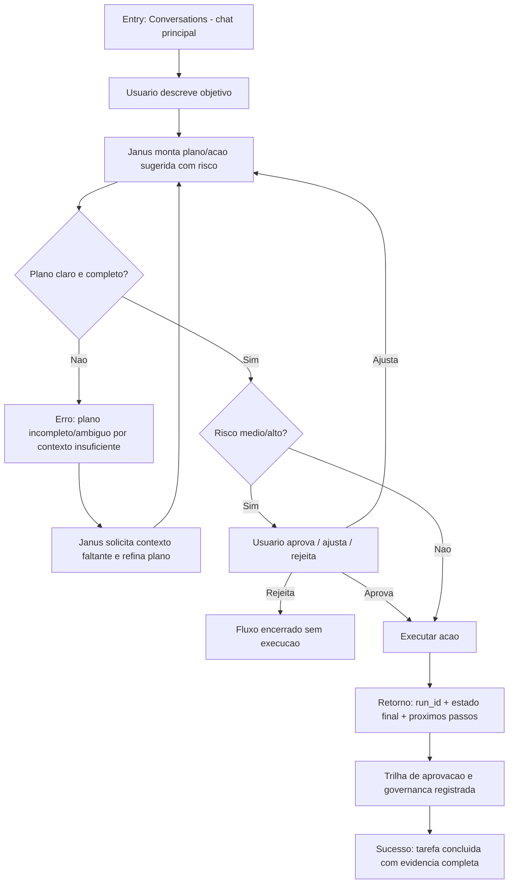
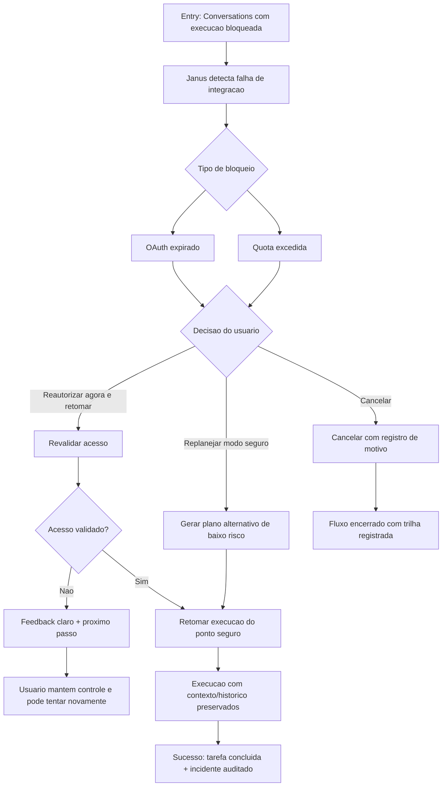
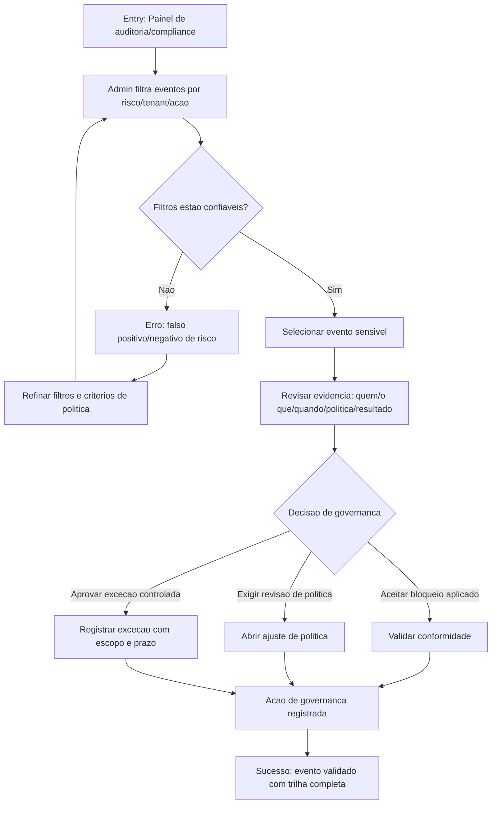

---
stepsCompleted:
  - 1
  - 2
  - 3
  - 4
  - 5
  - 6
  - 7
  - 8
  - 9
  - 10
  - 11
  - 12
  - 13
  - 14
inputDocuments:
  - '_bmad-output/planning-artifacts/prd.md'
  - '_bmad-output/planning-artifacts/prd-validation-report.md'
  - '_bmad-output/project-context.md'
  - 'docs/index.md'
  - 'docs/project-overview.md'
  - 'docs/integration-architecture.md'
  - 'docs/architecture-front.md'
  - 'docs/architecture-janus.md'
  - 'docs/component-inventory-front.md'
  - 'docs/component-inventory-janus.md'
  - 'docs/api-contracts-front.md'
  - 'docs/api-contracts-janus.md'
  - 'docs/data-models-front.md'
  - 'docs/data-models-janus.md'
  - 'docs/development-guide-front.md'
  - 'docs/development-guide-janus.md'
  - 'docs/deployment-guide.md'
  - 'docs/contribution-guide.md'
  - 'docs/source-tree-analysis.md'
project_name: 'janus-completo'
user_name: 'Arthur'
date: '2026-02-11T23:20:20-03:00'
lastStep: 14
completedAt: '2026-02-11T23:58:33-03:00'
---
# UX Design Specification janus-completo

**Author:** Arthur
**Date:** 2026-02-11T23:20:20-03:00

---

<!-- UX design content will be appended sequentially through collaborative workflow steps -->

## Executive Summary

### Project Vision

Janus deve unir a inteligência conversacional de um GPT com a memória contextual contínua de uma Alexa e capacidade real de execução via ferramentas, com governança enterprise. A experiência precisa permitir que o usuário converse, planeje e execute ações com confiança, mantendo transparência sobre o raciocínio e controle sobre decisões sensíveis.

Pensar como GPT: entender contexto, raciocinar, sugerir próximos passos e explicar decisões.
Lembrar como Alexa: manter memória persistente de preferências, rotinas, histórico e contexto operacional.
Agir com ferramentas: executar ações em sistemas externos (calendário, e-mail, automações), sempre com consentimento/aprovação quando sensível.

### Target Users

Usuários primários em ambientes enterprise que operam fluxos de trabalho complexos e sensíveis:
- Operadores e analistas que precisam executar ações assistidas com velocidade e rastreabilidade.
- Gestores e responsáveis por governança que exigem controle, auditoria e conformidade.
- Usuários com perfil técnico e semi-técnico, focados em produtividade operacional e redução de risco.

### Key Design Challenges

- Balancear autonomia e controle: manter fluidez conversacional sem perder checkpoints de aprovação em ações sensíveis.
- Tornar memória confiável e compreensível: mostrar o que o sistema "lembra", por que isso importa e como o usuário corrige/limpa contexto.
- Garantir explicabilidade prática: decisões, sugestões e execuções precisam ser claras, auditáveis e fáceis de validar.
- Reduzir fricção em integrações: executar em sistemas externos sem quebrar confiança, contexto ou segurança.

### Design Opportunities

- Diferenciação por "confiança operacional": UX que combina assistente inteligente com governança nativa.
- Experiência proativa de alto valor: sugestões contextuais de próximos passos com justificativa e impacto esperado.
- Memória como vantagem competitiva: personalização contínua por rotina e histórico, com controles explícitos de privacidade.
- Interface de execução assistida: transformar comandos conversacionais em ações estruturadas, revisáveis e reversíveis quando possível.
## Core User Experience

### Defining Experience

O loop principal do Janus é: conversar para definir uma tarefa operacional, validar sugestão do sistema, aprovar execução quando necessário, acompanhar resultado e seguir para próximos passos recomendados. O valor central está em fechar o ciclo ponta a ponta no mesmo fluxo conversacional, sem alternância entre múltiplas ferramentas.

A interação mais crítica e inegociável é o fluxo de aprovação para ações sensíveis, com três requisitos obrigatórios: clareza de impacto, confirmação explícita e feedback confiável de execução.

### Platform Strategy

Estratégia inicial: Web first, responsiva, com foco em desktop no MVP.
Modelo de interação predominante: teclado/mouse, com suporte secundário a touch.

Conectividade: offline não faz parte do núcleo do MVP. Pode haver degradação leve (ex.: rascunho local), mas execução de ações depende de conectividade ativa para garantir consistência, auditoria e confirmação real de estado.

### Effortless Interactions

As interações que devem parecer sem esforço:

- Continuidade de contexto: Janus mantém memória útil sem exigir que o usuário repita informações.
- Próxima melhor ação: o sistema antecipa e sugere o próximo passo operacional com baixo atrito.
- Execução com 1 confirmação: para ações apropriadas, transformar intenção em ação concreta com confirmação mínima e segura.
- Transição fluida entre conversa, validação e execução, sem ruptura de contexto.

### Critical Success Moments

Momentos que definem sucesso:

- O usuário conclui uma tarefa real de ponta a ponta mais rápido do que no fluxo tradicional.
- A tarefa é concluída sem troca de ferramentas externas para coordenação manual.
- O histórico da execução fica completo e rastreável (o que foi solicitado, aprovado, executado e retornado).

Momentos de falha crítica:

- Execução de ação errada ou sensível sem consentimento explícito.
- Estado falso de execução (sistema indica sucesso quando a ação não foi concluída de fato).

### Experience Principles

- Consentimento explícito antes de risco: nenhuma ação sensível sem aprovação inequívoca e contextualizada.
- Verdade operacional acima de conveniência: feedback de execução deve refletir estado real, nunca presumido.
- Memória útil sem repetição: contexto persistente para reduzir esforço cognitivo e acelerar decisões.
- Conversa que gera resultado: cada interação deve aproximar o usuário da conclusão de uma tarefa concreta.
- Rastreabilidade nativa: todo passo relevante deve ser auditável sem fricção adicional.

## Desired Emotional Response

### Primary Emotional Goals

A emoção principal do Janus é confiança empática: combinar segurança operacional com sensação de acolhimento humano. O usuário deve sentir que está protegido por mecanismos de governança robustos sem perder fluidez, respeito e apoio contextual durante toda a interação.

### Emotional Journey Mapping

- Descoberta/primeiro uso: "ele me entende rápido, me respeita e me ajuda sem fricção".
- Durante o loop principal: sensação de controle, calma e clareza enquanto o sistema orienta próximos passos.
- Durante ações sensíveis: percepção explícita de comando do usuário; Janus protege, explica impacto e só age com consentimento.
- Pós-conclusão de tarefa: alívio, produtividade concreta e confiança reforçada no sistema.
- Em falhas externas (timeout/erro): manutenção de controle percebido, entendimento claro do ocorrido e próximo passo objetivo para recuperação.

### Micro-Emotions

Micro-estados emocionais críticos para o sucesso do produto:

- Confiança > ceticismo
- Controle > insegurança
- Calma > ansiedade
- Clareza > confusão
- Empoderamento > frustração

Micro-estados a evitar:

- Julgamento
- Frieza
- Invasão
- Incerteza

### Design Implications

Conexões diretas entre emoção e decisão de UX:

- Confiança empática -> linguagem clara, respeitosa e não punitiva; transparência de intenção, impacto e resultado.
- Controle -> checkpoints explícitos de aprovação, especialmente em ações sensíveis; reversibilidade quando aplicável.
- Calma e clareza -> status objetivos, feedback determinístico, estados de sistema sem ambiguidade.
- Empoderamento -> sugestões de próxima melhor ação com justificativa e opção de ajuste pelo usuário.
- Segurança percebida em falhas -> mensagens que explicam causa provável, impacto real e plano de ação imediato.

Interações que devem evitar emoção negativa:

- Execução opaca sem confirmação.
- Mensagens vagas de erro sem orientação.
- Tom robótico/frio em situações de risco operacional.

### Emotional Design Principles

- Proteger sem infantilizar: segurança e governança fortes com autonomia explícita do usuário.
- Explicar antes de executar: impacto, escopo e consequência sempre visíveis antes de ações sensíveis.
- Confirmar verdade operacional: o produto só comunica sucesso com evidência de execução real.
- Reduzir ansiedade com previsibilidade: cada estado deve indicar claramente "o que está acontecendo" e "o que vem a seguir".
- Humanizar com respeito: tom empático, direto e profissional, sem julgamento.

## UX Pattern Analysis & Inspiration

### Inspiring Products Analysis

**ChatGPT**
- Resolve com elegância: transformar intenção em diálogo acionável com fricção mínima.
- Ponto forte de UX: entrada conversacional simples e início imediato.
- Interação de destaque: resposta incremental (streaming), que reduz ansiedade e aumenta percepção de progresso.
- Lição para Janus: manter fluxo conversacional contínuo como superfície primária de trabalho.

**Linear**
- Resolve com elegância: execução de trabalho com alta velocidade e clareza de estado.
- Ponto forte de UX: navegação rápida, estrutura objetiva e operação keyboard-first.
- Interação de destaque: atalhos, command palette e fluxo orientado à ação.
- Lição para Janus: reduzir custo de interação para usuários frequentes e operacionais.

**Stripe Dashboard**
- Resolve com elegância: operações críticas com confiança e rastreabilidade.
- Ponto forte de UX: trilhas de eventos, estados claros e feedback pós-ação verificável.
- Interação de destaque: clareza em ações sensíveis e visão de auditoria.
- Lição para Janus: governança e evidência operacional como parte nativa da experiência, não como camada extra.

### Transferable UX Patterns

**Navigation Patterns**
- Workspace principal centrado em uma superfície unificada de trabalho (composer + contexto + execução).
- Command palette e atalhos globais para reduzir navegação por clique.
- Informação hierárquica orientada por status e prioridade operacional.

**Interaction Patterns**
- Composer conversacional único com contexto visível e sugestões acionáveis.
- Fluxo keyboard-first com ações rápidas para operadores frequentes.
- Confirmação forte para ações sensíveis com impacto, escopo e rollback quando aplicável.
- Estados explícitos de execução: pendente, em andamento, concluído, falhou, com evidências.

**Visual/Trust Patterns**
- Timeline por ação com rastreabilidade fim a fim.
- Feedback determinístico pós-ação (o que foi feito, onde, resultado e próximos passos).
- Destaque visual de risco/criticidade sem ruído excessivo.

### Anti-Patterns to Avoid

- Caixa-preta operacional: executar sem explicar motivo, impacto e resultado.
- Navegação fragmentada com muitas telas para concluir tarefas simples.
- Feedback vago de erro sem causa provável e sem próximo passo.
- Excesso de notificações e alertas que aumentam ansiedade/fadiga.
- Confirm dialogs genéricos sem contexto real da ação sensível.

### Design Inspiration Strategy

**What to Adopt**
- Simplicidade conversacional inicial (ChatGPT) para reduzir atrito.
- Operação keyboard-first e velocidade de fluxo (Linear) para produtividade.
- Estados, trilhas e evidência operacional (Stripe) para confiança enterprise.

**What to Adapt**
- Streaming conversacional adaptado para contexto operacional com checkpoints de governança.
- Padrões de produtividade keyboard-first adaptados para tarefas assistidas por IA e aprovação.
- Modelo de auditoria adaptado para “intenção -> aprovação -> execução -> evidência -> próximo passo”.

**What to Avoid**
- Qualquer abstração que esconda decisão e consequência de ações sensíveis.
- Arquitetura de navegação que desloque o usuário para múltiplos contextos sem necessidade.
- Comunicação de erro sem diagnóstico mínimo orientado à ação.

## Design System Foundation

### 1.1 Design System Choice

Abordagem escolhida: sistema themeable/híbrido sobre a base atual do projeto.

Base:
- Tailwind (velocidade de composição visual e layout)
- Camada proprietária em `front/src/app/shared/components/ui`
- Design tokens em `_tokens.scss`

Diretriz: manter a fundação existente e expandir de forma controlada para suportar a experiência conversacional-operacional do Janus com confiança enterprise.

### Rationale for Selection

- Equilíbrio com viés de velocidade: entrega rápida sem reinvenção da base UI.
- Menor risco para MVP: evita migração de biblioteca em janela curta (1-2 meses).
- Acessibilidade: base atual facilita aderência a WCAG 2.1 AA nos fluxos críticos.
- Governança visual: tokens existentes permitem consistência e evolução de marca.
- Escalabilidade pragmática: customização progressiva com capacidade média do time.

### Implementation Approach

- Curto prazo (MVP):
  - Reaproveitar Tailwind + componentes já existentes.
  - Priorizar componentes do core operacional (composer, cards de ação, estado de execução, aprovação sensível, timeline/auditoria).
  - Definir critérios de pronto com WCAG AA para fluxos críticos.

- Médio prazo:
  - Consolidar primitives proprietárias para padrões recorrentes.
  - Reduzir variações ad hoc e fortalecer contratos de componente.
  - Expandir cobertura de acessibilidade e testes de interação.

### Customization Strategy

- Token-first: toda variação visual passa por tokens (cor, tipografia, espaçamento, estados).
- Confiança operacional por padrão: estados de risco, confirmação e feedback com semântica consistente.
- Keyboard-first: atalhos e foco navegável como requisito de componente.
- Padrões de feedback determinístico: sempre exibir status, evidência e próximo passo.
- Evolução de brand voice visual: manter paleta/tipografia/dark já definidas e iterar linguagem emocional sem quebrar consistência.

## 2. Core User Experience

### 2.1 Defining Experience

A experiência definidora do Janus é um loop operacional unificado no chat:

**Conversa -> validação de plano -> aprovação quando necessário -> execução -> evidência -> próximo passo**

Se essa interação for impecável, todo o restante do produto se beneficia. O diferencial é eliminar a fragmentação entre comunicação, contexto, execução e auditoria, mantendo governança no mesmo fluxo.

### 2.2 User Mental Model

Hoje, o usuário resolve tarefas operacionais de forma distribuída:
- Entende demanda em Slack/Teams.
- Busca contexto em Jira/Notion/Docs.
- Executa em ferramentas separadas (console interno, scripts, e-mail, calendário, dashboards).
- Aprova por mensagem/reunião.
- Monta evidência manualmente em ticket/planilha.

Modelo mental esperado no Janus:
- "Eu explico a intenção uma vez."
- "O sistema entende meu contexto/tenant e sugere um plano executável."
- "Eu aprovo conforme risco."
- "A execução devolve prova real e auditoria automaticamente."

Principal dor atual:
- Perda de contexto entre ferramentas e aprovação dispersa, aumentando tempo, erro e risco de auditoria incompleta.

### 2.3 Success Criteria

Critérios de rapidez percebida:
- Sugestão inicial: <= 2s
- Plano inicial validável: <= 5s
- ACK de execução após aprovação: <= 1s
- Primeira evidência/progresso visível: <= 10s
- Execução simples concluída: <= 30s
  (acima disso, progresso contínuo obrigatório)

Sinais concretos de sucesso:
- Status final claro: concluído (ou concluído com ressalvas).
- Evidência verificável: run_id, logs/resultados e objeto afetado.
- Trilha de governança completa: quem aprovou, o quê, quando, escopo.

### 2.4 Novel UX Patterns

**Padrões estabelecidos adotados:**
- Superfície conversacional contínua.
- Estados explícitos de execução.
- Confirmação em ações sensíveis.

**Twist único do Janus (inovação):**
- Memória operacional + governança adaptativa no próprio chat.
- O sistema conversa, lembra contexto real do usuário/tenant, propõe próximo passo, executa com política de risco e gera auditoria explicável automaticamente no mesmo fluxo.

**Classificação do padrão:**
- Combinação inovadora de padrões familiares, com baixa curva de aprendizado e alto ganho operacional.

### 2.5 Experience Mechanics

**1. Initiation**
- Usuário descreve tarefa no chat.
- Janus resgata contexto relevante e apresenta intenção entendida + plano inicial.

**2. Interaction**
- Usuário valida/ajusta plano.
- Janus classifica risco por ação:
  - Baixo: automático.
  - Médio: confirmação explícita.
  - Alto: human-in-the-loop obrigatório.

**3. Feedback**
- ACK imediato após aprovação.
- Estados visíveis: pendente, em andamento, concluído, falhou.
- Evidência progressiva: run_id, logs, objetos afetados, resultados parciais.
- Em erro: causa provável + impacto + próximo passo claro.

**4. Completion**
- Resultado final com status inequívoco.
- Auditoria completa gerada automaticamente (quem, o quê, quando, escopo, evidências).
- Janus sugere próxima melhor ação contextual.

## Visual Design Foundation

### Color System

A fundação visual seguirá os brand guidelines existentes, com estética dark orientada a operação e confiança.

**Core palette (base):**
- Primary: `#23D5A1`
- Background: `#0A0F13`
- Surface: `#10161C`
- Card: `#131C25`
- Success: `#23D5A1`
- Warning: `#F6B348`
- Error: `#FF5B6B`

**Semantic mapping:**
- Primary action / foco: `#23D5A1`
- Success state: `#23D5A1`
- Warning/risk médio: `#F6B348`
- Error/risk alto: `#FF5B6B`
- Background hierarchy:
  - App background: `#0A0F13`
  - Secondary surfaces: `#10161C`
  - Elevated cards/painéis: `#131C25`

**Diretrizes de uso:**
- Usar cor saturada com parcimônia para preservar legibilidade em dark mode.
- Destacar risco/criticidade com semântica consistente (warning/error) e texto explicativo.
- Evitar excesso de acentos simultâneos para reduzir fadiga visual em contexto operacional.

### Typography System

**Font families:**
- Body: `Sora` (fallback `Space Grotesk`)
- Display/Heading: `Space Grotesk` (fallback `Sora`)
- Mono (logs/evidências/IDs): `JetBrains Mono`

**Base and scale:**
- Base: `16px (1rem)`
- Type scale: `12 / 14 / 16 / 18 / 20 / 24 / 30 / 36`

**Hierarchy strategy:**
- Corpo e leitura operacional: 14-16px com alta legibilidade.
- Hierarquia de tela/painel: 20-36px para títulos.
- Dados técnicos (run_id, log snippets, estados): mono 12-14px.
- Priorizar contraste e peso tipográfico para estados de risco e feedback de execução.

### Spacing & Layout Foundation

**Spacing system:**
- Unidade base: `8px`
- Microajuste: `4px` para refinamentos de densidade em componentes operacionais.

**Density principle:**
- Densidade geral: equilibrada.
- Áreas operacionais (timeline, estados, evidência, comandos): levemente mais densas para aumentar throughput sem perder clareza.

**Grid/layout desktop:**
- Grid principal: `12 colunas`
- Container padrão: `1200px`
- Modo operacional expandido: `1400px` com layout de 3 painéis (ex.: contexto | chat/plano | execução/evidência).

**Layout principles:**
- Priorizar fluxo sequencial de decisão: intenção -> validação -> aprovação -> execução -> evidência.
- Minimizar troca de contexto entre painéis.
- Preservar estabilidade visual de estado para reduzir carga cognitiva.

### Accessibility Considerations

- Meta do MVP: `WCAG 2.1 AA` em toda a aplicação.
- Prioridade de validação reforçada nos fluxos críticos (ações sensíveis, aprovação, execução e erro).
- Garantir contraste AA em texto, ícones, estados e componentes interativos em tema dark.
- Garantir navegação por teclado completa (ordem de foco, visibilidade de foco, atalhos sem conflito).
- Estados e alertas não podem depender apenas de cor; incluir texto e/ou ícone semântico.
- Validar componentes de feedback operacional (status, progressos, erros) com mensagens claras e acionáveis.

## Design Direction Decision

### Design Directions Explored

Foram exploradas 8 direções visuais, com foco em:
- layout operacional em dark mode,
- clareza de governança e execução,
- evidência/auditoria integrada ao fluxo principal,
- produtividade keyboard-first.

A decisão final combina os pontos fortes de:
- **D1 (Ops Cockpit 3-Pane)**: estrutura operacional completa com contexto + chat/plano + auditoria.
- **D6 (Evidence-First Timeline)**: timeline de evidências como pilar de confiança operacional e troubleshooting.

### Chosen Direction

**Direção escolhida: D1 + D6 (híbrida).**

**Elementos mantidos:**
- 3 painéis no desktop.
- Chat/plano no centro (painel principal).
- Contexto à esquerda.
- Auditoria/estados à direita.
- Timeline de evidências sempre visível.

**Ajustes solicitados:**
- Densidade mais compacta (eficiente).
- Prioridade visual dinâmica:
  - fase de decisão: chat/plano em destaque;
  - fase de execução: timeline/evidência em destaque.
- Responsivo:
  - colapsar primeiro o painel esquerdo (contexto),
  - depois o painel direito (auditoria),
  - mantendo chat/plano fixo como núcleo.
- Destaque de risco mais forte:
  - nível de risco,
  - impacto esperado,
  - confirmação explícita altamente evidente.

### Design Rationale

A combinação D1 + D6 atende diretamente ao objetivo do Janus:
- manter o loop conversacional-operacional no centro;
- preservar confiança enterprise por evidência contínua e auditável;
- reduzir troca de contexto sem sacrificar rastreabilidade;
- oferecer produtividade com densidade eficiente para uso operacional intenso.

Esse direcionamento também reforça os princípios definidos anteriormente:
- consentimento explícito em ações sensíveis,
- verdade operacional com evidência verificável,
- clareza de estado e próximo passo.

### Implementation Approach

**Layout e informação**
- Implementar layout 3 painéis para desktop (container até 1400px em modo operacional).
- Definir comportamento de foco por fase (decisão vs. execução) com variação de peso visual.
- Garantir timeline persistente na viewport, com prioridade contextual.

**Responsividade**
- Breakpoints com colapso progressivo:
  1) esconder/contextualizar painel esquerdo,
  2) reduzir painel direito para rail/overlay,
  3) preservar chat/plano como superfície primária.

**Risco e governança**
- Cartões/alertas de risco com semântica forte (warning/error), impacto e escopo visíveis.
- Confirmação explícita destacada antes de ações sensíveis.
- Registro automático de aprovação e evidência no fluxo.

**Operação e eficiência**
- Densidade compacta em listas/timelines/estados.
- Navegação keyboard-first e atalhos para ações frequentes.
- Feedback determinístico de execução (estado, run_id, prova e próximo passo).

## User Journey Flows

### Jornada 1 - Operador Técnico (Caminho de Sucesso)

Fluxo principal no chat para transformar intenção em execução com risco controlado, confirmação explícita quando necessário e evidência verificável no fim.

### Jornada 2 - Operador Técnico (Edge Case e Recuperação)

Fluxo de recuperação guiada quando execução é bloqueada por OAuth/quota, mantendo contexto e histórico.

### Jornada 3 - Admin Governança/Compliance

Fluxo de validação de evento sensível, qualidade de filtros de risco e ação de governança registrada.

### Journey Patterns

- Entrada primária centrada em contexto (chat para operação, painel para governança).
- Decisão explícita em pontos críticos de risco (aprovar, ajustar, rejeitar, exceção).
- Estados de execução e governança sempre verificáveis (run_id, status final, política aplicada).
- Recuperação guiada em erro com preservação de contexto/histórico.
- Encerramento sempre com evidência e ação rastreável.

### Flow Optimization Principles

- Minimizar passos até valor: iniciar no ponto de trabalho principal (chat/painel) sem navegação desnecessária.
- Priorizar clareza decisória: risco, impacto e escopo visíveis antes da confirmação.
- Manter feedback determinístico: cada transição de estado com sinal textual objetivo.
- Tornar erro recuperável: causa provável + próximo passo acionável.
- Preservar confiança: nenhuma ação sensível sem consentimento explícito e trilha auditável completa.

## Component Strategy

### Design System Components

Componentes já disponíveis e reaproveitáveis (base/foundation):
- Ação e navegação: `ui-button`, `button.directive`, `icon`.
- Estrutura visual: `ui-card`, `ui-table`, `ui-badge`.
- Feedback de sistema: `toast`, `toaster`, `spinner`, `skeleton`, `loading`.
- Diálogos: `dialog` infra + `confirm-dialog`.
- Elementos conversacionais existentes: `jarvis-avatar`, `typing-indicator`, `message-content`, `system-status`, `voice-orb`.
- Layout base já implantado em `features/conversations` com grade 3 painéis.

Cobertura atual (o que já resolve):
- Controles básicos, estados visuais simples, estrutura de listas/tabelas e feedback genérico.
- Superfície de chat funcional com trilha de mensagens e contexto lateral.

Gaps para o Janus (MVP enterprise):
- Aprovação sensível contextualizada (impacto/escopo/rollback) além de confirm genérico.
- Timeline operacional com evidência progressiva e governança embutida.
- Blocos de recuperação OAuth/quota com retomada segura do fluxo.
- Painel de auditoria orientado a decisão (aceitar bloqueio, revisão de política, exceção controlada).

### Custom Components

### Risk Approval Sheet

**Purpose:** validar ações sensíveis com contexto completo antes da execução.
**Usage:** quando risco classificado como médio/alto.
**Anatomy:** nível de risco, impacto esperado, escopo afetado, pré-condições, opção de rollback, confirmação explícita.
**States:** default, loading-approval, approved, rejected, expired, policy-blocked.
**Variants:** medium-risk, high-risk (HIL obrigatório).
**Accessibility:** foco inicial no título, leitura estruturada por regiões ARIA, confirmação por teclado, texto de erro não dependente só de cor.
**Interaction Behavior:** usuário pode aprovar, ajustar escopo ou rejeitar; ajuste retorna ao plano sem perder contexto.

### Execution Evidence Timeline

**Purpose:** mostrar progresso real de execução com prova verificável.
**Usage:** durante/apos execução de ações.
**Anatomy:** eventos ordenados (pending/running/completed/failed), run_id, trace_id, objeto afetado, timestamp, links para logs.
**States:** idle, streaming, partial-evidence, completed, failed, retriable.
**Variants:** compact (rail), expanded (full panel).
**Accessibility:** navegação por item com teclado, labels de status textuais, contraste AA em estados críticos.
**Interaction Behavior:** cada evento abre detalhes sem tirar usuário do fluxo principal.

### Governance Audit Record Card

**Purpose:** consolidar “quem/o quê/quando/política/resultado” por evento sensível.
**Usage:** painel admin/compliance e trilha pós-execução.
**Anatomy:** ator, ação, tenant, política aplicada, decisão, justificativa, evidências anexas.
**States:** validado, pendente de revisão, exceção aprovada, bloqueio confirmado.
**Variants:** operator-view, admin-view.
**Accessibility:** semântica tabular/lista para leitura assistiva; ações com rótulos claros.

### OAuth/Quota Recovery Banner

**Purpose:** recuperar fluxo bloqueado sem perda de contexto/histórico.
**Usage:** erro de integração (OAuth expirado/quota excedida).
**Anatomy:** causa detectada, impacto, ação recomendada, CTA de reautorização/novo plano/cancelamento.
**States:** oauth-expired, quota-exceeded, recovering, recovered, failed-recovery.
**Variants:** inline banner, modal assistido.
**Accessibility:** anúncio imediato via `role="alert"` + instruções acionáveis por teclado.

### Next Best Action Panel

**Purpose:** sugerir próximo passo operacional com justificativa objetiva.
**Usage:** após conclusão, falha parcial ou bloqueio.
**Anatomy:** recomendação, motivo, benefício esperado, risco estimado, CTA direto.
**States:** suggestion-ready, requires-approval, unavailable.
**Variants:** compact rail, expanded center.
**Accessibility:** hierarquia textual clara, CTA principal único, leitura de justificativa por screen reader.

### Policy Decision Toolbar (Admin)

**Purpose:** acelerar decisão de governança no painel de auditoria.
**Usage:** jornadas J3 (aceitar bloqueio, exigir revisão, aprovar exceção).
**Anatomy:** ações primárias, resumo de risco, confirmação contextual, motivo obrigatório quando exceção.
**States:** ready, validating, committed, rejected-policy.
**Variants:** sticky toolbar (desktop), bottom action bar (responsive).
**Accessibility:** atalhos de teclado, confirmação dupla em exceção de alto risco.

### Component Implementation Strategy

- Estratégia híbrida: manter foundation em Tailwind/UI atual e construir custom components como camada de domínio.
- Token-first: todos os custom components consumindo tokens existentes (`_tokens.scss`) para cor, tipografia, espaçamento e estado.
- Contrato de componente:
  - inputs/outputs explícitos para risco, status, evidência e governança.
  - semântica de estados padronizada (`pending|running|completed|failed|blocked`).
- Acessibilidade como regra de build:
  - WCAG 2.1 AA global no MVP.
  - focus management, keyboard paths, feedback textual obrigatório em erro/risco.
- Reuso transversal:
  - componentes de risco/evidência usados tanto em `Conversations` quanto em auditoria/compliance.
- Observabilidade de UI:
  - eventos de interação críticos instrumentados (aprovação, rejeição, reautorização, exceção, rollback).

### Implementation Roadmap

**Phase 1 - Core (MVP crítico)**
- `Risk Approval Sheet`
- `Execution Evidence Timeline`
- `OAuth/Quota Recovery Banner`
- `Next Best Action Panel`

**Phase 2 - Governance/Admin**
- `Governance Audit Record Card`
- `Policy Decision Toolbar`

**Phase 3 - Hardening e escala**
- variantes compact/expanded refinadas por breakpoint
- catálogo visual/storybook dos componentes de domínio
- testes de acessibilidade automatizados + regressão visual para fluxos críticos

## UX Consistency Patterns

### Button Hierarchy

**Primary (1 por contexto):**
- Ação principal do momento (ex.: `Aprovar e Executar`, `Continuar`, `Confirmar`).
- Cor primária (`#23D5A1`) com contraste AA.
- Nunca exibir mais de um primary concorrendo no mesmo bloco decisório.

**Secondary:**
- Ações complementares (ex.: `Ajustar escopo`, `Ver detalhes`, `Voltar`).
- Estilo neutro/surface, sem competir com CTA principal.

**Tertiary/Ghost:**
- Ações utilitárias de baixo impacto (ex.: `Copiar run_id`, `Abrir logs`).

**Destructive:**
- Ações irreversíveis (exclusão, revogação, cancelamento crítico).
- Sempre com confirmação contextual explícita e texto de impacto.

**Policy-aware actions:**
- Baixo risco: `Executar` direto.
- Médio risco: `Confirmar execução`.
- Alto risco: `Solicitar aprovação` / `Aguardando aprovador`.

**Accessibility:**
- Estados visíveis: default, hover, focus, disabled, loading.
- Foco por teclado com ring claro; rótulo de ação sem ambiguidade.

### Feedback Patterns

**Estados canônicos:**
- `pending`, `running`, `completed`, `completed_with_notes`, `failed`, `blocked_policy`, `waiting_approval`.

**Feedback de execução:**
- Sempre exibir: status + run_id + timestamp + objeto afetado + próximo passo.
- Sem “sucesso” sem evidência verificável.

**Feedback de erro:**
- Estrutura fixa: causa provável -> impacto -> ação recomendada.
- Erros OAuth/quota com CTA de recuperação (`Reautorizar`, `Replanejar`, `Cancelar`).

**Alertas de risco:**
- Exibir nível de risco, escopo e impacto antes da confirmação.
- Não depender só de cor; incluir ícone e texto semântico.

### Form Patterns

**Princípios:**
- Formulários curtos e progressivos (progressive disclosure).
- Coleta mínima para executar com segurança.

**Validação:**
- Inline em tempo real para campos críticos.
- Resumo de erro no topo + indicação por campo.
- Mensagens acionáveis, sem linguagem genérica.

**Ações sensíveis:**
- Pré-visualização obrigatória de impacto/escopo.
- Campo de justificativa obrigatório para exceção de política.
- Confirmação explícita antes de submissão final.

**Acessibilidade:**
- Labels sempre visíveis, associação `label-for`.
- Ordem de tab lógica e suporte completo a teclado.

### Navigation Patterns

**Desktop (padrão):**
- 3 painéis: contexto (esquerda) | chat/plano (centro) | auditoria/estados (direita).
- Prioridade visual dinâmica:
  - decisão: centro em destaque;
  - execução: timeline/evidência em destaque.

**Responsivo:**
- Colapsar primeiro contexto (esquerda), depois auditoria (direita).
- Chat/plano permanece como núcleo fixo.

**Navegação operacional:**
- Command palette + atalhos keyboard-first para ações frequentes.
- Persistência de contexto ao trocar entre conversa, execução e auditoria.

### Additional Patterns

**Modal/Overlay:**
- Usar para confirmações críticas e exceções de política.
- Bloqueio com contexto completo (não usar modal genérico sem impacto/escopo).

**Empty states:**
- Sempre com ação sugerida (“comece por aqui”) e contexto mínimo.

**Loading states:**
- Skeleton para conteúdo estrutural.
- Indicador de progresso para execução >10s.
- Heartbeat/estado de conexão em fluxos de stream.

**Search & Filtering:**
- Filtros salvos por sessão para auditoria.
- Presets de risco/tenant/ação.
- Feedback claro para falso positivo/negativo com caminho de refinamento.

**Consistency rules globais:**
- Terminologia única para risco/estado/resultado.
- Semântica de estado compartilhada em chat, timeline e auditoria.
- Componentes de domínio sempre tokenizados (`_tokens.scss`) e AA por padrão.

## Responsive Design & Accessibility

### Responsive Strategy

**Diretriz geral**
- Estratégia desktop-first (MVP focado em operação desktop), com comportamento responsivo obrigatório para tablet/mobile.
- Preservar o loop central (conversa -> validação -> aprovação -> execução -> evidência) em todas as resoluções.

**Desktop**
- Layout principal de 3 painéis:
  - esquerda: contexto,
  - centro: chat/plano,
  - direita: auditoria/estados/timeline.
- Container padrão 1200px, com expansão para 1400px em modo operacional.
- Prioridade visual dinâmica:
  - decisão: foco no painel central,
  - execução: destaque para timeline/evidência.

**Tablet**
- Redução para 2 painéis com rail contextual.
- Painéis secundários acessíveis por tabs/drawer sem perder estado da conversa.
- Interações touch com áreas de toque amplas e alvos mínimos consistentes.

**Mobile**
- Chat/plano como superfície primária fixa.
- Contexto e auditoria em camadas secundárias (drawer/sheet), evitando competição com ação principal.
- Estados críticos (risco, bloqueio, erro, aprovação pendente) sempre visíveis no fluxo principal.

### Breakpoint Strategy

Breakpoints propostos (alinhados ao comportamento já observado no front):
- `>= 1400px`: desktop operacional expandido (3 painéis amplos)
- `1200px - 1399px`: desktop padrão (3 painéis)
- `900px - 1199px`: tablet grande / small desktop (2 painéis + rail)
- `720px - 899px`: tablet/retrato grande (1 painel principal + overlays contextuais)
- `< 720px`: mobile (chat/plano fixo, painéis secundários colapsados)

Regras de colapso (já definidas):
1. Colapsar primeiro painel esquerdo (contexto).
2. Depois painel direito (auditoria/estados).
3. Manter chat/plano fixo como núcleo.

### Accessibility Strategy

**Nível-alvo**
- WCAG 2.1 AA em toda a aplicação no MVP.
- Prioridade de validação reforçada nos fluxos críticos (aprovação sensível, execução, erro/recuperação, auditoria).

**Requisitos essenciais**
- Contraste AA em texto, ícones, componentes e estados.
- Navegação completa por teclado (ordem lógica, foco visível, atalhos sem conflito).
- Semântica correta (HTML semântico + ARIA quando necessário).
- Estados/alertas não dependentes apenas de cor.
- Feedback textual claro para sucesso, falha, bloqueio e recuperação.
- Touch targets mínimos de 44x44px em contextos touch.

### Testing Strategy

**Responsive**
- Teste em breakpoints críticos definidos (720, 900, 1200, 1400).
- Verificação cross-browser (Chrome, Firefox, Edge, Safari).
- Testes de comportamento de colapso e persistência de estado dos painéis.

**Accessibility**
- Testes automatizados de a11y por tela/fluxo crítico.
- Testes manuais de teclado-only.
- Testes com leitor de tela em fluxos essenciais.
- Auditorias periódicas de contraste e foco visível.

**Fluxos críticos obrigatórios para regressão**
- Aprovação de ação sensível.
- Recuperação OAuth/quota.
- Execução com timeline/evidência.
- Validação de evento no painel de auditoria/compliance.

### Implementation Guidelines

- Usar tokens e unidades relativas (`rem`) como padrão.
- Evitar lógica de layout acoplada a componente de domínio; concentrar regras responsivas em camadas de layout.
- Garantir foco previsível em drawers/modais/sheets.
- Mensagens de erro sempre com causa + impacto + próxima ação.
- Manter terminologia de estado consistente entre chat, timeline e auditoria.
- Instrumentar eventos de UX críticos (aprovação, rejeição, reautorização, exceção, rollback) para observabilidade operacional.

