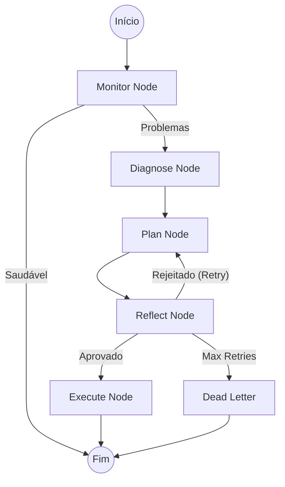

# Autonomia e Meta-Agente (Deep Dive)

O Janus implementa um ciclo **OODA (Observe, Orient, Decide, Act)** supervisionado por uma arquitetura avançada de **Meta-Agente**. Esta seção detalha o funcionamento interno, a máquina de estados (LangGraph) e as ferramentas utilizadas.

### 6.1 Visão Geral

O sistema de autonomia é composto por dois níveis hierárquicos:

1.  **Autonomy Loop (Nível Operacional):** Executa tarefas do dia a dia (conversar, pesquisar, gerar código). Gerenciado pelo `AutonomyService`.
2.  **Meta-Agente (Nível Estratégico/Supervisor):** Monitora a saúde do sistema, detecta anomalias (ex: aumento de latência, erros recorrentes) e altera a configuração do nível operacional (ex: resetar circuit breakers, limpar cache). Gerenciado pela classe `MetaAgent` via LangGraph.

### 6.2 O Meta-Agente (Supervisor)

O Meta-Agente não é apenas um script de monitoramento; é um agente cognitivo completo que "reflete" sobre o estado do sistema.

#### Arquitetura (LangGraph)

O Meta-Agente é implementado como um grafo de estados (`StateGraph`), permitindo ciclos de feedback e persistência.

**Arquivo Principal:** `janus/app/core/agents/meta_agent.py`

##### Os Nós do Grafo (The Nodes)

1.  **Monitor (`monitor_node_logic`)**:
    *   **Função:** Coleta métricas de saúde e uso de recursos.
    *   **Ferramentas:** `get_system_health_metrics`, `analyze_memory_for_failures`, `get_resource_usage`.
    *   **Saída:** Lista de `DetectedIssue` (se houver). Se saudável, o ciclo termina aqui.

2.  **Diagnose (`diagnosis_node_logic`)**:
    *   **Função:** Se problemas forem detectados, usa um LLM para analisar a causa raiz (`root_cause`) com base nas evidências.
    *   **Saída:** String de diagnóstico e nível de severidade.

3.  **Plan (`planning_node_logic`)**:
    *   **Função:** Gera um plano de correção estruturado (`PlanSchema`), sugerindo ações específicas (Recomendações).
    *   **Saída:** Lista de `RecommendationItem` (ex: "Aumentar timeout do Redis", "Reiniciar worker de consolidação").

4.  **Reflect (`reflection_node_logic`)**:
    *   **Função:** Crítica de segurança. O LLM avalia o próprio plano gerado no passo anterior.
    *   **Critérios:** O plano é seguro? Resolve o problema diagnosticado?
    *   **Decisão:**
        *   *Aprovado*: Segue para execução.
        *   *Rejeitado*: Retorna ao nó `Plan` para gerar uma nova estratégia (até `max_retries`).
        *   *Desistir*: Vai para `Dead Letter` se exceder tentativas.

5.  **Execute (`execution_node_logic`)**:
    *   **Função:** Despacha as tarefas recomendadas para os agentes ou serviços responsáveis.
    *   **Status:** Marca o ciclo como `completed`.

##### Estado do Agente (`AgentState`)

O estado é mantido em um `TypedDict` persistido entre reinicializações (via `MemorySaver` ou Postgres):

```python
class AgentState(TypedDict):
    cycle_id: str
    timestamp: float
    metrics: dict              # Snapshot de métricas
    detected_issues: list      # Problemas encontrados
    diagnosis: str             # Análise de causa raiz
    candidate_plan: list       # Plano proposto
    critique: dict             # Resultado da reflexão
    final_plan: list           # Plano aprovado
    retry_count: int           # Contador de tentativas de planejamento
```

### 6.3 Ferramentas do Meta-Agente

As ferramentas (`janus/app/core/agents/meta_agent_module/tools.py`) fornecem os "sentidos" para o Meta-Agente:

*   **`analyze_memory_for_failures(time_window_hours)`**: Consulta o Qdrant (memória episódica) buscando logs de erro recentes e agrupa por tipo.
*   **`get_system_health_metrics()`**: Agrega status de todos os componentes (RabbitMQ, Neo4j, LLM Pool, Circuit Breakers).
*   **`analyze_performance_trends(metric_name)`**: Analisa tendências (ex: latência subindo) usando estatística simples (média, p95).
*   **`get_resource_usage()`**: Retorna CPU, RAM e Disco do container atual via `psutil`.

### 6.4 O Autonomy Loop (Operacional)

Gerenciado pelo `AutonomyService` (`janus/app/services/autonomy_service.py`), este loop foca na execução de metas de usuário.

#### Ciclo de Execução (`_run_cycle`)

1.  **Perceber (Observe)**: Consulta métricas básicas e estado do `GoalManager`.
2.  **Planejar (Plan)**:
    *   Se não houver plano ativo, invoca o **Planner** (`janus/app/core/autonomy/planner.py`).
    *   O Planner usa o `ActionRegistry` para saber quais ferramentas estão disponíveis e gera uma sequência de passos JSON.
3.  **Executar (Act)**:
    *   Itera passo a passo.
    *   **Governança (`PolicyEngine`)**: Antes de cada ação, verifica:
        *   *Allowlist/Blocklist*: A ferramenta é permitida?
        *   *Risk Profile*: O perfil (Conservative/Balanced) permite essa ação? (ex: `write_file` pode exigir aprovação manual).
        *   *Rate Limit*: O limite de uso foi excedido?
    *   Se aprovado, executa a ferramenta e registra o resultado no histórico.
4.  **Replanejar (React)**:
    *   Se um passo falhar, o sistema pode entrar em `replan_goal`, onde o LLM decide se tenta novamente com novos argumentos ou aborta a meta.

#### Governança e Policy Engine

O `PolicyEngine` (`janus/app/core/autonomy/policy_engine.py`) é o "freio de segurança" do sistema. Ele garante que o agente não execute ações destrutivas sem permissão explícita, dependendo do nível de risco configurado (`CONSERVATIVE`, `BALANCED`, `AGGRESSIVE`).

### 6.5 Diagrama de Fluxo (Meta-Agente)



---

## 7. Memória Semântica, Grafo e Persistência (Deep Dive)

O Janus utiliza uma arquitetura de memória híbrida e assimétrica para equilibrar recuperação rápida (vetorial) com raciocínio estruturado (grafo).

### 7.1 Arquitetura de Memória Híbrida

#### Hot Path (Memória Episódica - Qdrant)
O "caminho quente" é responsável pela gravação imediata e recuperação por similaridade.
-   **Componente Principal**: `MemoryCore` (`janus/app/core/memory/memory_core.py`).
-   **Fluxo de Escrita (`amemorize`)**:
    1.  **Validação & Quotas**: Verifica tamanho do conteúdo e limites por origem.
    2.  **PII Redaction**: Remove dados sensíveis (e-mail, CPF) *antes* do embedding.
    3.  **Embedding**: Gera vetor usando `embedding_manager` (padrão 1536 dimensões).
    4.  **Criptografia**: Criptografa o conteúdo textual (AES) antes de salvar no payload.
    5.  **Upsert**: Grava no Qdrant e no `MemoryLocalCache` (LRU) simultaneamente.
-   **Recuperação (`arecall`)**: Busca paralela no cache local e no Qdrant, fundindo resultados por score.

#### Cold Path (Memória Semântica - Neo4j)
O "caminho frio" transforma experiências brutas em conhecimento estruturado (entidades e relações).
-   **Componente Principal**: `KnowledgeConsolidator` (`janus/app/core/workers/knowledge_consolidator_worker.py`).
-   **Processo de Consolidação**:
    1.  **Agendamento**: O worker roda periodicamente ou por gatilho de volume.
    2.  **Extração**: Usa um LLM (`KnowledgeExtractionService`) para identificar entidades (Pessoas, Tecnologias, Conceitos) e relacionamentos ("X usa Y", "A depende de B") a partir do texto bruto da memória episódica.
    3.  **Graph Guardian**: Valida as extrações contra políticas de segurança (evitar injeção de nós maliciosos).
    4.  **Persistência**: Grava no Neo4j usando `MERGE` para evitar duplicatas e evoluir pesos de arestas existentes.

### 7.2 RAG Híbrido (Graph RAG)

O sistema de recuperação (`janus/app/core/memory/graph_rag_core.py`) não escolhe entre vetor ou grafo; ele usa ambos.

1.  **Sementes Vetoriais**: A pergunta do usuário é convertida em vetor para encontrar "nós semente" no grafo (conceitos mais similares).
2.  **Expansão de Grafo**: A partir dos nós semente, o sistema navega pelas arestas (1-2 hops) para coletar contexto vizinho que o vetor sozinho perderia (ex: dependências indiretas).
3.  **Síntese**: O contexto combinado (trechos vetoriais + subgrafo) é enviado ao LLM para gerar a resposta final com citações.

### 7.3 Persistência Relacional (PostgreSQL/MySQL)

Embora o Qdrant e Neo4j dominem a memória cognitiva, um banco relacional (referenciado genericamente como DB, implementado com SQLAlchemy) sustenta a estrutura administrativa:
-   **Metas e Autonomia**: Estado das metas (`Goal`), histórico de ciclos e ações pendentes.
-   **Usuários e Políticas**: Perfis de usuário, configurações de `risk_profile` e logs de auditoria imutáveis.
-   **LangGraph Checkpoints**: O estado dos agentes (Meta-Agente) é serializado e salvo para permitir retomada após falhas (persistência da "consciência" do agente).
