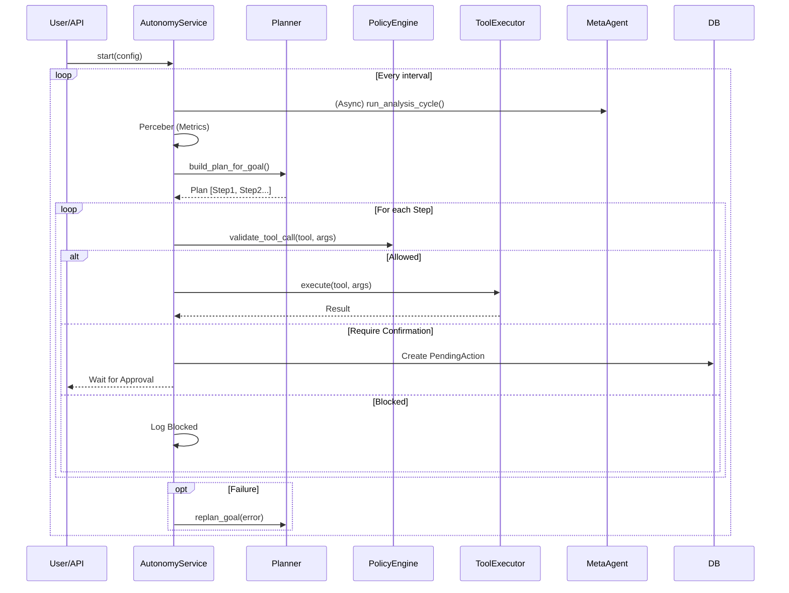

# Processo de Autonomia e Meta-Agente

Este documento detalha o funcionamento interno do ciclo de autonomia do Janus, explicando como o sistema percebe o ambiente, planeja ações, executa tarefas e reflete sobre os resultados.

## Visão Geral

O Janus opera não apenas como um chatbot reativo, mas como um sistema autônomo supervisionado. O núcleo dessa autonomia é o **Autonomy Loop**, um ciclo contínuo orquestrado pelo `AutonomyService` e supervisionado pelo **Meta-Agente**.

O processo segue uma variação do ciclo OODA (Observe, Orient, Decide, Act), com passos adicionais de validação e reflexão.

## Fluxo de Autonomia (Autonomy Loop)

O ciclo de autonomia é implementado em `janus/app/services/autonomy_service.py`.

### 1. Início e Configuração
- O loop é iniciado via `POST /api/v1/autonomy/start`.
- Recebe uma configuração (`AutonomyConfig`) que define:
  - Intervalo entre ciclos (`interval_seconds`).
  - Perfil de risco (`risk_profile`).
  - Listas de permissão/bloqueio (`allowlist`/`blocklist`).
  - Metas iniciais ou plano predefinido.

### 2. O Ciclo de Execução (`_run_cycle`)

A cada intervalo, o serviço executa os seguintes passos:

#### A. Perceber (Observe)
- Coleta métricas de saúde do sistema via `OptimizationService` e `get_system_health_metrics`.
- Informa o estado atual via `RealtimeService` (para o frontend/HUD).

#### B. Orientar e Planejar (Orient & Plan)
- Verifica se há uma meta (`Goal`) ativa no `GoalManager`.
- Se um plano explícito não foi fornecido na configuração, o sistema invoca o **Planner** (`build_plan_for_goal`).
  - O Planner usa um LLM (Orchestrator) para decompor a meta em passos acionáveis (lista de ferramentas e argumentos).
  - Se falhar, usa um plano de fallback (ex.: apenas coletar informações do sistema).

#### C. Executar (Act) com Governança
- Itera sobre os passos do plano.
- Para cada passo (`tool`, `args`):
  1. **Reset de Quota**: Verifica se o ciclo excedeu o tempo ou número de ações permitidas.
  2. **Validação de Política (`PolicyEngine`)**:
     - Verifica se a ferramenta está na `blocklist`.
     - Verifica o `PermissionLevel` da ferramenta contra o `RiskProfile` (Conservative, Balanced, Aggressive).
     - Verifica limites de taxa (`RateLimit`).
     - Decide se a ação requer **Confirmação Humana**.
  3. **Aprovação**:
     - Se `require_confirmation` for verdadeiro, cria uma `PendingAction` e pausa a execução daquele passo (o loop continua ou espera, dependendo da lógica de bloqueio).
  4. **Invocação**:
     - Se aprovado, executa a ferramenta (`tool.run` ou `tool.arun`).
     - Registra métricas de sucesso/erro e latência.
  5. **Histórico**:
     - Grava o passo e o resultado no repositório de autonomia (`AutonomyRepository`).

#### D. Replanejamento Dinâmico
- Se um passo crítico falhar, o sistema pode acionar o `replan_goal`.
- O LLM analisa o erro e decide:
  - `RETRY_WITH_ARGS`: Tentar novamente com novos parâmetros.
  - `NEW_PLAN`: Gerar um novo conjunto de passos.
  - `ABORT`: Desistir da meta atual.

## O Meta-Agente (LangGraph)

Enquanto o `AutonomyService` executa as ações do dia a dia, o **Meta-Agente** (`janus/app/core/agents/meta_agent.py`) atua como um supervisor de nível superior, focado na saúde e otimização do próprio Janus.

Ele é implementado como um grafo de estados (`StateGraph`) usando a biblioteca **LangGraph**.

### Nós do Grafo

1. **Monitor**:
   - Coleta métricas profundas (uso de recursos, falhas de memória nas últimas 24h).
   - Detecta anomalias usando heurísticas (ex.: "Status != healthy").
2. **Diagnose**:
   - Se problemas forem detectados, usa um LLM para analisar a causa raiz (`root_cause`).
3. **Plan**:
   - Gera um plano de correção estruturado (`RecommendationItem`), sugerindo ações para outros agentes (ex.: "Resetar Circuit Breaker", "Limpar Cache").
4. **Reflect**:
   - Um passo de "crítica" onde o LLM avalia o próprio plano quanto à segurança e eficácia.
   - Se rejeitado, o fluxo volta para o planejamento.
5. **Execute**:
   - Despacha as recomendações aprovadas (atualmente simula ou delega via logs, podendo ser expandido para execução direta).

### Persistência
- O estado do Meta-Agente é persistido, permitindo "viagem no tempo" e retomada de ciclos interrompidos (recurso do LangGraph).

## Governança: Policy Engine

O arquivo `janus/app/core/autonomy/policy_engine.py` é o guardião de segurança.

- **Perfis de Risco**:
  - `CONSERVATIVE`: Bloqueia ferramentas perigosas (`DANGEROUS`); ferramentas de escrita (`WRITE`) exigem confirmação.
  - `BALANCED`: Permite escrita; `DANGEROUS` apenas se estiver na `allowlist`.
  - `AGGRESSIVE`: Permite quase tudo, assume auto-confirmação.
- **Validação**:
  - A função `validate_tool_call` retorna uma `PolicyDecision` (`allowed`, `require_confirmation`, `reason`).

## Diagrama de Sequência Simplificado

## Arquivos Principais

- **Entrada API**: `janus/app/api/v1/endpoints/autonomy.py`
- **Orquestrador**: `janus/app/services/autonomy_service.py`
- **Supervisor**: `janus/app/core/agents/meta_agent.py`
- **Regras**: `janus/app/core/autonomy/policy_engine.py`
- **Planejador**: `janus/app/core/autonomy/planner.py`
